# Comparison of predictions based on domain (URL) information from a test corpus

To analyse how appropriate are various schemata for our target data, which is MaCoCu web corpora, we apply all the classifiers to a sample of a corpus. Then we analyse the distribution of labels inside one domain. We base this comparison on a hypothesis that web domains mostly consist of only one genre. Thus, we will analyse to which extent the genre labels from different schemata are able to consistently assign a genre to texts inside one domain.

Contents:
- [Models used](#models-used)
- [MaCoCu-sl - sample 1 - Data preparation](#macocu-sl---sample1---data-preparation)
- [Second sample of MaCoCu-sl, MaCoCu-mk and MaCoCu-is](#second-sample-of-macocu-sl-macocu-mk-and-macocu-is)
- [Most frequent label on instance level](#most-frequent-label-on-instance-level-per-classifier)
- [Comparision of classifiers based on label distribution per domain](#comparison-of-frequency-of-prediction-of-the-most-frequent-label-per-domain)
- [Label distribution on domain level](#label-distribution-on-the-domain-level)
- [Scores assuming domains are uni-genre](#precision-recall-and-f1-scores-using-domain-information-as-a-signal-of-a-true-label)
- [Comparison of X-GENRE classifiers based on majority labels](#comparison-of-x-genre-classifiers-performance-based-on-x-genre-majority-label)
- [Agreement between X-GENRE classifiers](#comparison-of-x-genre-classifier-agreement)
- [Comparing results with a shuffled corpus](#comparing-with-a-corpus-where-labels-are-randomly-shuffled)
- [Comparing schemata with the Apriori algorithm](#comparing-schemata-with-apriori-algorithm)

## Models used

Then I applied the following classifiers, developed in previous experiments and saved to Wandb to the sample:
- FTD classifier - original FTD data (except multi-labeled texts and non-text texts) - 10 categories, 849 instances in training data
- GINCO-downcast classifier - used primary_level_4 downcasted GINCO labels - 9 labels. It was trained on 601 texts.
- CORE-main classifier - main categories only - 9 instances. All texts with multiple labels were discarded. It was trained on 10256 instances.
- GINCO X-GENRE classifier - 9 X-GENRE labels. It was trained on 535 texts (10% texts discarded - belonging to "discarded" labels)
- FTD X-GENRE classifier - 7 X-GENRE labels. It was trained on 630 texts (23% texts were discarded).
- CORE X-GENRE classifier - 9 X-GENRE labels. It was trained on 607 texts - large changes to the dataset were performed (change of distribution, taking only a sample to have a similar size as FTD and GINCO).
- X-GENRE classifier - 9 X-GENRE labels. Trained on the training splits of all of the X-GENRE datasets mentioned above: 1772 instances in the training dataset.

## MaCoCu-sl - sample1 - Data preparation

- We first need to discard all texts with text length smaller than 75 - I created a dictionary of all domains and urls of texts that are long enough.
- Then I calculated the frequency of the domains (number of texts in each domain). I discarded domains that have less than 10 instances (if I wouldn't, the median would be 6 texts per domain). Then I calculated the median and took the instances with the median number of instances, and the same amount of domains above and below the median, so that at the end, the sample has around 1000 different domains. - There were 219 domains at the median, so I took 391 domains from above and below the median.
- Out of the table of domains and all urls belonging to them, I sampled 10 URLs per domain, and extracted texts with these URLs from the MaCoCu-sl XLM file. It turned out that ssome URLs appear multiple times with different texts, so at the end, the sample consisted out of 10.041 texts. The problem with this is a) that some domains have more instances than other, and b) that texts under some of the URLs might be shorter than 75 words. That is why I calculated the length of the texts again and discarded those with length less than 75 words. Then I also sampled out the instances from domains with more than 10 texts, so that at the end all domains have 10 instances.
- The final number of domains is 1001 and number of texts 10,010 (10 per domain). Final file: *MaCoCu-sl-sample.csv*

<!--- 

### Results

#### Comparison of confidence of the predictions

| classifier    |   min |   median |   max |
|-------------|------:|---------:|------:|
| X-GENRE       |  0.29 |     1    |  1    |
| GINCO-X-GENRE |  0.27 |     0.99 |  0.99 |
| GINCO         |  0.18 |     0.94 |  0.98 |
| FTD-X-GENRE   |  0.19 |     0.87 |  0.97 |
| CORE          |  0.23 |     0.86 |  0.99 |
| FTD           |  0.15 |     0.81 |  0.97 |
| CORE-X-GENRE  |  0.15 |     0.53 |  0.95 |

#### Most frequently predicted label

| classifier    | most frequent label       |   frequency |
|-------------|-------------------------------------|------------:|
| FTD           | A12 (promotion)   |        0.62 |
| GINCO         | Promotion         |        0.43 |
| CORE          | Informational Description/Explanation |        0.67 |
| GINCO-X-GENRE | Promotion         |        0.48 |
| FTD-X-GENRE   | Promotion         |        0.65 |
| CORE-X-GENRE  | Information/Explanation   |        0.44 |
| X-GENRE       | Promotion         |        0.43 |

#### Comparison of label distribution (instance level)

| FTD          | GINCO    | CORE        | GINCO-X-GENRE  | FTD-X-GENRE       | CORE-X-GENRE      | X-GENRE           | |
|------------------------------------|--------------------------------------------|-------------------------------------------------------|--------------------------------------|-----------------------------------------|-----------------------------------------|-----------------------------------------|----|
| ('A12 (promotion)', 0.62)       | ('Promotion', 0.43) | ('Informational Description/Explanation', 0.67) | ('Promotion', 0.48)   | ('Promotion', 0.65)      | ('Information/Explanation', 0.44) | ('Promotion', 0.43)      | |
| ('A16 (information)', 0.12)     | ('Information/Explanation', 0.14)       | ('Informational Persuasion', 0.12)     | ('Information/Explanation', 0.15) | ('Information/Explanation', 0.16) | ('Instruction', 0.2)     | ('Information/Explanation', 0.18) |    |
| ('A1 (argumentative)', 0.06) | ('Opinion/Argumentation', 0.11)         | ('Narrative', 0.1) | ('News', 0.13)| ('News', 0.06)   | ('Opinion/Argumentation', 0.14)      | ('News', 0.13)   | |
| ('A17 (review)', 0.05)          | ('News/Reporting', 0.11)    | ('How-To/Instructional', 0.05) | ('Opinion/Argumentation', 0.09)   | ('Instruction', 0.06)    | ('News', 0.13)   | ('Opinion/Argumentation', 0.11)      | |
| ('A7 (instruction)', 0.05)      | ('List of Summaries/Excerpts', 0.08) | ('Opinion', 0.04)  | ('Instruction', 0.07) | ('Opinion/Argumentation', 0.03)      | ('Forum', 0.06)  | ('Instruction', 0.08)    | |
| ('A8 (news)', 0.04) | ('Instruction', 0.07)       | ('Interactive Discussion', 0.01)       | ('Other', 0.06)       | ('Legal', 0.03)  | ('Other', 0.02)  | ('Other', 0.03)  | |
| ('A11 (personal)', 0.03)        | ('Other', 0.03)     | ('Spoken', 0.01)   | ('Forum', 0.01)       | ('Prose/Lyrical', 0.01)  | ('Prose/Lyrical', 0.02)  | ('Legal', 0.02)  | |
| ('A9 (legal)', 0.02)| ('Forum', 0.01)     | ('Lyrical', 0.0)   | ('Legal', 0.01)       |      | | ('Forum', 0.01)  | |
| ('A4 (fiction)', 0.01)          | ('Legal/Regulation', 0.01)  || ('Prose/Lyrical', 0.0)|      | | ('Prose/Lyrical', 0.0)   | |
| ('A14 (academic)', 0.0)         | |   |      | | | |    |

#### Comparison of frequency of prediction of the most frequent label per domain

#### Comparison of label distribution on the domain level

Table shows in how many of the domains a label is the most frequent label in the domain. The values in the table are percentages.

|  most frequent label in domain: FTD |  most frequent label in domain: GINCO |  most frequent label in domain: CORE    |  most frequent label in domain: GINCO-X-GENRE |  most frequent label in domain: FTD-X-GENRE |  most frequent label in domain: CORE-X-GENRE |  most frequent label in domain: X-GENRE |
|---------------------------------------|-----------------------------------------|-------------------------------------------------------|-------------------------------------------------|-----------------------------------------------|------------------------------------------------|-------------------------------------------|
|  ('A12 (promotion)', 0.74)          |  ('Promotion', 0.52)      |  ('Informational Description/Explanation', 0.76)  |  ('Promotion', 0.57)      |  ('Promotion', 0.76)    |  ('Information/Explanation', 0.51)           |  ('Promotion', 0.5) |
|  ('A16 (information)', 0.08)        |  ('Information/Explanation', 0.13)    |  ('Informational Persuasion', 0.09)     |  ('News', 0.13)           |  ('Information/Explanation', 0.12)          |  ('Instruction', 0.18)   |  ('Information/Explanation', 0.16)      |
|  ('A17 (review)', 0.04) |  ('News/Reporting', 0.12) |  ('Narrative', 0.08)|  ('Information/Explanation', 0.12)|  ('News', 0.05)         |  ('Opinion/Argumentation', 0.13) |  ('News', 0.14)     |
|  ('A1 (argumentative)', 0.04)       |  ('Opinion/Argumentation', 0.11)      |  ('How-To/Instructional', 0.03) |  ('Opinion/Argumentation', 0.09)  |  ('Instruction', 0.03)  |  ('News', 0.11)          |  ('Opinion/Argumentation', 0.11)        |
|  ('A8 (news)', 0.03)    |  ('List of Summaries/Excerpts', 0.04) |  ('Opinion', 0.02)  |  ('Instruction', 0.04)    |  ('Opinion/Argumentation', 0.02)|  ('Forum', 0.03)         |  ('Instruction', 0.06)      |
|  ('A7 (instruction)', 0.03)         |  ('Instruction', 0.04)    |  ('Interactive Discussion', 0.01)       |  ('Other', 0.03)          |  ('Legal', 0.01)        |  ('Prose/Lyrical', 0.02) |  ('Other', 0.01)    |
|  ('A11 (personal)', 0.03)           |  ('Forum', 0.01)  |  ('Spoken', 0.0)    |  ('Forum', 0.01)          |  ('Prose/Lyrical', 0.01)|  ('Other', 0.01)         |  ('Forum', 0.01)    |
|  ('A9 (legal)', 0.01)   |  ('Legal/Regulation', 0.01)           |  ('Lyrical', 0.0)   |  ('Legal', 0.01)          |     |        |  ('Legal', 0.01)    |
|  ('A4 (fiction)', 0.01) |  ('Other', 0.0)   | |  ('Prose/Lyrical', 0.0)   |     |        |  ('Prose/Lyrical', 0.0)     |
|  ('A14 (academic)', 0.0)|       |   |         |       |        |   |

#### Precision, recall and F1 scores using domain information as a signal of a "true label"

We used the most frequent label predicted on the domain as the "true label". Biggest values for each metric are in bold.

| Classifier (no. of labels)   |   Macro F1 |   Micro F1 |   Macro precision |   Macro recall |
|:--------------|-----------:|-----------:|------------------:|---------------:|
| FTD-X-GENRE (7)  |       **0.57** |       0.76 |  **0.51** |           **0.67** |
| GINCO-X-GENRE (9)|       0.53 |       0.68 |  0.49 |           0.58 |
| CORE-X-GENRE  (9)|       0.53 |       0.65 |  0.5  |           0.59 |
| FTD (10)          |       0.52 |       0.74 |  0.46 |           0.62 |
| CORE  (9)        |       0.51 |       **0.78** |  0.45 |           0.63 |
| X-GENRE (9)      |       0.51 |       0.66 |  0.49 |           0.57 |
| GINCO  (9)       |       0.49 |       0.64 |  0.47 |           0.55 |

#### Comparison of X-GENRE classifier's performance based on X-GENRE majority label

I calculated the evaluation metrics for the X-GENRE classifiers (classifiers which use the X-GENRE schema) by taking the majority label (label predicted by most of the classifiers) as the "y_true" label. If there was a tie (more than 1 most common label), I randomly chose the majority label out of them.

Ties occurred in 11% of instances:

|     |   X-GENRE-majority-label-tie |
|:----|-----------------------------:|
| no  | 0.889311 |
| yes | 0.110689 |

The distribution of the majority X-GENRE predictions:

|     |   X-GENRE-majority-label |
|:------------------------|-------------------------:|
| Promotion   |   0.463037   |
| Information/Explanation |   0.191009   |
| News|   0.120779   |
| Opinion/Argumentation   |   0.086014   |
| Instruction |   0.0792208  |
| Other       |   0.0225774  |
| Legal       |   0.0167832  |
| Forum       |   0.0138861  |
| Prose/Lyrical           |   0.00669331 |

Results:

| Classifier (labels)   |   Macro F1 |   Micro F1 |   Macro precision |   Macro recall |
|:--------------|-----------:|-----------:|------------------:|---------------:|
| X-GENRE  (9)     |       **0.84** |       **0.88** |  **0.84** |           **0.85** |
| GINCO-X-GENRE (9) |       0.73 |       0.86 |  0.83 |           0.74 |
| FTD-X-GENRE (7)  |       0.68 |       0.74 |  0.76 |           0.68 |
| CORE-X-GENRE (9) |       0.48 |       0.53 |  0.38 |           0.75 |

#### Comparison of X-GENRE classifier agreement

I used the predictions of one classifier as y_true, and the predictions of the other as y_pred. I did it in both directions, just to check how the results change.
FTD-X-GENRE has less labels than the other (7, instead of 9), so whenever this classifier was in the pair, I used 7 labels for calculation of the evaluation metrics.

A problem: CORE-X-GENRE didn't predict Promotion to any of the instances - when calculating macro and micro F1, this affected the results - metrics for when CORE-X-GENRE labels are used as the list of labels (when its predictions are used as y_pred) are different than when the other classifier is used to create a list of labels (when its predictions are used as y_pred - except in the case of FTD-X-GENRE, which is always used for the list of labels, because it has less labels).

| Classifier as y_true   | Classifier as y_pred   |   Macro F1 |   Micro F1 |   Macro precision |   Macro recall |
|:-----------------------|:-----------------------|-----------:|-----------:|------------------:|---------------:|
| GINCO-X-GENRE          | X-GENRE    |       **0.67** |       **0.79** |  0.64 |           **0.76** |
| X-GENRE    | GINCO-X-GENRE          |       **0.67** |       **0.79** |  **0.76** |           0.64 |
| FTD-X-GENRE| X-GENRE    |       0.6  |       0.66 |  0.62 |           0.67 |
| X-GENRE    | FTD-X-GENRE|       0.6  |       0.66 |  0.67 |           0.62 |
| GINCO-X-GENRE          | FTD-X-GENRE|       0.53 |       0.69 |  0.57 |           0.65 |
| FTD-X-GENRE| GINCO-X-GENRE          |       0.53 |       0.69 |  0.65 |           0.57 |
| X-GENRE    | CORE-X-GENRE           |       0.4  |       0.47 |  0.33 |           0.67 |
| CORE-X-GENRE           | X-GENRE    |       0.31 |       0.37 |  0.52 |           0.26 |
| CORE-X-GENRE           | GINCO-X-GENRE          |       0.27 |       0.32 |  0.51 |           0.22 |
| GINCO-X-GENRE          | CORE-X-GENRE           |       0.34 |       0.42 |  0.28 |           0.65 |
| CORE-X-GENRE           | FTD-X-GENRE|       0.27 |       0.24 |  0.5  |           0.18 |
| FTD-X-GENRE| CORE-X-GENRE           |       0.27 |       0.24 |  0.18 |           0.5  |

Based on the results, GINCO-X-GENRE and X-GENRE match the most, followed by FTD-X-GENRE and X-GENRE. On Micro F1 level, FTD-X-GENRE and GINCO-X-GENRE even outperform the combination of FTD-X-GENRE and X-GENRE (mostly because they both predict "Promotion" most frequently). CORE-X-GENRE matches the worst with all other. The worst agreement is between FTD-X-GENRE and CORE-X-GENRE.

--->

## Second sample of MaCoCu-sl, MaCoCu-mk and MaCoCu-is

I re-did all experiments on a new sample of MaCoCu-sl, where I chosen 500 random domains above and 500 random domains below the median instead of the domains around the median (as I did in the first sample.)

I then extended the experiments to the Macedonian dataset - MaCoCu-mk -, and the Icelandic dataset - MaCoCu-is, as well, following the same steps as with the MaCoCu-sl.

<!--

#### Comparison of confidence of the predictions

MaCoCu-sl
- no big differences with sample1

| classifier    |   min |   median |   max |
|:--------------|------:|---------:|------:|
| X-GENRE       |  0.33 |     1    |  1    |
| GINCO-X-GENRE |  0.26 |     0.99 |  0.99 |
| GINCO         |  0.25 |     0.94 |  0.98 |
| CORE          |  0.25 |     0.86 |  0.99 |
| FTD-X-GENRE   |  0.19 |     0.86 |  0.97 |
| FTD           |  0.16 |     0.78 |  0.96 |
| CORE-X-GENRE  |  0.15 |     0.54 |  0.95 |

MaCoCu-mk

| classifier    |   min |   median |   max |
|:--------------|------:|---------:|------:|
| X-GENRE       |  0.32 |     1    |  1    |
| GINCO-X-GENRE |  0.28 |     0.98 |  0.99 |
| GINCO         |  0.24 |     0.95 |  0.98 |
| CORE          |  0.24 |     0.91 |  0.99 |
| FTD-X-GENRE   |  0.22 |     0.83 |  0.97 |
| FTD           |  0.16 |     0.77 |  0.96 |
| CORE-X-GENRE  |  0.15 |     0.64 |  0.95 |

The median confidence of CORE and CORE-X-GENRE is bigger on MaCoCu-mk (5-10 points).

MaCoCu-is

| classifier    |   min |   median |   max |
|:--------------|------:|---------:|------:|
| X-GENRE       |  0.32 |     1    |  1    |
| GINCO-X-GENRE |  0.28 |     0.97 |  0.99 |
| CORE          |  0.19 |     0.91 |  0.99 |
| GINCO         |  0.2  |     0.9  |  0.98 |
| FTD           |  0.15 |     0.7  |  0.97 |
| FTD-X-GENRE   |  0.17 |     0.67 |  0.97 |
| CORE-X-GENRE  |  0.16 |     0.59 |  0.95 |

The median confidence of GINCO, FTD and CORE-X-GENRE is slightly lower (5-7 points) and quite lower for FTD-X-GENRE (16 points) when applied to MaCoCu-is than when applied to MaCoCu-mk.
-->

#### Most frequent label (on instance level) per classifier

MaCoCu-sl:
- The frequency of the most frequent label between sample1 and sample2 of MaCoCu-sl changed only slightly (up to 5 percent) - it is slightly less frequent now.

|  classifier        |  MaCoCu-sl (sample2)        |  MaCoCu-mk      |  MaCoCu-is  |  |
|----------------------|---------------------------------------------------|---------------------------------------------------|-------------------------------------------------------|----|
|  FTD   |  A12 (promotion), 0.59      |  A12 (promotion), 0.42      |  ('A12 (promotion)', 0.31)      |  |
|  GINCO |  Promotion, 0.4 |  News/Reporting, 0.31       |  ('Information/Explanation', 0.25)      |  |
|  CORE  |  Informational Description/Explanation, 0.65  |  Informational Description/Explanation, 0.58  |  ('Informational Description/Explanation', 0.58)  |    |
|  GINCO-X-GENRE   |  Promotion, 0.45|  News, 0.31     |  Information/Explanation, 0.25  |    |
|  FTD-X-GENRE       |  Promotion, 0.63|  Promotion, 0.44|  ('Promotion', 0.36)|  |
|  CORE-X-GENRE      |  Information/Explanation, 0.41      |  Information/Explanation, 0.36      |  ('Information/Explanation', 0.37)      |  |
|  X-GENRE           |  Promotion, 0.39|  News, 0.34     |  ('Information/Explanation', 0.22)      |  |

The frequency of the most frequent label is the highest in the case of MaCoCu-sl (most unbalanced data), followed by MaCoCu-mk, and in the case of most classifiers, the supremacy of the most frequent label is the least present in MaCoCu-is. In the case of FTD, CORE, FTD-X-GENRE and CORE-X-GENRE, the most frequent label is the same one in all three datasets, while GINCO, GINCO-X-GENRE and X-GENRE identified different distribution of labels in the corpora.

**Comparison of label distribution (instance level)**

MaCoCu-sl:
- Label distribution between sample1 and sample2 of MaCoCu-sl remains more or less the same (very small differences between the samples).

| label_distribution_FTD          | label_distribution_GINCO    | label_distribution_CORE        | label_distribution_GINCO-X-GENRE  | label_distribution_FTD-X-GENRE       | label_distribution_CORE-X-GENRE      | label_distribution_X-GENRE           |
|------------------------------------|--------------------------------------------|-------------------------------------------------------|--------------------------------------|-----------------------------------------|-----------------------------------------|-----------------------------------------|
| ('A12 (promotion)', 0.59)       | ('Promotion', 0.4)  | ('Informational Description/Explanation', 0.65) | ('Promotion', 0.45)   | ('Promotion', **0.63**)      | ('Information/Explanation', 0.41) | ('Promotion', 0.39)      |
| ('A16 (information)', 0.13)     | ('Information/Explanation', 0.14)       | ('Informational Persuasion', 0.12)     | ('Information/Explanation', 0.15) | ('Information/Explanation', 0.17) | ('Instruction', 0.2)     | ('Information/Explanation', 0.18) |
| ('A1 (argumentative)', 0.07) | ('Opinion/Argumentation', 0.12)         | ('Narrative', 0.11)| ('News', 0.14)| ('News', 0.08)   | ('Opinion/Argumentation', 0.14)      | ('News', 0.15)   |
| ('A8 (news)', 0.05) | ('News/Reporting', 0.12)    | ('How-To/Instructional', 0.05) | ('Opinion/Argumentation', 0.1)    | ('Instruction', 0.06)    | ('News', 0.13)   | ('Opinion/Argumentation', 0.12)      |
| ('A7 (instruction)', 0.05)      | ('List of Summaries/Excerpts', 0.08) | ('Opinion', 0.04)  | ('Instruction', 0.08) | ('Opinion/Argumentation', 0.03)      | ('Forum', 0.07)  | ('Instruction', 0.09)    |
| ('A17 (review)', 0.05)          | ('Instruction', 0.07)       | ('Interactive Discussion', 0.02)       | ('Other', 0.06)       | ('Legal', 0.02)  | ('Prose/Lyrical', 0.02)  | ('Other', 0.03)  |
| ('A11 (personal)', 0.03)        | ('Other', 0.03)     | ('Spoken', 0.01)   | ('Forum', 0.02)       | ('Prose/Lyrical', 0.01)  | ('Other', 0.02)  | ('Forum', 0.02)  |
| ('A9 (legal)', 0.02)| ('Forum', 0.02)     | ('Lyrical', 0.0)   | ('Legal', 0.01)       |      | | ('Legal', 0.02)  |
| ('A4 (fiction)', 0.01)          | ('Legal/Regulation', 0.01)  || ('Prose/Lyrical', 0.0)|      | | ('Prose/Lyrical', 0.01)  |
| ('A14 (academic)', 0.0)         | |   |      | | | |

MaCoCu-is:

| label_distribution_FTD       | label_distribution_GINCO             | label_distribution_CORE                         | label_distribution_GINCO-X-GENRE   | label_distribution_FTD-X-GENRE    | label_distribution_CORE-X-GENRE   | label_distribution_X-GENRE        |
|:-----------------------------|:-------------------------------------|:------------------------------------------------|:-----------------------------------|:----------------------------------|:----------------------------------|:----------------------------------|
| ('A12 (promotion)', 0.31)    | ('Information/Explanation', 0.25)    | ('Informational Description/Explanation', 0.58) | ('Information/Explanation', 0.25)  | ('Promotion', 0.36)               | ('Information/Explanation', 0.37) | ('Information/Explanation', 0.22) |
| ('A16 (information)', 0.2)   | ('Opinion/Argumentation', 0.22)      | ('Narrative', 0.23)                             | ('Promotion', 0.22)                | ('Information/Explanation', 0.27) | ('News', 0.18)                    | ('News', 0.2)                     |
| ('A1 (argumentative)', 0.19) | ('News/Reporting', 0.15)             | ('Opinion', 0.08)                               | ('Opinion/Argumentation', 0.14)    | ('News', 0.17)                    | ('Opinion/Argumentation', 0.16)   | ('Opinion/Argumentation', 0.2)    |
| ('A8 (news)', 0.09)          | ('Promotion', 0.15)                  | ('Informational Persuasion', 0.04)              | ('News', 0.14)                     | ('Opinion/Argumentation', 0.1)    | ('Forum', 0.14)                   | ('Promotion', 0.16)               |
| ('A11 (personal)', 0.08)     | ('List of Summaries/Excerpts', 0.07) | ('Interactive Discussion', 0.04)                | ('Other', 0.12)                    | ('Instruction', 0.04)             | ('Instruction', 0.09)             | ('Forum', 0.07)                   |
| ('A17 (review)', 0.05)       | ('Forum', 0.06)                      | ('How-To/Instructional', 0.03)                  | ('Instruction', 0.06)              | ('Legal', 0.04)                   | ('Prose/Lyrical', 0.04)           | ('Instruction', 0.06)             |
| ('A7 (instruction)', 0.04)   | ('Instruction', 0.05)                | ('Lyrical', 0.01)                               | ('Forum', 0.05)                    | ('Prose/Lyrical', 0.02)           | ('Other', 0.02)                   | ('Other', 0.05)                   |
| ('A9 (legal)', 0.02)         | ('Other', 0.04)                      | ('Spoken', 0.0)                                 | ('Legal', 0.01)                    |                                   |                                   | ('Legal', 0.02)                   |
| ('A4 (fiction)', 0.01)       | ('Legal/Regulation', 0.01)           |                                                 | ('Prose/Lyrical', 0.0)             |                                   |                                   | ('Prose/Lyrical', 0.01)           |
| ('A14 (academic)', 0.0)      |                                      |                                                 |                                    |                                   |                                   |                                   |
|                              |                                      |                                                 |                                    |                                   |                                   |                                   |
|                              |                                      |                                                 |                                    |                                   |                                   |                                   |

#### Comparison of frequency of prediction of the most frequent label per domain

MaCoCu-sl: distributions in sample2 are very similar to the sample1.

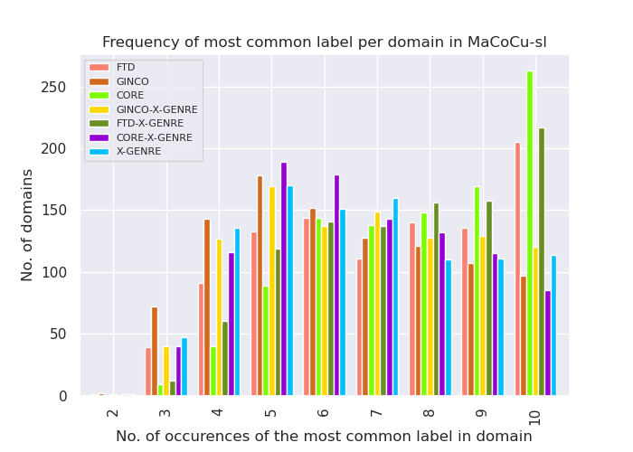

MaCoCu-mk:

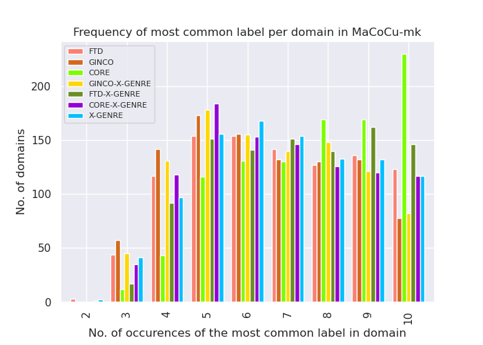

MaCoCu-is:

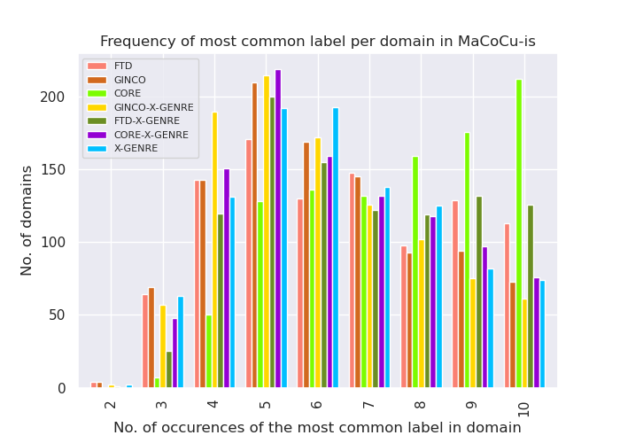

We can see that CORE still has the highest frequency of prediction of the most frequent label per domain, but all other classifiers are now much more similar to each other.

MaCoCu-sl:

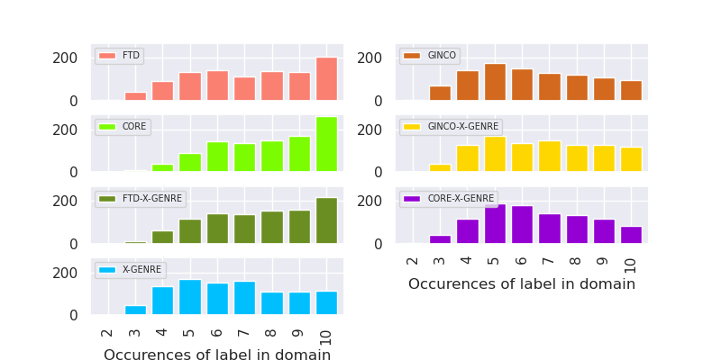

MaCoCu-mk:

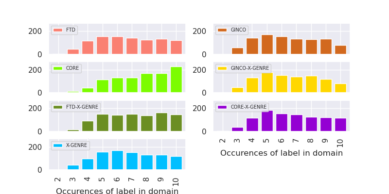

MaCoCu-is:

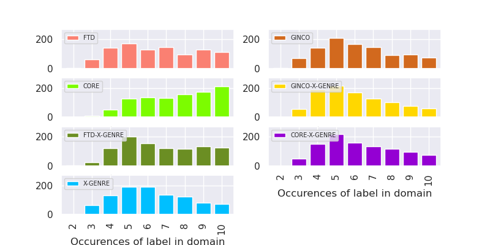

MaCoCu-sl:

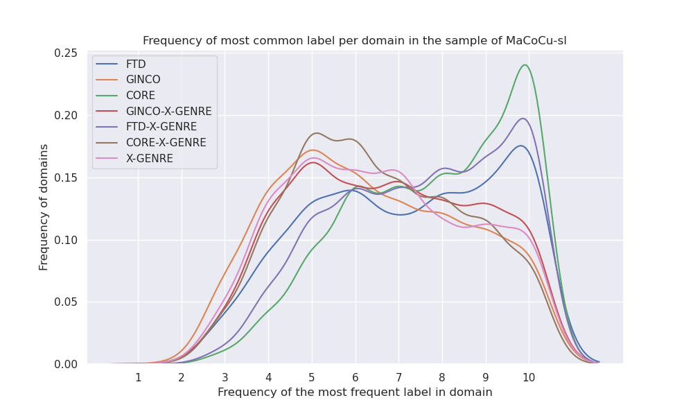

MaCoCu-mk:

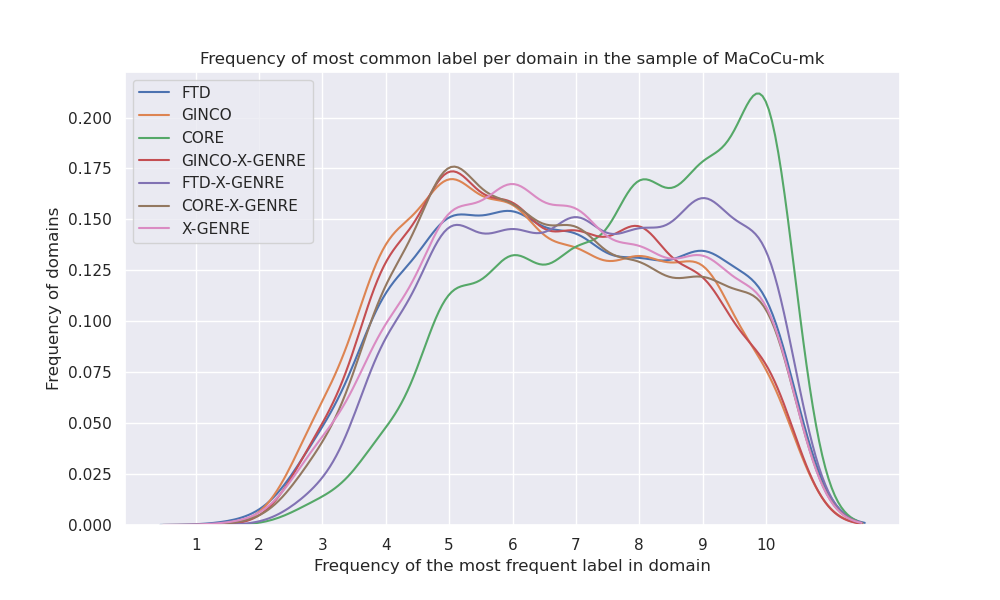

MaCoCu-is:

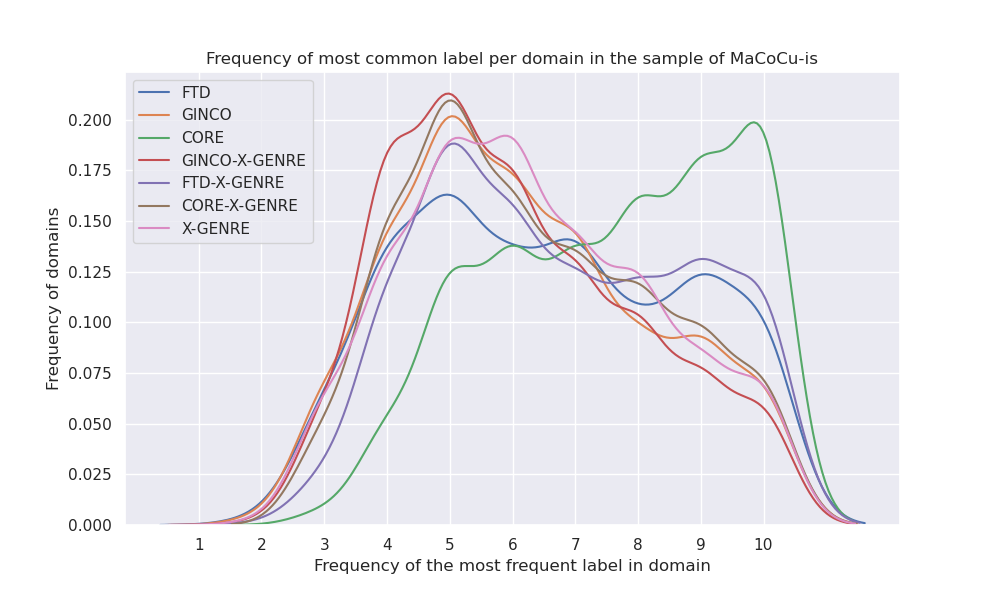

#### Label distribution on the domain level

When comparing the two samples of MaCoCu-sl, frequency of the most frequent label on domain level is slightly smaller for all classifiers, but only up to 5 points. Otherwise, the distributions are very similar.

Table shows in how many of the domains a label is the most frequent label in the domain. The values in the table are percentages.

MaCoCu-sl:

| most frequent label in domain: FTD | most frequent label in domain: GINCO | most frequent label in domain: CORE    | most frequent label in domain: GINCO-X-GENRE | most frequent label in domain: FTD-X-GENRE | most frequent label in domain: CORE-X-GENRE | most frequent label in domain: X-GENRE |
|---------------------------------------|-----------------------------------------|-------------------------------------------------------|-------------------------------------------------|-----------------------------------------------|------------------------------------------------|-------------------------------------------|
| ('A12 (promotion)', 0.7)           | ('Promotion', 0.5)       | ('Informational Description/Explanation', 0.73) | ('Promotion', 0.53)      | ('Promotion', 0.72)    | ('Information/Explanation', 0.47)           | ('Promotion', 0.46)|
| ('A16 (information)', 0.09)        | ('Information/Explanation', 0.13)    | ('Informational Persuasion', 0.1)      | ('News', 0.14)           | ('Information/Explanation', 0.13)          | ('Instruction', 0.19)   | ('Information/Explanation', 0.16)      |
| ('A1 (argumentative)', 0.06)       | ('News/Reporting', 0.13) | ('Narrative', 0.09)| ('Information/Explanation', 0.13)| ('News', 0.07)         | ('Opinion/Argumentation', 0.13) | ('News', 0.16)     |
| ('A8 (news)', 0.05)    | ('Opinion/Argumentation', 0.11)      | ('How-To/Instructional', 0.04) | ('Opinion/Argumentation', 0.09)  | ('Instruction', 0.04)  | ('News', 0.12)          | ('Opinion/Argumentation', 0.1)         |
| ('A17 (review)', 0.04) | ('Instruction', 0.05)    | ('Interactive Discussion', 0.02)       | ('Instruction', 0.05)    | ('Opinion/Argumentation', 0.03)| ('Forum', 0.06)         | ('Instruction', 0.07)      |
| ('A7 (instruction)', 0.03)         | ('List of Summaries/Excerpts', 0.04) | ('Opinion', 0.02)  | ('Other', 0.03)          | ('Legal', 0.01)        | ('Prose/Lyrical', 0.02) | ('Forum', 0.03)    |
| ('A11 (personal)', 0.02)           | ('Forum', 0.03)  | ('Lyrical', 0.0)   | ('Forum', 0.02)          | ('Prose/Lyrical', 0.01)| ('Other', 0.01)         | ('Other', 0.01)    |
| ('A9 (legal)', 0.01)   | ('Other', 0.01)  | ('Spoken', 0.0)    | ('Legal', 0.0)           |    |        | ('Legal', 0.01)    |
| ('A4 (fiction)', 0.0)  | ('Legal/Regulation', 0.0)|| ('Prose/Lyrical', 0.0)   |    |        | ('Prose/Lyrical', 0.0)     |
| ('A14 (academic)', 0.0)|      |   |         |       |        |   |

MaCoCu-mk:

| most frequent label in domain: FTD | most frequent label in domain: GINCO | most frequent label in domain: CORE    | most frequent label in domain: GINCO-X-GENRE | most frequent label in domain: FTD-X-GENRE | most frequent label in domain: CORE-X-GENRE | most frequent label in domain: X-GENRE |
|---------------------------------------|-----------------------------------------|-------------------------------------------------------|-------------------------------------------------|-----------------------------------------------|------------------------------------------------|-------------------------------------------|
| ('A12 (promotion)', 0.5)           | ('News/Reporting', 0.41) | ('Informational Description/Explanation', **0.63**) | ('News', 0.38)           | ('Promotion', 0.48)    | ('Information/Explanation', 0.41)           | ('News', 0.41)     |
| ('A8 (news)', 0.22)    | ('Promotion', 0.26)      | ('Narrative', 0.24)| ('Promotion', 0.33)      | ('News', 0.3)          | ('News', 0.34)          | ('Promotion', 0.3) |
| ('A1 (argumentative)', 0.12)       | ('Information/Explanation', 0.17)    | ('Informational Persuasion', 0.06)     | ('Information/Explanation', 0.17)| ('Information/Explanation', 0.16)          | ('Instruction', 0.11)   | ('Information/Explanation', 0.15)      |
| ('A16 (information)', 0.09)        | ('Opinion/Argumentation', 0.07)      | ('Opinion', 0.03)  | ('Opinion/Argumentation', 0.05)  | ('Instruction', 0.03)  | ('Opinion/Argumentation', 0.09) | ('Opinion/Argumentation', 0.06)        |
| ('A17 (review)', 0.03) | ('List of Summaries/Excerpts', 0.04) | ('How-To/Instructional', 0.02) | ('Instruction', 0.03)    | ('Legal', 0.02)        | ('Forum', 0.03)         | ('Instruction', 0.05)      |
| ('A7 (instruction)', 0.03)         | ('Instruction', 0.03)    | ('Interactive Discussion', 0.01)       | ('Other', 0.03)          | ('Opinion/Argumentation', 0.02)| ('Prose/Lyrical', 0.01) | ('Forum', 0.01)    |
| ('A9 (legal)', 0.01)   | ('Forum', 0.01)  | ('Lyrical', 0.0)   | ('Forum', 0.01)          | ('Prose/Lyrical', 0.0) | ('Other', 0.0)          | ('Legal', 0.01)    |
| ('A4 (fiction)', 0.0)  | ('Other', 0.01)  | ('Spoken', 0.0)    | ('Legal', 0.0)           |    |        | ('Other', 0.01)    |
| ('A14 (academic)', 0.0)| ('Legal/Regulation', 0.0)||         |       |        | ('Prose/Lyrical', 0.0)     |
| ('A11 (personal)', 0.0)|      |   |         |       |        |   |

MaCoCu-is:

| label_distribution_FTD      | label_distribution_GINCO             | label_distribution_CORE                         | label_distribution_GINCO-X-GENRE   | label_distribution_FTD-X-GENRE    | label_distribution_CORE-X-GENRE   | label_distribution_X-GENRE        |
|:----------------------------|:-------------------------------------|:------------------------------------------------|:-----------------------------------|:----------------------------------|:----------------------------------|:----------------------------------|
| ('A12 (promotion)', 0.35)   | ('Information/Explanation', 0.27)    | ('Informational Description/Explanation', 0.65) | ('Information/Explanation', 0.27)  | ('Promotion', 0.41)               | ('Information/Explanation', 0.43) | ('News', 0.25)                    |
| ('A16 (information)', 0.21) | ('Opinion/Argumentation', 0.25)      | ('Narrative', 0.2)                              | ('Promotion', 0.24)                | ('Information/Explanation', 0.27) | ('News', 0.18)                    | ('Opinion/Argumentation', 0.23)   |
| ('A1 (argumentative)', 0.2) | ('News/Reporting', 0.18)             | ('Opinion', 0.07)                               | ('Opinion/Argumentation', 0.16)    | ('News', 0.17)                    | ('Forum', 0.15)                   | ('Information/Explanation', 0.21) |
| ('A8 (news)', 0.09)         | ('Promotion', 0.16)                  | ('Informational Persuasion', 0.03)              | ('News', 0.15)                     | ('Opinion/Argumentation', 0.11)   | ('Opinion/Argumentation', 0.14)   | ('Promotion', 0.17)               |
| ('A11 (personal)', 0.07)    | ('Forum', 0.05)                      | ('How-To/Instructional', 0.02)                  | ('Other', 0.08)                    | ('Legal', 0.02)                   | ('Instruction', 0.07)             | ('Forum', 0.06)                   |
| ('A17 (review)', 0.03)      | ('List of Summaries/Excerpts', 0.04) | ('Interactive Discussion', 0.02)                | ('Forum', 0.04)                    | ('Instruction', 0.02)             | ('Prose/Lyrical', 0.03)           | ('Instruction', 0.04)             |
| ('A7 (instruction)', 0.03)  | ('Instruction', 0.03)                | ('Lyrical', 0.0)                                | ('Instruction', 0.04)              | ('Prose/Lyrical', 0.01)           | ('Other', 0.01)                   | ('Other', 0.01)                   |
| ('A9 (legal)', 0.01)        | ('Other', 0.01)                      |                                                 | ('Legal', 0.01)                    |                                   |                                   | ('Legal', 0.01)                   |
| ('A4 (fiction)', 0.0)       | ('Legal/Regulation', 0.01)           |                                                 | ('Prose/Lyrical', 0.0)             |                                   |                                   | ('Prose/Lyrical', 0.01)           |
|                             |                                      |                                                 |                                    |                                   |                                   |                                   |
|                             |                                      |                                                 |                                    |                                   |                                   |                                   |
|                             |                                      |                                                 |                                    |                                   |                                   |                                   |

#### Precision, recall and F1 scores using domain information as a signal of a "true label"

We used the most frequent label predicted on the domain as the "true label". Biggest values for each metric are in bold.

MaCoCu-sl:
- in sample1, the ranking based on Macro F1 was FTD-X-GENRE (0.57), GINCO-X-GENRE and CORE-X-GENRE (sharing the 2nd spot: 0.53), FTD (0.52), CORE and X-GENRE (0.51), GINCO (0.49).

- in sample2, CORE has a slightly higher Macro F1 score, ranking is: FTD-X-GENRE (0.58), CORE-X-GENRE (0.56), CORE (0.54), GINCO-X-GENRE (0.53), GINCO and X-GENRE (0.51), FTD (0.49). However, in both samples, all scores are pretty similar.

| Classifier    |   Accuracy |   Krippendorfs Alpha |   Macro F1 |   Micro F1 |   Macro precision |   Macro recall |
|:--------------|-----------:|---------------------:|-----------:|-----------:|------------------:|---------------:|
| FTD-X-GENRE   |       0.75 |                 0.52 |       0.58 |       0.75 |              0.53 |           0.65 |
| CORE-X-GENRE  |       0.65 |                 0.52 |       0.56 |       0.65 |              0.53 |           0.61 |
| CORE          |       0.78 |                 0.56 |       0.54 |       0.78 |              0.49 |           0.65 |
| GINCO-X-GENRE |       0.67 |                 0.54 |       0.53 |       0.67 |              0.52 |           0.57 |
| GINCO         |       0.64 |                 0.51 |       0.51 |       0.64 |              0.49 |           0.58 |
| X-GENRE       |       0.66 |                 0.54 |       0.51 |       0.66 |              0.49 |           0.6  |
| FTD           |       0.72 |                 0.5  |       0.49 |       0.72 |              0.44 |           0.6  |

MaCoCu-mk:

| Classifier    |   Accuracy |   Krippendorfs Alpha |   Macro F1 |   Micro F1 |   Macro precision |   Macro recall |
|:--------------|-----------:|---------------------:|-----------:|-----------:|------------------:|---------------:|
| FTD-X-GENRE   |       0.71 |                 0.57 |       0.52 |       0.71 |              0.49 |           0.62 |
| GINCO         |       0.65 |                 0.54 |       0.51 |       0.65 |              0.48 |           0.6  |
| CORE          |       0.77 |                 0.59 |       0.51 |       0.77 |              0.47 |           0.56 |
| CORE-X-GENRE  |       0.67 |                 0.54 |       0.51 |       0.67 |              0.47 |           0.59 |
| X-GENRE       |       0.68 |                 0.57 |       0.5  |       0.68 |              0.47 |           0.59 |
| GINCO-X-GENRE |       0.66 |                 0.54 |       0.48 |       0.66 |              0.45 |           0.56 |
| FTD           |       0.68 |                 0.55 |       0.47 |       0.68 |              0.42 |           0.57 |

The scores in MaCoCu-mk are similar to the MaCoCu-sl and there are no big differences in the ranking order. The scores are slighlty smaller, I assume the reason for this is that the MaCoCu-mk is slightly more diverse in terms of the percentage of texts in the most frequent genre, and that is why just predicting one genre gave worse scores to the classifiers that are biased towards one genre (FTD prefers Promotion, CORE prefers Information/Explanation).

MaCoCu-is:

| Classifier    |   Accuracy |   Krippendorfs Alpha |   Macro F1 |   Micro F1 |   Macro precision |   Macro recall |
|:--------------|-----------:|---------------------:|-----------:|-----------:|------------------:|---------------:|
| FTD-X-GENRE   |       0.67 |                 0.56 |       0.56 |       0.67 |              0.52 |           0.65 |
| GINCO-X-GENRE |       0.6  |                 0.52 |       0.54 |       0.6  |              0.53 |           0.58 |
| CORE-X-GENRE  |       0.63 |                 0.51 |       0.54 |       0.63 |              0.51 |           0.58 |
| X-GENRE       |       0.63 |                 0.55 |       0.53 |       0.63 |              0.5  |           0.61 |
| GINCO         |       0.62 |                 0.53 |       0.52 |       0.62 |              0.5  |           0.59 |
| CORE          |       0.76 |                 0.57 |       0.51 |       0.76 |              0.47 |           0.59 |
| FTD           |       0.65 |                 0.56 |       0.49 |       0.65 |              0.47 |           0.54 |

#### Comparison of X-GENRE classifier's performance based on X-GENRE majority label

I calculated the evaluation metrics for the X-GENRE classifiers (classifiers which use the X-GENRE schema) by taking the majority label (label predicted by most of the classifiers) as the "y_true" label. If there was a tie (more than 1 most common label), I randomly chose the majority label out of them. There were around 10 % of ties in all datasets.

**Distribution of majority X-GENRE labels in MaCoCu-sl**

Distribution is very similar to the sample1.

|     |   X-GENRE-majority-label |
|:------------------------|-------------------------:|
| Promotion   |       0.4265 |
| Information/Explanation |       0.1902 |
| News|       0.1347 |
| Opinion/Argumentation   |       0.0918 |
| Instruction |       0.0861 |
| Forum       |       0.0252 |
| Other       |       0.0243 |
| Legal       |       0.0141 |
| Prose/Lyrical           |       0.0071 |

**Distribution of majority X-GENRE labels in MaCoCu-mk**

|     |   X-GENRE-majority-label |
|:------------------------|-------------------------:|
| News|       0.3261 |
| Promotion   |       0.2827 |
| Information/Explanation |       0.2103 |
| Instruction |       0.0617 |
| Opinion/Argumentation   |       0.0586 |
| Legal       |       0.0202 |
| Other       |       0.0201 |
| Forum       |       0.0121 |
| Prose/Lyrical           |       0.0082 |

In contrast to SL, in MK, the most frequent label is News, not Promotion. The second most frequent labels is Promotion, while in the SL, it is Information/Explanation.

**Distribution of majority X-GENRE labels in MaCoCu-is**

|                         |   X-GENRE-majority-label |
|:------------------------|-------------------------:|
| Information/Explanation |                   0.2663 |
| Promotion               |                   0.2089 |
| News                    |                   0.1755 |
| Opinion/Argumentation   |                   0.1562 |
| Forum                   |                   0.0641 |
| Instruction             |                   0.0586 |
| Other                   |                   0.0357 |
| Legal                   |                   0.0214 |
| Prose/Lyrical           |                   0.0133 |

In contrast to other two corpora, here, the most frequent label is Information/Explanation.

**Results - MaCoCu-sl**

The ranking remains the same as in sample1, only the values are mostly a couple of points slightly higher. No big differences between the samples were observed, though.

| Classifier    |   Macro F1 |   Micro F1 |   Macro precision |   Macro recall |
|:--------------|-----------:|-----------:|------------------:|---------------:|
| X-GENRE       |       **0.87** |       **0.89** |  **0.86** |           **0.89** |
| GINCO-X-GENRE |       0.73 |       0.86 |  0.85 |           0.73 |
| FTD-X-GENRE   |       0.67 |       0.73 |  0.74 |           0.69 |
| CORE-X-GENRE  |       0.5  |       0.56 |  0.41 |           0.74 |

**Results - MaCoCu-mk**

| Classifier    |   Macro F1 |   Micro F1 |   Macro precision |   Macro recall |
|:--------------|-----------:|-----------:|------------------:|---------------:|
| X-GENRE       |       **0.85** |       **0.9**  |  **0.83** |           **0.87** |
| FTD-X-GENRE   |       0.7  |       0.78 |  0.75 |           0.72 |
| GINCO-X-GENRE |       0.69 |       0.85 |  0.81 |           0.7  |
| CORE-X-GENRE  |       0.57 |       0.67 |  0.48 |           **0.79** |

The classifiers seem to be more comparable based on the results in MaCoCu-mk sample in all cases except in the case of GINCO-X-GENRE where the scores are slightly lower. However, in general, scores are quite similar. X-GENRE remains the most similar to the majority results.

**Results - MaCoCu-is**

| Classifier    |   Accuracy |   Macro F1 |   Micro F1 |   Macro precision |   Macro recall |
|:--------------|-----------:|-----------:|-----------:|------------------:|---------------:|
| X-GENRE       |       0.84 |       **0.83** |       **0.84** |              0.82 |           0.84 |
| GINCO-X-GENRE |       0.8  |       0.73 |       0.8  |              0.82 |           0.74 |
| FTD-X-GENRE   |       0.67 |       0.68 |       0.7  |              0.67 |           0.74 |
| CORE-X-GENRE  |       0.6  |       0.6  |       0.67 |              0.54 |           0.75 |

#### Comparison of X-GENRE classifier agreement

I used the predictions of one classifier as y_true, and the predictions of the other as y_pred. I did it in both directions, just to check how the results change.
FTD-X-GENRE has less labels than the other (7, instead of 9), so whenever this classifier was in the pair, I used 7 labels for calculation of the evaluation metrics.

**MaCoCu-sl**

The ranking order is the same as in sample1 and the results are very similar as well. CORE-X-GENRE now has a bit higher scores when in combination with GINCO-X-GENRE and X-GENRE (up to 5 points bigger Macro F1).

| Classifier as y_true   | Classifier as y_pred   |   Macro F1 |   Micro F1 |   Macro precision |   Macro recall |
|:-----------------------|:-----------------------|-----------:|-----------:|------------------:|---------------:|
| GINCO-X-GENRE          | X-GENRE    |       **0.67** |       ****0.79**** |  0.64 |           **0.79** |
| X-GENRE    | GINCO-X-GENRE          |       0.67 |       **0.79** |  ****0.79****|           0.64 |
| FTD-X-GENRE| X-GENRE    |       0.6  |       0.66 |  **0.63** |           0.67 |
| X-GENRE    | FTD-X-GENRE|       0.6  |       0.66 |  0.67 |           **0.63** |
| GINCO-X-GENRE          | FTD-X-GENRE|       0.52 |       0.68 |  0.55 |           0.65 |
| FTD-X-GENRE| GINCO-X-GENRE          |       0.52 |       0.68 |  0.65 |           0.55 |
| X-GENRE    | CORE-X-GENRE           |       0.45 |       0.51 |  0.38 |           0.**68** |
| CORE-X-GENRE           | X-GENRE    |       0.35 |       0.41 |  0.53 |           0.3  |
| GINCO-X-GENRE          | CORE-X-GENRE           |       0.37 |       0.45 |  0.31 |           0.68 |
| CORE-X-GENRE           | GINCO-X-GENRE          |       0.28 |       0.35 |  0.53 |           0.24 |
| FTD-X-GENRE| CORE-X-GENRE           |       0.28 |       0.27 |  0.2  |           0.49 |
| CORE-X-GENRE           | FTD-X-GENRE|       0.28 |       0.27 |  0.49 |           0.2  |

**MaCoCu-mk**

Results are similar as in MaCoCu-sl. Based on Macro F1, FTD-X-GENE and GINCO-X-GENRE are the most similar to the X-GENRE classifier, with the same Macro F1 scores. Based on Micro F1, GINCO-X-GENRE is more similar. After these pairs, GINCO-X-GENRE and FTD-X-GENRE are similar. CORE-X-GENRE is the least similar to all others.

| Classifier as y_true   | Classifier as y_pred   |   Macro F1 |   Micro F1 |   Macro precision |   Macro recall |
|:-----------------------|:-----------------------|-----------:|-----------:|------------------:|---------------:|
| GINCO-X-GENRE          | X-GENRE    |       **0.63** |       **0.79** |  0.62 |           **0.77** |
| FTD-X-GENRE| X-GENRE    |       **0.63** |       0.71 |  0.66 |           0.67 |
| X-GENRE    | GINCO-X-GENRE          |       **0.63** |       **0.79** |  **0.77** |           0.62 |
| X-GENRE    | FTD-X-GENRE|       **0.63** |       0.71 |  0.67 |           0.66 |
| GINCO-X-GENRE          | FTD-X-GENRE|       0.53 |       0.71 |  0.54 |           0.67 |
| FTD-X-GENRE| GINCO-X-GENRE          |       0.53 |       0.71 |  0.67 |           0.54 |
| X-GENRE    | CORE-X-GENRE           |       0.51 |       0.62 |  0.44 |           0.71 |
| CORE-X-GENRE           | X-GENRE    |       0.4  |       0.53 |  0.55 |           0.34 |
| GINCO-X-GENRE          | CORE-X-GENRE           |       0.38 |       0.57 |  0.35 |           0.68 |
| FTD-X-GENRE| CORE-X-GENRE           |       0.34 |       0.44 |  0.27 |           0.5  |
| CORE-X-GENRE           | FTD-X-GENRE|       0.34 |       0.44 |  0.5  |           0.27 |
| CORE-X-GENRE           | GINCO-X-GENRE          |       0.3  |       0.48 |  0.53 |           0.27 |

**MaCoCu-is**

| Classifier as y_true   | Classifier as y_pred   |   Macro F1 |   Micro F1 |   Macro precision |   Macro recall |
|:-----------------------|:-----------------------|-----------:|-----------:|------------------:|---------------:|
| GINCO-X-GENRE          | X-GENRE                |       0.65 |       0.7  |              0.63 |           0.74 |
| X-GENRE                | GINCO-X-GENRE          |       0.65 |       0.7  |              0.74 |           0.63 |
| FTD-X-GENRE            | X-GENRE                |       0.59 |       0.6  |              0.67 |           0.59 |
| X-GENRE                | FTD-X-GENRE            |       0.59 |       0.6  |              0.59 |           0.67 |
| GINCO-X-GENRE          | FTD-X-GENRE            |       0.56 |       0.63 |              0.52 |           0.7  |
| FTD-X-GENRE            | GINCO-X-GENRE          |       0.56 |       0.63 |              0.7  |           0.52 |
| X-GENRE                | CORE-X-GENRE           |       0.52 |       0.59 |              0.48 |           0.67 |
| GINCO-X-GENRE          | CORE-X-GENRE           |       0.43 |       0.52 |              0.4  |           0.65 |
| CORE-X-GENRE           | X-GENRE                |       0.4  |       0.53 |              0.52 |           0.37 |
| CORE-X-GENRE           | GINCO-X-GENRE          |       0.33 |       0.46 |              0.51 |           0.31 |
| FTD-X-GENRE            | CORE-X-GENRE           |       0.32 |       0.4  |              0.27 |           0.41 |
| CORE-X-GENRE           | FTD-X-GENRE            |       0.32 |       0.4  |              0.41 |           0.27 |

#### Comparing with a corpus where labels are randomly shuffled

I randomly shuffled predictions of each classifier and calculated the most frequent label per domain based on that.

The distribution is much different:

**Original MaCoCu-sl**:

**Shuffled MaCoCu-sl**:

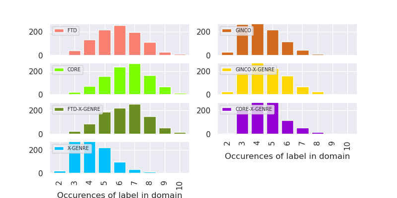

**Original MaCoCu-mk**:

**Shuffled MaCoCu-mk**:

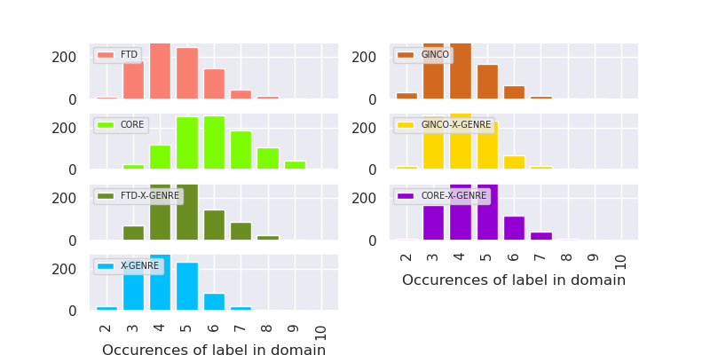

**Original MaCoCu-is**:

**Shuffled MaCoCu-is**:

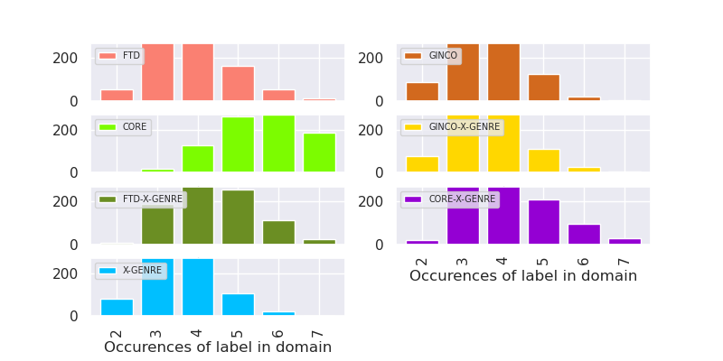

**Difference between shuffled and original corpus - MaCoCu-sl**

|   Classifier  | Accuracy - shuffled | Accuracy - original | Absolute difference (original   minus shuffled) | Relative improvement |
|:-------------:|--------------------:|--------------------:|------------------------------------------------:|---------------------:|
|    X-GENRE    |                0.43 |                0.66 |                                            0.23 |                 1.53 |
|     GINCO     |                0.43 |                0.64 |                                            0.21 |                 1.49 |
|  CORE-X-GENRE |                0.45 |                0.65 |                                             0.2 |                 1.44 |
| GINCO-X-GENRE |                0.47 |                0.67 |                                             0.2 |                 1.43 |
|      FTD      |                0.59 |                0.72 |                                            0.13 |                 1.22 |
|      CORE     |                0.65 |                0.78 |                                            0.13 |                  1.2 |
|  FTD-X-GENRE  |                0.63 |                0.75 |                                            0.12 |                 1.19 |

**Difference between shuffled and original corpus - MaCoCu-mk**

| Classifier    | Accuracy - shuffled | Accuracy - original | Absolute difference | Relative improvement |
|---------------|--------------------:|--------------------:|--------------------:|---------------------:|
| GINCO         |                 0.4 |                0.65 |                0.25 |                 1.63 |
| X-GENRE       |                0.42 |                0.68 |                0.26 |                 1.62 |
| GINCO-X-GENRE |                0.41 |                0.66 |                0.25 |                 1.61 |
| FTD           |                0.45 |                0.68 |                0.23 |                 1.51 |
| CORE-X-GENRE  |                0.45 |                0.67 |                0.22 |                 1.49 |
| FTD-X-GENRE   |                0.49 |                0.71 |                0.22 |                 1.45 |
| CORE          |                 0.6 |                0.77 |                0.17 |                 1.28 |

**Difference between shuffled and original corpus - MaCoCu-is**

| Classifier    | Accuracy - shuffled | Accuracy - original | Absolute difference | Relative improvement |
|---------------|--------------------:|--------------------:|--------------------:|---------------------:|
| X-GENRE       |                0.35 |                0.63 |                0.28 |                 1.80 |
| GINCO         |                0.36 |                0.62 |                0.26 |                 1.72 |
| FTD           |                0.38 |                0.65 |                0.27 |                 1.71 |
| GINCO-X-GENRE |                0.36 |                 0.6 |                0.24 |                 1.67 |
| FTD-X-GENRE   |                0.44 |                0.67 |                0.23 |                 1.52 |
| CORE-X-GENRE  |                0.42 |                0.63 |                0.21 |                 1.50 |
| CORE          |                0.59 |                0.76 |                0.17 |                 1.29 |

**Shuffled corpus (Slovene):**

| Classifier    |   Accuracy |   Krippendorfs Alpha |   Macro F1 |   Micro F1 |   Macro precision |   Macro recall |
|:--------------|-----------:|---------------------:|-----------:|-----------:|------------------:|---------------:|
| CORE-X-GENRE  |       0.45 |                 0.14 |       0.22 |       0.45 |              0.22 |           0.32 |
| X-GENRE       |       0.43 |                 0.12 |       0.18 |       0.43 |              0.18 |           0.27 |
| GINCO         |       0.43 |                 0.09 |       0.17 |       0.43 |              0.17 |           0.26 |
| GINCO-X-GENRE |       0.47 |                 0.07 |       0.17 |       0.47 |              0.17 |           0.26 |
| FTD-X-GENRE   |       0.63 |                -0.01 |       0.15 |       0.63 |              0.16 |           0.25 |
| CORE          |       0.65 |                -0.05 |       0.12 |       0.65 |              0.14 |           0.25 |
| FTD           |       0.59 |                -0.04 |       0.1  |       0.59 |              0.11 |           0.22 |

**Compared to the original scores (Slovene):**

| Classifier    |   Accuracy |   Krippendorfs Alpha |   Macro F1 |   Micro F1 |   Macro precision |   Macro recall |
|:--------------|-----------:|---------------------:|-----------:|-----------:|------------------:|---------------:|
| FTD-X-GENRE   |       0.75 |                 0.52 |       0.58 |       0.75 |              0.53 |           0.65 |
| CORE-X-GENRE  |       0.65 |                 0.52 |       0.56 |       0.65 |              0.53 |           0.61 |
| CORE          |       0.78 |                 0.56 |       0.54 |       0.78 |              0.49 |           0.65 |
| GINCO-X-GENRE |       0.67 |                 0.54 |       0.53 |       0.67 |              0.52 |           0.57 |
| GINCO         |       0.64 |                 0.51 |       0.51 |       0.64 |              0.49 |           0.58 |
| X-GENRE       |       0.66 |                 0.54 |       0.51 |       0.66 |              0.49 |           0.6  |
| FTD           |       0.72 |                 0.5  |       0.49 |       0.72 |              0.44 |           0.6  |

**Shuffled corpus (MaCoCu-mk)**

| Classifier    |   Accuracy |   Krippendorfs Alpha |   Macro F1 |   Micro F1 |   Macro precision |   Macro recall |
|:--------------|-----------:|---------------------:|-----------:|-----------:|------------------:|---------------:|
| CORE-X-GENRE  |       0.45 |                 0.18 |       0.21 |       0.45 |              0.22 |           0.33 |
| GINCO         |       0.4  |                 0.17 |       0.2  |       0.4  |              0.19 |           0.31 |
| FTD-X-GENRE   |       0.49 |                 0.17 |       0.2  |       0.49 |              0.2  |           0.24 |
| GINCO-X-GENRE |       0.41 |                 0.19 |       0.18 |       0.41 |              0.18 |           0.23 |
| X-GENRE       |       0.42 |                 0.17 |       0.17 |       0.42 |              0.17 |           0.26 |
| FTD           |       0.45 |                 0.12 |       0.15 |       0.45 |              0.15 |           0.23 |
| CORE          |       0.6  |                 0.07 |       0.14 |       0.6  |              0.15 |           0.26 |

**Original corpus (MaCoCu-mk)**

| Classifier    |   Accuracy |   Krippendorfs Alpha |   Macro F1 |   Micro F1 |   Macro precision |   Macro recall |
|:--------------|-----------:|---------------------:|-----------:|-----------:|------------------:|---------------:|
| FTD-X-GENRE   |       0.71 |                 0.57 |       0.52 |       0.71 |              0.49 |           0.62 |
| GINCO         |       0.65 |                 0.54 |       0.51 |       0.65 |              0.48 |           0.6  |
| CORE          |       0.77 |                 0.59 |       0.51 |       0.77 |              0.47 |           0.56 |
| CORE-X-GENRE  |       0.67 |                 0.54 |       0.51 |       0.67 |              0.47 |           0.59 |
| X-GENRE       |       0.68 |                 0.57 |       0.5  |       0.68 |              0.47 |           0.59 |
| GINCO-X-GENRE |       0.66 |                 0.54 |       0.48 |       0.66 |              0.45 |           0.56 |
| FTD           |       0.68 |                 0.55 |       0.47 |       0.68 |              0.42 |           0.57 |

**Shuffled corpus (MaCoCu-is)**

| Classifier    |   Accuracy |   Krippendorfs Alpha |   Macro F1 |   Micro F1 |   Macro precision |   Macro recall |
|:--------------|-----------:|---------------------:|-----------:|-----------:|------------------:|---------------:|
| GINCO         |       0.36 |                 0.19 |       0.23 |       0.36 |              0.22 |           0.32 |
| GINCO-X-GENRE |       0.36 |                 0.2  |       0.23 |       0.36 |              0.22 |           0.28 |
| CORE-X-GENRE  |       0.42 |                 0.14 |       0.22 |       0.42 |              0.23 |           0.31 |
| X-GENRE       |       0.35 |                 0.19 |       0.22 |       0.35 |              0.22 |           0.28 |
| FTD-X-GENRE   |       0.44 |                 0.17 |       0.21 |       0.44 |              0.22 |           0.32 |
| FTD           |       0.38 |                 0.17 |       0.17 |       0.38 |              0.18 |           0.25 |
| CORE          |       0.59 |                 0.04 |       0.14 |       0.59 |              0.15 |           0.22 |

**Original corpus (MaCoCu-is)**

| Classifier    |   Accuracy |   Krippendorfs Alpha |   Macro F1 |   Micro F1 |   Macro precision |   Macro recall |
|:--------------|-----------:|---------------------:|-----------:|-----------:|------------------:|---------------:|
| FTD-X-GENRE   |       0.67 |                 0.56 |       0.56 |       0.67 |              0.52 |           0.65 |
| GINCO-X-GENRE |       0.6  |                 0.52 |       0.54 |       0.6  |              0.53 |           0.58 |
| CORE-X-GENRE  |       0.63 |                 0.51 |       0.54 |       0.63 |              0.51 |           0.58 |
| X-GENRE       |       0.63 |                 0.55 |       0.53 |       0.63 |              0.5  |           0.61 |
| GINCO         |       0.62 |                 0.53 |       0.52 |       0.62 |              0.5  |           0.59 |
| CORE          |       0.76 |                 0.57 |       0.51 |       0.76 |              0.47 |           0.59 |
| FTD           |       0.65 |                 0.56 |       0.49 |       0.65 |              0.47 |           0.54 |

**Label distribution per domain is now much different (MaCoCu-sl):**

| label_distribution_FTD       | label_distribution_GINCO             | label_distribution_CORE                         | label_distribution_GINCO-X-GENRE   | label_distribution_FTD-X-GENRE    | label_distribution_CORE-X-GENRE   | label_distribution_X-GENRE        |
|:-----------------------------|:-------------------------------------|:------------------------------------------------|:-----------------------------------|:----------------------------------|:----------------------------------|:----------------------------------|
| ('A12 (promotion)', 0.96)    | ('Promotion', 0.77)                  | ('Informational Description/Explanation', 0.97) | ('Promotion', 0.81)                | ('Promotion', 0.95)               | ('Information/Explanation', 0.69) | ('Promotion', 0.7)                |
| ('A16 (information)', 0.03)  | ('Information/Explanation', 0.08)    | ('Narrative', 0.01)                             | ('Information/Explanation', 0.07)  | ('Information/Explanation', 0.04) | ('Instruction', 0.17)             | ('Information/Explanation', 0.14) |
| ('A1 (argumentative)', 0.01) | ('Opinion/Argumentation', 0.05)      | ('Informational Persuasion', 0.01)              | ('News', 0.06)                     | ('News', 0.01)                    | ('Opinion/Argumentation', 0.07)   | ('News', 0.09)                    |
| ('A7 (instruction)', 0.0)    | ('News/Reporting', 0.05)             | ('How-To/Instructional', 0.0)                   | ('Instruction', 0.03)              | ('Instruction', 0.0)              | ('News', 0.06)                    | ('Opinion/Argumentation', 0.05)   |
| ('A8 (news)', 0.0)           | ('List of Summaries/Excerpts', 0.02) | ('Interactive Discussion', 0.0)                 | ('Opinion/Argumentation', 0.02)    |                                   | ('Forum', 0.01)                   | ('Instruction', 0.02)             |
| ('A17 (review)', 0.0)        | ('Instruction', 0.02)                |                                                 | ('Other', 0.01)                    |                                   | ('Prose/Lyrical', 0.0)            | ('Forum', 0.0)                    |
|                              | ('Other', 0.0)                       |                                                 | ('Forum', 0.01)                    |                                   |                                   | ('Other', 0.0)                    |
|                              |                                      |                                                 |                                    |                                   |                                   |                                   |
|                              |                                      |                                                 |                                    |                                   |                                   |                                   |
|                              |                                      |                                                 |                                    |                                   |                                   |                                   |
|                              |                                      |                                                 |                                    |                                   |                                   |                                   |
|                              |                                      |                                                 |                                    |                                   |                                   |                                   |

#### Comparing schemata with Apriori algorithm

I had another idea that we could analyse which labels occur together using the apriori algorithm which is used in association rule learning.

Main concepts:

- Support: It measures the number of times a particular item or combination of items occur in a dataset out of the number of all instances.
`Support(pair) = frequency_of_pair/no_of_instances`

- Confidence: It measures how likely the pair will occur given they the left value has been predicted - number of times both have been predicted together divided by a number of time the left value has been predicted (-> if the left value occurs very often, the confidence will be smaller)
`Confidence(pair (based of occurrence of left value)) = frequency_of_pair/frequency of left value`

- Lift: A lift is a metric that determines the strength of association between the best rules. It is obtained by taking confidence (based on the frequency of the left value and right value) dand diving it with support (for right value). 
`Lift(pair (based on occurrence of left value)) = Confidence(based on occurrence of left value)/Support(right value)}`

This means that if left value is very frequent -> confidence is smaller, if the pair does not occur together very often, it won't reach the confidence limit. The frequency of right value does not impact the confidence, but it does impact the lift. For the same number of occurences of the pair, the lift is higher if one of them is infrequent than if both were frequent. The bigger support (frequency of the pair occuring together), the bigger is lift.

Parameters used: min_support=0.01, min_confidence=0.50, min_lift=1.0

Results of comparison based on the apriori rules: see the Mapping to CORE-table (Določanje žanrov > Mapping to CORE), sheet "X-GENRE-schema-apriori-analysis".