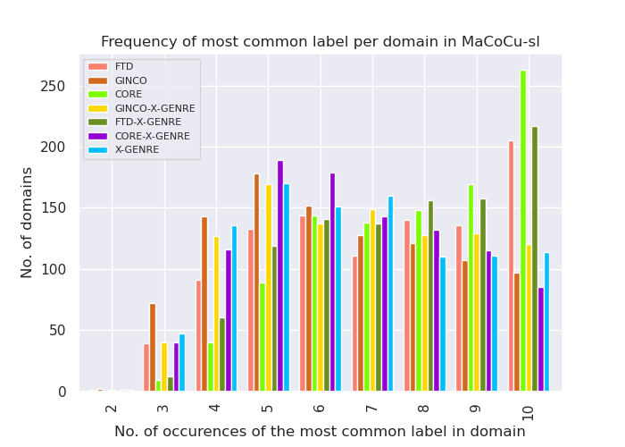
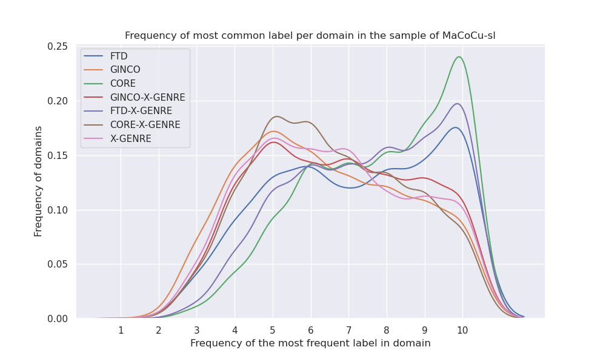

# Comparison of classifiers on the second sample of MaCoCu-sl

I re-did all experiments on a new sample of MaCoCu-sl, where I chosen 500 random domains above and 500 random domains below the median instead of the domains around the median (as I did in the first sample.)

#### Comparison of confidence of the predictions

- no big differences with sample1

| classifier    |   min |   median |   max |
|:--------------|------:|---------:|------:|
| X-GENRE       |  0.33 |     1    |  1    |
| GINCO-X-GENRE |  0.26 |     0.99 |  0.99 |
| GINCO         |  0.25 |     0.94 |  0.98 |
| CORE          |  0.25 |     0.86 |  0.99 |
| FTD-X-GENRE   |  0.19 |     0.86 |  0.97 |
| FTD           |  0.16 |     0.78 |  0.96 |
| CORE-X-GENRE  |  0.15 |     0.54 |  0.95 |

#### Most frequent label (on instance level) per classifier:

| classifier    | most frequent label                   |   frequency |
|:--------------|:--------------------------------------|------------:|
| FTD           | A12 (promotion)                       |        0.59 |
| GINCO         | Promotion                             |        0.4  |
| CORE          | Informational Description/Explanation |        0.65 |
| GINCO-X-GENRE | Promotion                             |        0.45 |
| FTD-X-GENRE   | Promotion                             |        0.63 |
| CORE-X-GENRE  | Information/Explanation               |        0.41 |
| X-GENRE       | Promotion                             |        0.39 |

#### Comparison of label distribution (instance level)

| label_distribution_FTD          | label_distribution_GINCO                | label_distribution_CORE                            | label_distribution_GINCO-X-GENRE  | label_distribution_FTD-X-GENRE       | label_distribution_CORE-X-GENRE      | label_distribution_X-GENRE           |
|------------------------------------|--------------------------------------------|-------------------------------------------------------|--------------------------------------|-----------------------------------------|-----------------------------------------|-----------------------------------------|
| ('A12 (promotion)', 0.59)       | ('Promotion', 0.4)                      | ('Informational Description/Explanation', 0.65) | ('Promotion', 0.45)               | ('Promotion', 0.63)                  | ('Information/Explanation', 0.41) | ('Promotion', 0.39)                  |
| ('A16 (information)', 0.13)     | ('Information/Explanation', 0.14)       | ('Informational Persuasion', 0.12)                 | ('Information/Explanation', 0.15) | ('Information/Explanation', 0.17) | ('Instruction', 0.2)                 | ('Information/Explanation', 0.18) |
| ('A1 (argumentative)', 0.07) | ('Opinion/Argumentation', 0.12)         | ('Narrative', 0.11)                                | ('News', 0.14)                    | ('News', 0.08)                       | ('Opinion/Argumentation', 0.14)      | ('News', 0.15)                       |
| ('A8 (news)', 0.05)             | ('News/Reporting', 0.12)                | ('How-To/Instructional', 0.05)                     | ('Opinion/Argumentation', 0.1)    | ('Instruction', 0.06)                | ('News', 0.13)                       | ('Opinion/Argumentation', 0.12)      |
| ('A7 (instruction)', 0.05)      | ('List of Summaries/Excerpts', 0.08) | ('Opinion', 0.04)                                  | ('Instruction', 0.08)             | ('Opinion/Argumentation', 0.03)      | ('Forum', 0.07)                      | ('Instruction', 0.09)                |
| ('A17 (review)', 0.05)          | ('Instruction', 0.07)                   | ('Interactive Discussion', 0.02)                   | ('Other', 0.06)                   | ('Legal', 0.02)                      | ('Prose/Lyrical', 0.02)              | ('Other', 0.03)                      |
| ('A11 (personal)', 0.03)        | ('Other', 0.03)                         | ('Spoken', 0.01)                                   | ('Forum', 0.02)                   | ('Prose/Lyrical', 0.01)              | ('Other', 0.02)                      | ('Forum', 0.02)                      |
| ('A9 (legal)', 0.02)            | ('Forum', 0.02)                         | ('Lyrical', 0.0)                                   | ('Legal', 0.01)                   |                                      |                                         | ('Legal', 0.02)                      |
| ('A4 (fiction)', 0.01)          | ('Legal/Regulation', 0.01)              |                                                    | ('Prose/Lyrical', 0.0)            |                                      |                                         | ('Prose/Lyrical', 0.01)              |
| ('A14 (academic)', 0.0)         |                                         |                                                       |                                      |                                         |                                         |                                         |

#### Comparison of frequency of prediction of the most frequent label per domain

#### Comparison of label distribution on the domain level

Table shows in how many of the domains a label is the most frequent label in the domain. The values in the table are percentages.

| most frequent label in domain: FTD | most frequent label in domain: GINCO | most frequent label in domain: CORE                | most frequent label in domain: GINCO-X-GENRE | most frequent label in domain: FTD-X-GENRE | most frequent label in domain: CORE-X-GENRE | most frequent label in domain: X-GENRE |
|---------------------------------------|-----------------------------------------|-------------------------------------------------------|-------------------------------------------------|-----------------------------------------------|------------------------------------------------|-------------------------------------------|
| ('A12 (promotion)', 0.7)           | ('Promotion', 0.5)                   | ('Informational Description/Explanation', 0.73) | ('Promotion', 0.53)                          | ('Promotion', 0.72)                        | ('Information/Explanation', 0.47)           | ('Promotion', 0.46)                    |
| ('A16 (information)', 0.09)        | ('Information/Explanation', 0.13)    | ('Informational Persuasion', 0.1)                  | ('News', 0.14)                               | ('Information/Explanation', 0.13)          | ('Instruction', 0.19)                       | ('Information/Explanation', 0.16)      |
| ('A1 (argumentative)', 0.06)       | ('News/Reporting', 0.13)             | ('Narrative', 0.09)                                | ('Information/Explanation', 0.13)            | ('News', 0.07)                             | ('Opinion/Argumentation', 0.13)             | ('News', 0.16)                         |
| ('A8 (news)', 0.05)                | ('Opinion/Argumentation', 0.11)      | ('How-To/Instructional', 0.04)                     | ('Opinion/Argumentation', 0.09)              | ('Instruction', 0.04)                      | ('News', 0.12)                              | ('Opinion/Argumentation', 0.1)         |
| ('A17 (review)', 0.04)             | ('Instruction', 0.05)                | ('Interactive Discussion', 0.02)                   | ('Instruction', 0.05)                        | ('Opinion/Argumentation', 0.03)            | ('Forum', 0.06)                             | ('Instruction', 0.07)                  |
| ('A7 (instruction)', 0.03)         | ('List of Summaries/Excerpts', 0.04) | ('Opinion', 0.02)                                  | ('Other', 0.03)                              | ('Legal', 0.01)                            | ('Prose/Lyrical', 0.02)                     | ('Forum', 0.03)                        |
| ('A11 (personal)', 0.02)           | ('Forum', 0.03)                      | ('Lyrical', 0.0)                                   | ('Forum', 0.02)                              | ('Prose/Lyrical', 0.01)                    | ('Other', 0.01)                             | ('Other', 0.01)                        |
| ('A9 (legal)', 0.01)               | ('Other', 0.01)                      | ('Spoken', 0.0)                                    | ('Legal', 0.0)                               |                                            |                                                | ('Legal', 0.01)                        |
| ('A4 (fiction)', 0.0)              | ('Legal/Regulation', 0.0)            |                                                    | ('Prose/Lyrical', 0.0)                       |                                            |                                                | ('Prose/Lyrical', 0.0)                 |
| ('A14 (academic)', 0.0)            |                                      |                                                       |                                                 |                                               |                                                |                                           |

#### Precision, recall and F1 scores using domain information as a signal of a "true label"

We used the most frequent label predicted on the domain as the "true label". Biggest values for each metric are in bold.

| Classifier    |   Macro F1 |   Micro F1 |   Macro precision |   Macro recall |
|:--------------|-----------:|-----------:|------------------:|---------------:|
| FTD-X-GENRE   |       **0.58** |       0.75 |              **0.53** |           **0.65** |
| CORE-X-GENRE  |       0.56 |       0.65 |              **0.53** |           0.61 |
| CORE          |       0.54 |       **0.78** |              0.49 |           **0.65** |
| GINCO-X-GENRE |       0.53 |       0.67 |              0.52 |           0.57 |
| GINCO         |       0.51 |       0.64 |              0.49 |           0.58 |
| X-GENRE       |       0.51 |       0.66 |              0.49 |           0.6  |
| FTD           |       0.49 |       0.72 |              0.44 |           0.6  |

#### Comparison of X-GENRE classifier's performance based on X-GENRE majority label

I calculated the evaluation metrics for the X-GENRE classifiers (classifiers which use the X-GENRE schema) by taking the majority label (label predicted by most of the classifiers) as the "y_true" label. If there was a tie (more than 1 most common label), I randomly chose the majority label out of them.

Number of ties:

|     |   X-GENRE-majority-label-tie |
|:----|-----------------------------:|
| no  |                       0.8954 |
| yes |                       0.1046 |

Distribution of majority X-GENRE labels:

|                         |   X-GENRE-majority-label |
|:------------------------|-------------------------:|
| Promotion               |                   0.4265 |
| Information/Explanation |                   0.1902 |
| News                    |                   0.1347 |
| Opinion/Argumentation   |                   0.0918 |
| Instruction             |                   0.0861 |
| Forum                   |                   0.0252 |
| Other                   |                   0.0243 |
| Legal                   |                   0.0141 |
| Prose/Lyrical           |                   0.0071 |

Results:

| Classifier    |   Macro F1 |   Micro F1 |   Macro precision |   Macro recall |
|:--------------|-----------:|-----------:|------------------:|---------------:|
| X-GENRE       |       **0.87** |       **0.89** |              **0.86** |           **0.89** |
| GINCO-X-GENRE |       0.73 |       0.86 |              0.85 |           0.73 |
| FTD-X-GENRE   |       0.67 |       0.73 |              0.74 |           0.69 |
| CORE-X-GENRE  |       0.5  |       0.56 |              0.41 |           0.74 |

#### Comparison of X-GENRE classifier agreement

I used the predictions of one classifier as y_true, and the predictions of the other as y_pred. I did it in both directions, just to check how the results change.
FTD-X-GENRE has less labels than the other (7, instead of 9), so whenever this classifier was in the pair, I used 7 labels for calculation of the evaluation metrics.

| Classifier as y_true   | Classifier as y_pred   |   Macro F1 |   Micro F1 |   Macro precision |   Macro recall |
|:-----------------------|:-----------------------|-----------:|-----------:|------------------:|---------------:|
| GINCO-X-GENRE          | X-GENRE                |       **0.67** |       **0.79** |              0.64 |           0.79 |
| X-GENRE                | GINCO-X-GENRE          |       0.67 |       0.79 |              **0.79**|           0.64 |
| FTD-X-GENRE            | X-GENRE                |       0.6  |       0.66 |              0.63 |           0.67 |
| X-GENRE                | FTD-X-GENRE            |       0.6  |       0.66 |              0.67 |           0.63 |
| GINCO-X-GENRE          | FTD-X-GENRE            |       0.52 |       0.68 |              0.55 |           0.65 |
| FTD-X-GENRE            | GINCO-X-GENRE          |       0.52 |       0.68 |              0.65 |           0.55 |
| X-GENRE                | CORE-X-GENRE           |       0.45 |       0.51 |              0.38 |           0.**68** |
| GINCO-X-GENRE          | CORE-X-GENRE           |       0.37 |       0.45 |              0.31 |           0.68 |
| CORE-X-GENRE           | X-GENRE                |       0.35 |       0.41 |              0.53 |           0.3  |
| FTD-X-GENRE            | CORE-X-GENRE           |       0.28 |       0.27 |              0.2  |           0.49 |
| CORE-X-GENRE           | GINCO-X-GENRE          |       0.28 |       0.35 |              0.53 |           0.24 |
| CORE-X-GENRE           | FTD-X-GENRE            |       0.28 |       0.27 |              0.49 |           0.2  |