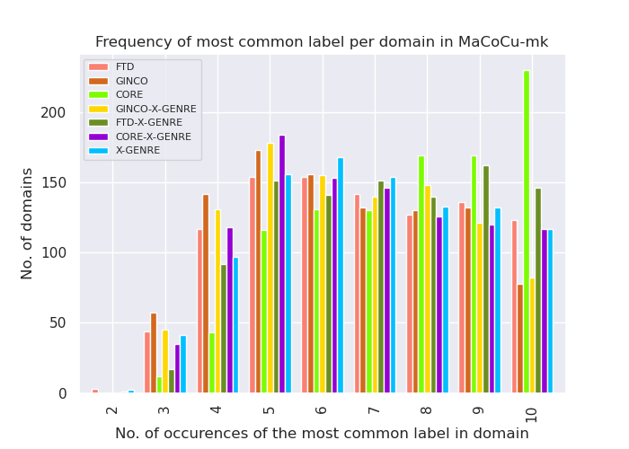
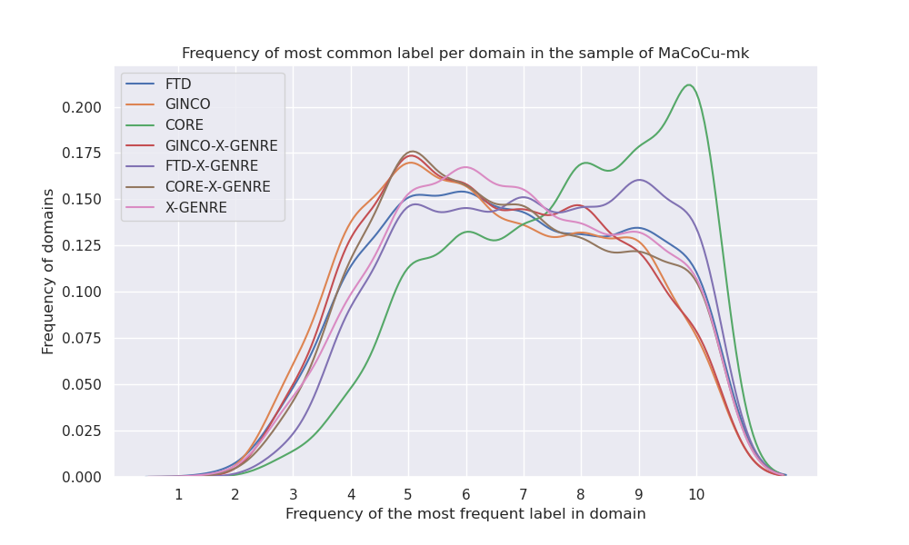

# Comparison of classifiers on the second sample of MaCoCu-sl and on MaCoCu-mk

I re-did all experiments on a new sample of MaCoCu-sl, where I chosen 500 random domains above and 500 random domains below the median instead of the domains around the median (as I did in the first sample.)

I then extended the experiments to the Macedonian dataset - MaCoCu-mk - as well, following the same steps as with the MaCoCu-sl.

#### Comparison of confidence of the predictions

MaCoCu-sl
- no big differences with sample1

| classifier    |   min |   median |   max |
|:--------------|------:|---------:|------:|
| X-GENRE       |  0.33 |     1    |  1    |
| GINCO-X-GENRE |  0.26 |     0.99 |  0.99 |
| GINCO         |  0.25 |     0.94 |  0.98 |
| CORE          |  0.25 |     0.86 |  0.99 |
| FTD-X-GENRE   |  0.19 |     0.86 |  0.97 |
| FTD           |  0.16 |     0.78 |  0.96 |
| CORE-X-GENRE  |  0.15 |     0.54 |  0.95 |

MaCoCu-mk

| classifier    |   min |   median |   max |
|:--------------|------:|---------:|------:|
| X-GENRE       |  0.32 |     1    |  1    |
| GINCO-X-GENRE |  0.28 |     0.98 |  0.99 |
| GINCO         |  0.24 |     0.95 |  0.98 |
| CORE          |  0.24 |     0.91 |  0.99 |
| FTD-X-GENRE   |  0.22 |     0.83 |  0.97 |
| FTD           |  0.16 |     0.77 |  0.96 |
| CORE-X-GENRE  |  0.15 |     0.64 |  0.95 |

The median confidence of CORE and CORE-X-GENRE is bigger on MaCoCu-mk (5-10 points).

#### Most frequent label (on instance level) per classifier

MaCoCu-sl:
- The frequency of the most frequent label between sample1 and sample2 of MaCoCu-sl changed only slightly (up to 5 percent) - it is slightly less frequent now.

| classifier    | most frequent label                   |   frequency |
|:--------------|:--------------------------------------|------------:|
| FTD           | A12 (promotion)                       |        0.59 |
| GINCO         | Promotion                             |        0.4  |
| CORE          | Informational Description/Explanation |        0.65 |
| GINCO-X-GENRE | Promotion                             |        0.45 |
| FTD-X-GENRE   | Promotion                             |        **0.63** |
| CORE-X-GENRE  | Information/Explanation               |        0.41 |
| X-GENRE       | Promotion                             |        0.39 |

MaCoCu-mk:

| classifier    | most frequent label                   |   frequency |
|:--------------|:--------------------------------------|------------:|
| FTD           | A12 (promotion)                       |        0.42 |
| GINCO         | News/Reporting                        |        0.31 |
| CORE          | Informational Description/Explanation |        0.58 |
| GINCO-X-GENRE | News                                  |        0.31 |
| FTD-X-GENRE   | Promotion                             |        0.44 |
| CORE-X-GENRE  | Information/Explanation               |        0.36 |
| X-GENRE       | News                                  |        0.34 |

Slovene and Macedonian datasets differ in terms of which label was shown to be the most frequent in some of the classifiers. FTD and FTD-X-GENRE still predict Promotion as the most frequent label, but with a smaller frequency (17-19 points smaller). According to GINCO, X-GENRE and GINCO-X-GENRE, the most frequent label in MK (= MaCoCu-mk) is News (in SL, it is Promotion), while CORE still predicts Information/Explanation as the most frequent label, but it is a bit less frequently predicted in MK (5-7 points less frequent).

It seems that the label distribution is a bit less ruled by just one label as in SL (=MaCoCu-sl).

<!-- 

#### Comparison of label distribution (instance level)

MaCoCu-sl:
- Label distribution between sample1 and sample2 of MaCoCu-sl remains more or less the same (very small differences between the samples).

| label_distribution_FTD          | label_distribution_GINCO                | label_distribution_CORE                            | label_distribution_GINCO-X-GENRE  | label_distribution_FTD-X-GENRE       | label_distribution_CORE-X-GENRE      | label_distribution_X-GENRE           |
|------------------------------------|--------------------------------------------|-------------------------------------------------------|--------------------------------------|-----------------------------------------|-----------------------------------------|-----------------------------------------|
| ('A12 (promotion)', 0.59)       | ('Promotion', 0.4)                      | ('Informational Description/Explanation', 0.65) | ('Promotion', 0.45)               | ('Promotion', **0.63**)                  | ('Information/Explanation', 0.41) | ('Promotion', 0.39)                  |
| ('A16 (information)', 0.13)     | ('Information/Explanation', 0.14)       | ('Informational Persuasion', 0.12)                 | ('Information/Explanation', 0.15) | ('Information/Explanation', 0.17) | ('Instruction', 0.2)                 | ('Information/Explanation', 0.18) |
| ('A1 (argumentative)', 0.07) | ('Opinion/Argumentation', 0.12)         | ('Narrative', 0.11)                                | ('News', 0.14)                    | ('News', 0.08)                       | ('Opinion/Argumentation', 0.14)      | ('News', 0.15)                       |
| ('A8 (news)', 0.05)             | ('News/Reporting', 0.12)                | ('How-To/Instructional', 0.05)                     | ('Opinion/Argumentation', 0.1)    | ('Instruction', 0.06)                | ('News', 0.13)                       | ('Opinion/Argumentation', 0.12)      |
| ('A7 (instruction)', 0.05)      | ('List of Summaries/Excerpts', 0.08) | ('Opinion', 0.04)                                  | ('Instruction', 0.08)             | ('Opinion/Argumentation', 0.03)      | ('Forum', 0.07)                      | ('Instruction', 0.09)                |
| ('A17 (review)', 0.05)          | ('Instruction', 0.07)                   | ('Interactive Discussion', 0.02)                   | ('Other', 0.06)                   | ('Legal', 0.02)                      | ('Prose/Lyrical', 0.02)              | ('Other', 0.03)                      |
| ('A11 (personal)', 0.03)        | ('Other', 0.03)                         | ('Spoken', 0.01)                                   | ('Forum', 0.02)                   | ('Prose/Lyrical', 0.01)              | ('Other', 0.02)                      | ('Forum', 0.02)                      |
| ('A9 (legal)', 0.02)            | ('Forum', 0.02)                         | ('Lyrical', 0.0)                                   | ('Legal', 0.01)                   |                                      |                                         | ('Legal', 0.02)                      |
| ('A4 (fiction)', 0.01)          | ('Legal/Regulation', 0.01)              |                                                    | ('Prose/Lyrical', 0.0)            |                                      |                                         | ('Prose/Lyrical', 0.01)              |
| ('A14 (academic)', 0.0)         |                                         |                                                       |                                      |                                         |                                         |                                         |

 -->

#### Comparison of frequency of prediction of the most frequent label per domain

MaCoCu-sl: distributions in sample2 are very similar to the sample1.

MaCoCu-mk:

We can see that CORE still has the highest frequency of prediction of the most frequent label per domain, but all other classifiers are now much more similar to each other.

MaCoCu-sl:

MaCoCu-mk:

MaCoCu-sl:

MaCoCu-mk:

#### Comparison of label distribution on the domain level

When comparing the two samples of MaCoCu-sl, frequency of the most frequent label on domain level is slightly smaller for all classifiers, but only up to 5 points. Otherwise, the distributions are very similar.

Table shows in how many of the domains a label is the most frequent label in the domain. The values in the table are percentages.

MaCoCu-sl:

| most frequent label in domain: FTD | most frequent label in domain: GINCO | most frequent label in domain: CORE                | most frequent label in domain: GINCO-X-GENRE | most frequent label in domain: FTD-X-GENRE | most frequent label in domain: CORE-X-GENRE | most frequent label in domain: X-GENRE |
|---------------------------------------|-----------------------------------------|-------------------------------------------------------|-------------------------------------------------|-----------------------------------------------|------------------------------------------------|-------------------------------------------|
| ('A12 (promotion)', 0.7)           | ('Promotion', 0.5)                   | ('Informational Description/Explanation', 0.73) | ('Promotion', 0.53)                          | ('Promotion', 0.72)                        | ('Information/Explanation', 0.47)           | ('Promotion', 0.46)                    |
| ('A16 (information)', 0.09)        | ('Information/Explanation', 0.13)    | ('Informational Persuasion', 0.1)                  | ('News', 0.14)                               | ('Information/Explanation', 0.13)          | ('Instruction', 0.19)                       | ('Information/Explanation', 0.16)      |
| ('A1 (argumentative)', 0.06)       | ('News/Reporting', 0.13)             | ('Narrative', 0.09)                                | ('Information/Explanation', 0.13)            | ('News', 0.07)                             | ('Opinion/Argumentation', 0.13)             | ('News', 0.16)                         |
| ('A8 (news)', 0.05)                | ('Opinion/Argumentation', 0.11)      | ('How-To/Instructional', 0.04)                     | ('Opinion/Argumentation', 0.09)              | ('Instruction', 0.04)                      | ('News', 0.12)                              | ('Opinion/Argumentation', 0.1)         |
| ('A17 (review)', 0.04)             | ('Instruction', 0.05)                | ('Interactive Discussion', 0.02)                   | ('Instruction', 0.05)                        | ('Opinion/Argumentation', 0.03)            | ('Forum', 0.06)                             | ('Instruction', 0.07)                  |
| ('A7 (instruction)', 0.03)         | ('List of Summaries/Excerpts', 0.04) | ('Opinion', 0.02)                                  | ('Other', 0.03)                              | ('Legal', 0.01)                            | ('Prose/Lyrical', 0.02)                     | ('Forum', 0.03)                        |
| ('A11 (personal)', 0.02)           | ('Forum', 0.03)                      | ('Lyrical', 0.0)                                   | ('Forum', 0.02)                              | ('Prose/Lyrical', 0.01)                    | ('Other', 0.01)                             | ('Other', 0.01)                        |
| ('A9 (legal)', 0.01)               | ('Other', 0.01)                      | ('Spoken', 0.0)                                    | ('Legal', 0.0)                               |                                            |                                                | ('Legal', 0.01)                        |
| ('A4 (fiction)', 0.0)              | ('Legal/Regulation', 0.0)            |                                                    | ('Prose/Lyrical', 0.0)                       |                                            |                                                | ('Prose/Lyrical', 0.0)                 |
| ('A14 (academic)', 0.0)            |                                      |                                                       |                                                 |                                               |                                                |                                           |

MaCoCu-mk:

| most frequent label in domain: FTD | most frequent label in domain: GINCO | most frequent label in domain: CORE                | most frequent label in domain: GINCO-X-GENRE | most frequent label in domain: FTD-X-GENRE | most frequent label in domain: CORE-X-GENRE | most frequent label in domain: X-GENRE |
|---------------------------------------|-----------------------------------------|-------------------------------------------------------|-------------------------------------------------|-----------------------------------------------|------------------------------------------------|-------------------------------------------|
| ('A12 (promotion)', 0.5)           | ('News/Reporting', 0.41)             | ('Informational Description/Explanation', **0.63**) | ('News', 0.38)                               | ('Promotion', 0.48)                        | ('Information/Explanation', 0.41)           | ('News', 0.41)                         |
| ('A8 (news)', 0.22)                | ('Promotion', 0.26)                  | ('Narrative', 0.24)                                | ('Promotion', 0.33)                          | ('News', 0.3)                              | ('News', 0.34)                              | ('Promotion', 0.3)                     |
| ('A1 (argumentative)', 0.12)       | ('Information/Explanation', 0.17)    | ('Informational Persuasion', 0.06)                 | ('Information/Explanation', 0.17)            | ('Information/Explanation', 0.16)          | ('Instruction', 0.11)                       | ('Information/Explanation', 0.15)      |
| ('A16 (information)', 0.09)        | ('Opinion/Argumentation', 0.07)      | ('Opinion', 0.03)                                  | ('Opinion/Argumentation', 0.05)              | ('Instruction', 0.03)                      | ('Opinion/Argumentation', 0.09)             | ('Opinion/Argumentation', 0.06)        |
| ('A17 (review)', 0.03)             | ('List of Summaries/Excerpts', 0.04) | ('How-To/Instructional', 0.02)                     | ('Instruction', 0.03)                        | ('Legal', 0.02)                            | ('Forum', 0.03)                             | ('Instruction', 0.05)                  |
| ('A7 (instruction)', 0.03)         | ('Instruction', 0.03)                | ('Interactive Discussion', 0.01)                   | ('Other', 0.03)                              | ('Opinion/Argumentation', 0.02)            | ('Prose/Lyrical', 0.01)                     | ('Forum', 0.01)                        |
| ('A9 (legal)', 0.01)               | ('Forum', 0.01)                      | ('Lyrical', 0.0)                                   | ('Forum', 0.01)                              | ('Prose/Lyrical', 0.0)                     | ('Other', 0.0)                              | ('Legal', 0.01)                        |
| ('A4 (fiction)', 0.0)              | ('Other', 0.01)                      | ('Spoken', 0.0)                                    | ('Legal', 0.0)                               |                                            |                                                | ('Other', 0.01)                        |
| ('A14 (academic)', 0.0)            | ('Legal/Regulation', 0.0)            |                                                    |                                                 |                                               |                                                | ('Prose/Lyrical', 0.0)                 |
| ('A11 (personal)', 0.0)            |                                      |                                                       |                                                 |                                               |                                                |                                           |

#### Precision, recall and F1 scores using domain information as a signal of a "true label"

We used the most frequent label predicted on the domain as the "true label". Biggest values for each metric are in bold.

MaCoCu-sl:
- in sample1, the ranking based on Macro F1 was FTD-X-GENRE (0.57), GINCO-X-GENRE and CORE-X-GENRE (sharing the 2nd spot: 0.53), FTD (0.52), CORE and X-GENRE (0.51), GINCO (0.49).

- in sample2, CORE has a slightly higher Macro F1 score, ranking is: FTD-X-GENRE (0.58), CORE-X-GENRE (0.56), CORE (0.54), GINCO-X-GENRE (0.53), GINCO and X-GENRE (0.51), FTD (0.49). However, in both samples, all scores are pretty similar.

| Classifier    |   Macro F1 |   Micro F1 |   Macro precision |   Macro recall |
|:--------------|-----------:|-----------:|------------------:|---------------:|
| FTD-X-GENRE   |       **0.58** |       0.75 |              **0.53** |           **0.65** |
| CORE-X-GENRE  |       0.56 |       0.65 |              **0.53** |           0.61 |
| CORE          |       0.54 |       **0.78** |              0.49 |           **0.65** |
| GINCO-X-GENRE |       0.53 |       0.67 |              0.52 |           0.57 |
| GINCO         |       0.51 |       0.64 |              0.49 |           0.58 |
| X-GENRE       |       0.51 |       0.66 |              0.49 |           0.6  |
| FTD           |       0.49 |       0.72 |              0.44 |           0.6  |

MaCoCu-mk:

| Classifier    |   Macro F1 |   Micro F1 |   Macro precision |   Macro recall |
|:--------------|-----------:|-----------:|------------------:|---------------:|
| FTD-X-GENRE   |       **0.53** |       0.71 |              **0.5**  |           **0.62** |
| CORE          |       0.52 |       **0.77** |              0.48 |           **0.62** |
| GINCO         |       0.51 |       0.65 |              0.48 |           **0.62** |
| CORE-X-GENRE  |       0.51 |       0.67 |              0.48 |           0.59 |
| X-GENRE       |       0.5  |       0.68 |              0.47 |           0.58 |
| GINCO-X-GENRE |       0.47 |       0.66 |              0.45 |           0.56 |
| FTD           |       0.46 |       0.68 |              0.41 |           0.58 |

The scores are similar to the MaCoCu-sl and there are no big differences in the ranking order. The scores are slighlty smaller, I assume the reason for this is that the MaCoCu-mk is slightly more diverse in terms of the percentage of texts in the most frequent genre, and that is why just predicting one genre gave worse scores to the classifiers that are biased towards one genre (FTD prefers Promotion, CORE prefers Information/Explanation).

#### Comparison of X-GENRE classifier's performance based on X-GENRE majority label

I calculated the evaluation metrics for the X-GENRE classifiers (classifiers which use the X-GENRE schema) by taking the majority label (label predicted by most of the classifiers) as the "y_true" label. If there was a tie (more than 1 most common label), I randomly chose the majority label out of them. There were around 10 % of ties in all datasets.

**Distribution of majority X-GENRE labels in MaCoCu-sl**

Distribution is very similar to the sample1.

|                         |   X-GENRE-majority-label |
|:------------------------|-------------------------:|
| Promotion               |                   0.4265 |
| Information/Explanation |                   0.1902 |
| News                    |                   0.1347 |
| Opinion/Argumentation   |                   0.0918 |
| Instruction             |                   0.0861 |
| Forum                   |                   0.0252 |
| Other                   |                   0.0243 |
| Legal                   |                   0.0141 |
| Prose/Lyrical           |                   0.0071 |

**Distribution of majority X-GENRE labels in MaCoCu-mk**

|                         |   X-GENRE-majority-label |
|:------------------------|-------------------------:|
| News                    |                   0.3261 |
| Promotion               |                   0.2827 |
| Information/Explanation |                   0.2103 |
| Instruction             |                   0.0617 |
| Opinion/Argumentation   |                   0.0586 |
| Legal                   |                   0.0202 |
| Other                   |                   0.0201 |
| Forum                   |                   0.0121 |
| Prose/Lyrical           |                   0.0082 |

In contrast to SL, in MK, the most frequent label is News, not Promotion. The second most frequent labels is Promotion, while in the SL, it is Information/Explanation.

**Results - MaCoCu-sl**

The ranking remains the same as in sample1, only the values are mostly a couple of points slightly higher. No big differences between the samples were observed, though.

| Classifier    |   Macro F1 |   Micro F1 |   Macro precision |   Macro recall |
|:--------------|-----------:|-----------:|------------------:|---------------:|
| X-GENRE       |       **0.87** |       **0.89** |              **0.86** |           **0.89** |
| GINCO-X-GENRE |       0.73 |       0.86 |              0.85 |           0.73 |
| FTD-X-GENRE   |       0.67 |       0.73 |              0.74 |           0.69 |
| CORE-X-GENRE  |       0.5  |       0.56 |              0.41 |           0.74 |

**Results - MaCoCu-mk**

| Classifier    |   Macro F1 |   Micro F1 |   Macro precision |   Macro recall |
|:--------------|-----------:|-----------:|------------------:|---------------:|
| X-GENRE       |       **0.85** |       **0.9**  |              **0.83** |           **0.87** |
| FTD-X-GENRE   |       0.7  |       0.78 |              0.75 |           0.72 |
| GINCO-X-GENRE |       0.69 |       0.85 |              0.81 |           0.7  |
| CORE-X-GENRE  |       0.57 |       0.67 |              0.48 |           **0.79** |

The classifiers seem to be more comparable based on the results in MaCoCu-mk sample in all cases except in the case of GINCO-X-GENRE where the scores are slightly lower. However, in general, scores are quite similar. X-GENRE remains the most similar to the majority results.

#### Comparison of X-GENRE classifier agreement

I used the predictions of one classifier as y_true, and the predictions of the other as y_pred. I did it in both directions, just to check how the results change.
FTD-X-GENRE has less labels than the other (7, instead of 9), so whenever this classifier was in the pair, I used 7 labels for calculation of the evaluation metrics.

**MaCoCu-sl**

The ranking order is the same as in sample1 and the results are very similar as well. CORE-X-GENRE now has a bit higher scores when in combination with GINCO-X-GENRE and X-GENRE (up to 5 points bigger Macro F1).

| Classifier as y_true   | Classifier as y_pred   |   Macro F1 |   Micro F1 |   Macro precision |   Macro recall |
|:-----------------------|:-----------------------|-----------:|-----------:|------------------:|---------------:|
| GINCO-X-GENRE          | X-GENRE                |       **0.67** |       ****0.79**** |              0.64 |           **0.79** |
| X-GENRE                | GINCO-X-GENRE          |       0.67 |       **0.79** |              ****0.79****|           0.64 |
| FTD-X-GENRE            | X-GENRE                |       0.6  |       0.66 |              **0.63** |           0.67 |
| X-GENRE                | FTD-X-GENRE            |       0.6  |       0.66 |              0.67 |           **0.63** |
| GINCO-X-GENRE          | FTD-X-GENRE            |       0.52 |       0.68 |              0.55 |           0.65 |
| FTD-X-GENRE            | GINCO-X-GENRE          |       0.52 |       0.68 |              0.65 |           0.55 |
| X-GENRE                | CORE-X-GENRE           |       0.45 |       0.51 |              0.38 |           0.**68** |
| CORE-X-GENRE           | X-GENRE                |       0.35 |       0.41 |              0.53 |           0.3  |
| GINCO-X-GENRE          | CORE-X-GENRE           |       0.37 |       0.45 |              0.31 |           0.68 |
| CORE-X-GENRE           | GINCO-X-GENRE          |       0.28 |       0.35 |              0.53 |           0.24 |
| FTD-X-GENRE            | CORE-X-GENRE           |       0.28 |       0.27 |              0.2  |           0.49 |
| CORE-X-GENRE           | FTD-X-GENRE            |       0.28 |       0.27 |              0.49 |           0.2  |

**MaCoCu-mk**

Results are similar as in MaCoCu-sl. Based on Macro F1, FTD-X-GENE and GINCO-X-GENRE are the most similar to the X-GENRE classifier, with the same Macro F1 scores. Based on Micro F1, GINCO-X-GENRE is more similar. After these pairs, GINCO-X-GENRE and FTD-X-GENRE are similar. CORE-X-GENRE is the least similar to all others.

| Classifier as y_true   | Classifier as y_pred   |   Macro F1 |   Micro F1 |   Macro precision |   Macro recall |
|:-----------------------|:-----------------------|-----------:|-----------:|------------------:|---------------:|
| GINCO-X-GENRE          | X-GENRE                |       **0.63** |       **0.79** |              0.62 |           **0.77** |
| FTD-X-GENRE            | X-GENRE                |       **0.63** |       0.71 |              0.66 |           0.67 |
| X-GENRE                | GINCO-X-GENRE          |       **0.63** |       **0.79** |              **0.77** |           0.62 |
| X-GENRE                | FTD-X-GENRE            |       **0.63** |       0.71 |              0.67 |           0.66 |
| GINCO-X-GENRE          | FTD-X-GENRE            |       0.53 |       0.71 |              0.54 |           0.67 |
| FTD-X-GENRE            | GINCO-X-GENRE          |       0.53 |       0.71 |              0.67 |           0.54 |
| X-GENRE                | CORE-X-GENRE           |       0.51 |       0.62 |              0.44 |           0.71 |
| CORE-X-GENRE           | X-GENRE                |       0.4  |       0.53 |              0.55 |           0.34 |
| GINCO-X-GENRE          | CORE-X-GENRE           |       0.38 |       0.57 |              0.35 |           0.68 |
| FTD-X-GENRE            | CORE-X-GENRE           |       0.34 |       0.44 |              0.27 |           0.5  |
| CORE-X-GENRE           | FTD-X-GENRE            |       0.34 |       0.44 |              0.5  |           0.27 |
| CORE-X-GENRE           | GINCO-X-GENRE          |       0.3  |       0.48 |              0.53 |           0.27 |

Results of comparison based on the apriori rules: see the Mapping to CORE-table (Določanje žanrov > Mapping to CORE), sheet "X-GENRE-schema-apriori-analysis".