Most recent results: [Comparison of classifiers based on MaCoCu-sl and domain information](#comparison-of-predictions-based-on-domain-url-information-from-a-test-corpus)

# Comparison of genre datasets: CORE, GINCO and FTD

We compare genre datasets that aim to cover all of the genre diversity found on the web: the CORE dataset, the GINCO dataset and the FTD dataset.

To this end, we perform text classification experiments:
* baseline experiments: in-dataset experiments (training and testing on the same dataset)
* cross-dataset experiments: training on one dataset, applying prediction on the other two - to analyse the comparability of labels (which labels are predicted as which)
* multi-dataset experiments: merging the labels into a joint schema, and training on a combination of all three datasets - using the joint schema, testing on each dataset (+ on a combination of the datasets)

We then also evaluate the schemata by applying all classifiers to a sample from a web corpus where we group the documents based on their URLs. See [the section on comparison based on domain (URL) information](#comparison-of-predictions-based-on-domain-url-information-from-a-test-corpus).

To simplify experiments, we will perform single-label classification and the texts from CORE and FTD which are labelled with multiple labels will not be used.

We will use the base-sized XLM-RoBERTa model.

The joint schema based on the comparison of the labels (based on predictions of baseline classifiers and manual inspection of instances):

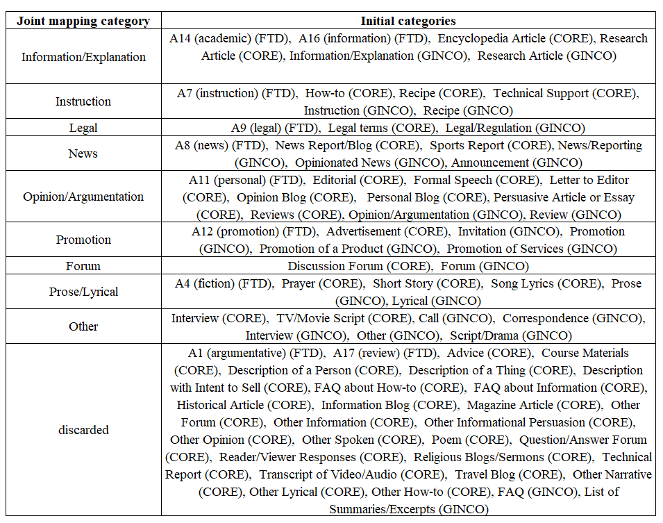


## Repository structure
* artifacts: contains saved models
* data-preparation code: code for preparation of splits for training and testing; some additional data for preparation of splits
* data-sheets-with-all-information: sheets for GINCO, MT-GINCO, CORE and FTD, enriched with all information obtained from the experiments and containing all instances (even those that were not used in the experiments)
* data-splits: datasets, split into train, dev and test splits which were used for classification
* figures: figures with information on results, joint schema etc.
* hyperparameter-search: code with hyperparameter search for FTD - sweep with Wandb (not used in the end)
* results: json and csv files with results of the model training
* root folder: "2.*" - code for training, testing the models and applying prediction to the datasets; "3.*" - code for comparison of labels (based on the prediction on other datasets)

## Table of Contents
* [Experiments overview](#experiments-overview)
* [Information on the datasets](#information-on-the-datasets)
* [Baseline experiments](#baseline-experiments)
* [Comparison of labels based on cross-dataset prediction](#comparison-of-labels-based-on-cross-dataset-prediction)
* [Experiments based on the joint schema](#joint-schema-x-genre)
* [Comparison of classifiers on MaCoCu-sl](#comparison-of-predictions-based-on-domain-url-information-from-a-test-corpus)


## Experiments Overview

Table of Contents:
* [1. Baseline Experiments](#1-baseline-experiments)
* [2. Applying prediction to other datasets](#2-applying-prediction-to-other-datasets)
* [3. Training on a combination of GINCO + FTD + CORE (joint schema)](#3-training-on-a-combination-of-ginco--ftd--core-joint-schema)

As previous experiments have shown that there is little variance between the results, each experiment will be performed once. We will do the following experiments:

### 1. Baseline Experiments

Baseline experiments (in-dataset experiments) - training and testing on the splits from the same dataset:
* GINCO-full-set: the GINCO dataset with the full set of GINCO labels, except instances of labels that have less than 10 instances -> 17 labels
* GINCO-downcast: GINCO dataset a merged set of labels - 9 labels
* CORE-main: main categories as labels
* CORE-sub: subcategories as labels

| Dataset | Micro F1 | Macro F1 |
|---------|----------|----------|
| FTD     | 0.739    | 0.74     |
| MT-GINCO-downcast        |   0.72       |  0.723        |
| GINCO-downcast        |  0.73        |  0.715        |
| CORE-main        |    0.745      |   0.62       |
| GINCO-full-set        |  0.591        | 0.466         |
| CORE-sub        |    0.661      |   0.394       |

From the in-dataset experiments, we can see that the FTD dataset obtains the best results, followed by GINCO-downcast and MT-GINCO-downcast, while the GINCO-full-set and CORE-main achieve worse results, especially in terms of macro F1. The CORE-sub shows the problem with a too high granularity of labels, as the macro F1 is low.

From the results we can see that there is no big difference between the performance of GINCO-downcast (trained on Slovene text) and MT-GINCO-downcast (trained on English text - Slovene text, machine-translated to English).

For more details, see [Baseline experiments](#baseline-experiments).

### 2. Applying prediction to other datasets

Applying prediction to other datasets:
* predict FTD on Sl-GINCO and MT_GINCO
* predict FTD on CORE
* predict MT-GINCO (downcast) on FTD and CORE
* predict SL-GINCO (downcast) on FTD and CORE
* predict CORE-main on SL-GINCO, MT-GINCO and FTD
* predict CORE-sub on SL-GINCO, MT-GINCO and FTD

The figure below shows labels that match very well - labels for which most of the instances were predicted with an appropriate label from the other schema and vice versa (e.g. most of CORE texts with the label "Legal Terms" were predicted as "A9 (legal)" with the FTD classifier, and most of FTD texts with the label "A9 (legal)" were predicted as "Legal Terms" with the CORE-sub classifier).

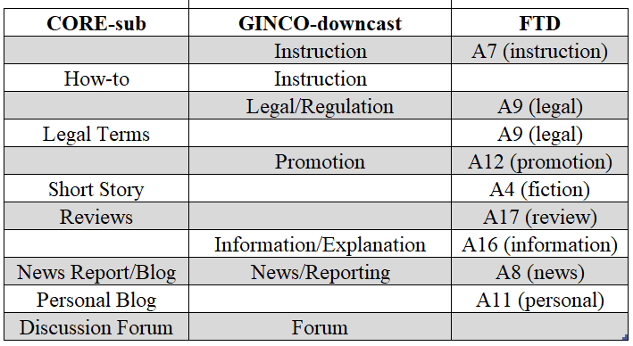

Comparison between the prediction of FTDs on Slovene and MT text shows that mostly there is not a big difference between prediction on Slovene or English text when the model is trained on English text. Only in 23% instances there is a difference between the FTD labels predicted on SL and MT text. This indicates that prediction of genre seems to be easily cross-lingual. However, it also depends on genres. On some labels, the predictions are worse on MT (Promotion labels), on some it is better (News: 0.24 more correctly predicted instances of News). Regarding the other direction (training on Slovene data, predicting on English), the situation is similar - the GINCO and MT-GINCO predictions on the CORE sample dataset differ only in case of 265 instances (18% of instances) and on the FTD they differ in case of 347 instances (29%).

Most FTD and GINCO-downcast categories match very well, even when we apply the Slovene classifier to the FTD dataset. The only two FTD categories that are not matched well by the GINCO categories are 'A1 (argumentative) and A17 (review). When we apply the MT-GINCO classifier, the results are better for A12 (promotion) (9 points), A4 (fiction) (26 points), A7 (instruction) (6 points), A8 (news) (7 points), but worse for A14 (academic) (3 points), A16 (information) (9 points), A9 (legal) (13 points).

The comparison showed that the main CORE categories are not well connected to the FTD categories. The only main CORE category where a majority of instances are identified with a corresponding FTD label, is 'How-To/Instructional' ('A7 (instruction)': 0.713). Some CORE main categories could be described by a combination of FTD categories: 'Interactive Discussion' (forum): 'A1 (argumentative)' + 'A11 (personal)', Opinion': 'A1 (argumentative)' + 'A17 (review)' . Most CORE main labels are predicted with multiple FTD labels where no corresponding label has the majority.

In contrast to the other direction, FTD categories are identified well with the CORE-main classifier - 7 categories match, while 3 categories are not well predicted. As in the case of the CORE-main predictions to the GINCO dataset, we can see that the category "Opinion" is not matched with the FTD category 'A1 (argumentative)' or 'A11 (personal)' which were expected to be connected. However, here, FTD's Review is better identified as CORE's "Opinion" than in the case of GINCO. As with GINCO, the CORE-main classifier is not capable of recognizing promotion.

FTD categories match much more with the CORE sub categories than with the main categories. 19 CORE subcategories match very well with FTD categories. Some categories, such as  'Description with Intent to Sell' or 'News Report/Blog' match worse, but they were still predominantly predicted with appropriate FTD category. Around 20 CORE subcategories do not match with FTD categories well, which means that there was no predominantly predicted FTD category which would be appropriate.FTD predictions on CORE sublabels also revealed some issues with the categorization of instances of certain labels ("Magazine Article", "Description of a Thing", "Research Article" etc.). This shows that maybe some of the categories are not to be included in the joint schema which will be used for training a classifier on all of the datasets. Manual analysis (based of predictions of "Forum" by GINCO and CORE) showed that there are some instances of Forum in FTD as well, but only a few (e.g., __id__424-co - annotated as "review", __id__636-co - "personal", __id__834-co - "review", __id__839-org - review).

Suprisingly, the main CORE labels are rather well connected to the GINCO-downcast labels, even when the Slovene classifier is used. The only category that is not connected is the category "Spoken".  Some category are better predicted with MT-GINCO ('How-To/Instructional': 'Instruction' - 4 points better; 'Narrative': 'News/Reporting'- 1 point, 'Opinion': 'Opinion/Argumentation' - 8 points, 'Interactive Discussion': 'Forum' - 10 points; 'Lyrical': 'Other' - 13 points), some are worse ('Informational Persuasion': 'Promotion' - 7 points worse; 'Informational Description/Explanation': 'Information/Explanation' - 5 points worse).

The CORE-main predictions on Slovene and MT text differ in 182 instances (18%). 12 GINCO categories are relatively well connected to the CORE main categories (with at least on of the classifiers), while the other half (12 categories) are not well connected. Using MT-GINCO improves results in some cases ('News/Reporting': 'Narrative' - 14 points better; 'Opinionated News': 'Narrative' - 13 points better; 'Prose': 'Narrative' - 17 points better), while it gives worse results with some other categories (Forum: 'Interactive Discussion' - 18 points less; Script/Drama - MT-GINCO identifies it as Informational Description/Explanation). The comparison shows that CORE categories and texts are not suited well to be able to recognize some of the genres that are included in the GINCO schema: Correspondence, Promotional categories (Invitation, Promotion, Promotion of a Product, Promotion of Services), List of Summaries/Excerpts. Interestingly, although the CORE includes a category "Opinion" it is not matched well to the GINCO category Opinion/Argumentation, and the GINCO category "Review" which is a CORE subcategory belonging under the main category "Opinion" is not recognized by this main category.

On 249 instances (25%) are the CORE-sub labels predicted to Slovene text different than those predicted on the MT text. Half of the 24 GINCO categories are well connected to the CORE subcategories (well predicted by the CORE-sub classifier). In most cases, prediction on MT-GINCO improves the results (FAQ - 67 points better, Instruction - 8 points better, Song Lyrics - 25 points better, News/Reporting - 6 points better, Recipe - 17 points better, Research Article - 33 points better), for some categories, the predictions were worse (Forum - 8 points worse, Legal Terms - 6 points worse, Promotion of a Product - 1 point worse, Review - 12 points worse). For some GINCO labels 100% of the instances were correctly predicted by the CORE-sub labels: 'FAQ': 'FAQ about Information'(on MT), 'Interview': 'Interview' (on both Slovene and MT), 'Recipe': 'Recipe' (on MT), 'Research Article': 'Research Article' (on MT).

As with the GINCO labels, the comparison also revealed that FTD labels do not focus on some other labels, that GINCO and CORE define as a separate genre category. For instance, while GINCO and CORE have Forum as a genre category, it is not possible to identify this category with the FTD schema. According to FTD predictions, Forum text are between argumentative and personal texts. This could be a problem if we merge the datasets, because we cannot know how many forum texts are in the FTD dataset, annotated as another category (e.g., as Opinion).

For more details, see [Comparison of labels based on cross-dataset prediction](#comparison-of-labels-based-on-cross-dataset-prediction)

### 3. Training on a combination of GINCO + FTD + CORE (joint schema)

First, the original labels were mapped to a joint schema ("X-GENRE" schema): see [Mapping](#mapping) and the resulting [data](#data).

Then classifiers were trained with the joint schema labels:
* FTD-X-GENRE classifier (FTD dataset with X-GENRE labels)
* CORE-X-GENRE classifier (CORE dataset with X-GENRE labels)
* SI-GINCO-X-GENRE classifier (SI-GINCO dataset with X-GENRE labels)
* MT-GINCO-X-GENRE classifier (MT-GINCO dataset with X-GENRE labels)
* X-GENRE classifier (FTD+CORE+GINCO dataset with X-GENRE labels)

Then the classifiers were also tested on the English GINCO dataset (EN-GINCO): [Classifiers tested on EN-GINCO](#classifiers-tested-on-en-ginco).

For more details, see [Experiments based on the joint schema](#joint-schema-x-genre)

(4. Multilingual experiments: training on GINCO + FTD + CORE + X-CORE corpora (joint schema):
* testing on GINCO (GINCO schema)
* testing on CORE (CORE schema)
* testing on FTD (FTD schema)
* (testing on EN-GINCO (GINCO schema))
* testing on a combination of GINCO + FTD + CORE (joint schema)
* testing on a combination of all corpora used for training
)

## Information on the datasets

Content:
* [Information on CORE](#information-on-core)
* [Information on FTD](#information-on-ftd)
* [Information on GINCO](#information-on-ginco)

### Information on CORE

Analysis of the CORE dataset which is now published to GitHub (https://github.com/TurkuNLP/CORE-corpus) showed that the published dataset is slightly different - it has ID number added - but the number of texts is the same and it still included duplicates and instances without text (despite the fact that they were informed about that).

When preparing the dataset, we:
* discarded instances with no texts (17)
* discarded duplicates (12)

The dataset has 48,420 texts with 459 different main and sub-category label combinations. Regarding main labels, it has 35 different combinations and 297 different sub-category combinations.

Training and testing the model on such a big dataset takes a lot of time and computational sources. In addition to this, a recent article  *Register identification from the unrestricted open Web using the Corpus of Online Registers of English* (Veronika Laippala et al.) showed that the performance of the model does not improve much after being trained on 30% of the data (see figure below). Thus, I decided to use only 30% of the data for baseline experiments and prediction of labels to other datasets. This means that for each CORE-main and CORE-sub, I conducted a stratified split based on the labels and used 30% of the data which I further split into train, test and dev splits.

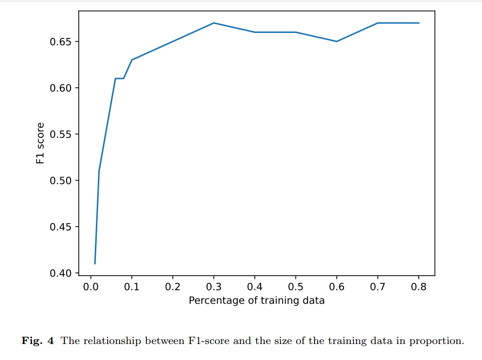

#### CORE-main

CORE-main is the CORE dataset, annotated with main categories only (9 categories). For these experiments, we discarded all text that are annotated with more than 1 main category (5686 texts).

| main labels                  | count | percentage |
|-----------------------------------------|-------|------------|
| Narrative                               | 17659 | 41.3231    |
| Informational Description/Explanation | 9314  | 21.7953    |
| Opinion                                 | 7862  | 18.3975    |
| Interactive Discussion                | 3272  | 7.65667    |
| How-To/Instructional                    | 1493  | 3.49371    |
| Informational Persuasion              | 1330  | 3.11228    |
| Lyrical                                 | 639   | 1.4953     |
| Spoken                                  | 583   | 1.36425    |
| Other                                   | 582   | 1.36191    |


|       |   text_length |
|-----|--------------:|
| text count |      42734    |
| mean  |       1236.27 |
| std   |       3167.36 |
| min   |         52    |
| 25%   |        333    |
| 50%   |        630.5  |
| 75%   |       1152    |
| max   |     118278    |

Total number of texts: 42734. For the experiments, I used 40% of the data: 17094 instances. The data is split into 60:20:20 stratified split: train (10256 instance), test and dev split (3419 instances each). The distribution of the labels remained the same:

|                                       |   Count |   Percentage |
|-------------------------------------|--------:|-------------:|
| Narrative                             |    7064 |     41.3244  |
| Informational Description/Explanation |    3726 |     21.7971  |
| Opinion                               |    3145 |     18.3983  |
| Interactive Discussion                |    1309 |      7.65766 |
| How-To/Instructional                  |     597 |      3.49245 |
| Informational Persuasion              |     532 |      3.1122  |
| Lyrical                               |     255 |      1.49175 |
| Other                                 |     233 |      1.36305 |
| Spoken                                |     233 |      1.36305 |

#### CORE-sub

CORE-sub is the CORE dataset, annotated with subcategories only.

For the experiments, I used roughly 40% of the data: 15,895 instances. Prior to that, I also:
* discarded all texts that are annotated with multiple subcategories (3622)
* discarded all texts that are not annotated with any subcategory (4932)
* discarded instances belonging to categories with less than 10 instances in the subset (15,895 instances): Other Narrative, Other Lyrical, Other How-to, "Other Informational Persuasion", "Advertisement", "Prayer", "Other Spoken", "Other Forum", "Other Opinion", "TV/Movie Script"

The data is split into 60:20:20 stratified split: train (9537 instance), test and dev split (3179 instances each). There are 37 labels. The distribution of the labels remained the same as in the entire dataset:

|                                 |   Count |   Percentage |
|-------------------------------|--------:|-------------:|
| News Report/Blog                |    4201 |    26.4297   |
| Opinion Blog                    |    1654 |    10.4058   |
| Description of a Thing          |    1403 |     8.82668  |
| Sports Report                   |    1128 |     7.09657  |
| Personal Blog                   |    1108 |     6.97075  |
| Discussion Forum                |     780 |     4.9072   |
| Reviews                         |     721 |     4.53602  |
| Information Blog                |     611 |     3.84398  |
| How-to                          |     527 |     3.31551  |
| Description with Intent to Sell |     437 |     2.74929  |
| Question/Answer Forum           |     421 |     2.64863  |
| Advice                          |     373 |     2.34665  |
| Research Article                |     329 |     2.06983  |
| Description of a Person         |     306 |     1.92513  |
| Religious Blogs/Sermons         |     279 |     1.75527  |
| Song Lyrics                     |     217 |     1.36521  |
| Encyclopedia Article            |     209 |     1.31488  |
| Interview                       |     187 |     1.17647  |
| Historical Article              |     169 |     1.06323  |
| Travel Blog                     |     113 |     0.710915 |
| Short Story                     |     113 |     0.710915 |
| FAQ about Information           |     101 |     0.63542  |
| Legal terms                     |      75 |     0.471846 |
| Recipe                          |      69 |     0.434099 |
| Other Information               |      55 |     0.346021 |
| Persuasive Article or Essay     |      48 |     0.301982 |
| Course Materials                |      47 |     0.29569  |
| Magazine Article                |      29 |     0.182447 |
| Poem                            |      29 |     0.182447 |
| Editorial                       |      26 |     0.163573 |
| Transcript of Video/Audio       |      25 |     0.157282 |
| Reader/Viewer Responses         |      20 |     0.125826 |
| FAQ about How-to                |      19 |     0.119534 |
| Letter to Editor                |      17 |     0.106952 |
| Formal Speech                   |      17 |     0.106952 |
| Technical Report                |      16 |     0.100661 |
| Technical Support               |      16 |     0.100661 |

### Information on FTD

The dataset is available here: https://github.com/ssharoff/genre-keras/blob/master/en.csv

To simplify experiments, we will perform single-label classification. The original dataset allows multiple-label annotation using a scale from 0 to 2 for each label. To simplify experiments, we will regard texts annotated with 2 at a certain category as belonging to this label.

The distribution of the labels:

| Labels         | Count | % (of single labels)|
|--------------------|-------------|--------------|
| **single labels**      | **1547**        |      |
| A1 (argumentative) | 297         | 19,20%       |
| A11 (personal)     | 79          | 5,11%        |
| A12 (promotion)    | 259         | 16,74%       |
| A14 (academic)     | 81          | 5,24%        |
| A16 (information)  | 168         | 10,86%       |
| A17 (review)       | 70          | 4,52%        |
| A22 (non-text)     | 125         | 8,08%        |
| A4 (fiction)       | 94          | 6,08%        |
| A7 (instruction)   | 165         | 10,67%       |
| A8 (news)          | 136         | 8,79%        |
| A9 (legal)         | 73          | 4,72%        |
| **multiple labels**    | **139**         |      |
| **Grand Total**        | **1686**        |              |

Although the FTD article mentions 12 principal categories and 6 optional, it seems that the final FTD dataset is annotated only with 11 categories, out of which one is an "unsuitable" category.

For the experiments, we removed:
* unsuitable texts, marked as "non-text" (125)
* texts, annotated with multiple labels (139)
* duplicated texts (7)

The final number of instances, used for the experiments: 1415.

Dataset that is used for the ML experiments is split into the train-dev-test split according to the label distribution.

|        | train              | test               | dev                |
|------|------------------|------------------|------------------|
| count (texts) | 849                | 283                | 283                |

Text length (non-text instances and multiple labels included in the table below):

|       |    length |
|-----|----------:|
| count |   1678    |
| mean  |   1468.09 |
| std   |   4644.93 |
| min   |     31    |
| 25%   |    244    |
| 50%   |    564.5  |
| 75%   |   1291.25 |
| max   | 146922    |

There are 215 texts that are longer than 2000 words, 71 of them are longer than 5000 words and 10 of them are longer than 20,000 words. The analysis shows that the corpus contains very big parts of literary works (e.g., __id__47-FictBalzacH_Goriot_Ia_EN.txt - 22.3k words) and very long UN documents (e.g., __id__214-un - 35.6k words).

### Information on GINCO

We will use paragraphs of texts that are marked as "keep".

Text length:

|       |   text_length |
|-----|--------------:|
| count |      1002     |
| mean  |       362.159 |
| std   |       483.747 |
| min   |        12     |
| 25%   |        98     |
| 50%   |       208     |
| 75%   |       418.75  |
| max   |      4364     |

#### GINCO-full-set

As labels, we used the primary_level_1 labels (the original set without downcasting). Like in experiments with CORE, we discarded instances of categories with less than 10 instances (marked with a * in the table below).

|                            |   Count |   Percentage |
|--------------------------|--------:|-------------:|
| Information/Explanation    |     130 |  0.129741    |
| News/Reporting             |     115 |  0.11477     |
| Promotion of a Product     |     115 |  0.11477     |
| Opinion/Argumentation      |     114 |  0.113772    |
| List of Summaries/Excerpts |     106 |  0.105788    |
| Opinionated News           |      89 |  0.0888224   |
| Forum                      |      52 |  0.0518962   |
| Instruction                |      38 |  0.0379242   |
| Other                      |      34 |  0.0339321   |
| Invitation                 |      32 |  0.0319361   |
| Promotion of Services      |      32 |  0.0319361   |
| Promotion                  |      30 |  0.0299401   |
| Legal/Regulation           |      17 |  0.0169661   |
| Announcement               |      17 |  0.0169661   |
| Review                     |      17 |  0.0169661   |
| Correspondence             |      16 |  0.0159681   |
| Call                       |      11 |  0.010978    |
| Research Article*           |       9 |  0.00898204  |
| Interview*                  |       8 |  0.00798403  |
| Recipe*                     |       6 |  0.00598802  |
| Prose*                      |       6 |  0.00598802  |
| Lyrical*                    |       4 |  0.00399202  |
| FAQ*                        |       3 |  0.00299401  |
| Script/Drama*               |       1 |  0.000998004 |

The final dataset has 965 texts with 17 different labels. A stratified split was performed in a 60:20:20 manner into a train (579), dev and test spli (each 193). The splits are saved as *data-splits/GINCO-full-set-{train, test, dev}.csv*

The spreadsheet with information on the splits is saved as *data-sheets-with-all-info/GINCO-MT-GINCO-keeptext-with-all-information.csv*.

#### GINCO-downcasted-set

As the results of training the classifier on GINCO-full-set were not great, we will also experiment with a smaller set of labels.

The categories were merged in the following way:
```
{"Script/Drama":"Other", "Lyrical":"Other","FAQ":"Other","Recipe":"Instruction", "Research Article":"Information/Explanation", "Review":"Opinion/Argumentation", "Promotion of Services":"Promotion", "Promotion of a Product":"Promotion", "Invitation":"Promotion", "Correspondence":"Other", "Prose":"Other", "Call":"Other", "Interview":"Other", "Opinionated News":"News/Reporting", "Announcement": "News/Reporting"}
```

The downcasted set (primary_level_4 in the sheet with all information) has 9 labels:

|                            |   Count |   Percentage |
|--------------------------|--------:|-------------:|
| News/Reporting             |     221 |    0.220559  |
| Promotion                  |     209 |    0.208583  |
| Information/Explanation    |     139 |    0.138723  |
| Opinion/Argumentation      |     131 |    0.130739  |
| List of Summaries/Excerpts |     106 |    0.105788  |
| Other                      |      83 |    0.0828343 |
| Forum                      |      52 |    0.0518962 |
| Instruction                |      44 |    0.0439122 |
| Legal/Regulation           |      17 |    0.0169661 |

The final dataset has 1002 instances, split into 60:20:20 stratified split - into train (601 instances), dev (201 instances) and test (200 instances) files.

The splits are saved as *data-splits/GINCO-downcast-{train, test, dev}.csv*

## Baseline experiments

Content:
* [FTD Classifier](#ftd-classifier)
* [GINCO-full-set classifier](#ginco-full-set-classifier)
* [GINCO-downcast classifier](#ginco-downcast-classifier)
* [MT-GINCO-downcast classifier](#mt-ginco-downcast-classifier)
* [CORE-main classifier](#core-main-classifier)
* [CORE-sub classifier](#core-sub-classifier)

### FTD Classifier
I used the wandb library to evaluate the optimal number of epochs by performing evaluation during training. By analysing the training and evaluation loss, I opted for the epoch number = 10.

Code for training: *2.1-FTD-classifier-training-and-saving.ipynb*

The hyperparameters that I used:

```
            "overwrite_output_dir": True,
            "num_train_epochs": 10,
            "train_batch_size":8,
            "learning_rate": 1e-5,
            # Use these parameters if you want to evaluate during training
            #"evaluate_during_training": True,
            #"evaluate_during_training_steps": steps_per_epoch*10,
            #"evaluate_during_training_verbose": True,
            #"use_cached_eval_features": True,
            #'reprocess_input_data': True,
            "labels_list": LABELS,
            "max_seq_length": 512,
            "save_steps": -1,
            # Only the trained model will be saved - to prevent filling all of the space
            "save_model_every_epoch":False,
            "wandb_project": 'FTD-learning-manual-hyperparameter-search',
            "silent": True,
```

The trained model was saved to the Wandb repository and can be accessed for testing (see code *2.2-FTD-classifier-testing-and-applying-on-other-datasets.ipynb*).

Load the FTD model from Wandb:
```
artifact = run.use_artifact('tajak/FTD-learning-manual-hyperparameter-search/FTD-classifier:v1', type='model')
artifact_dir = artifact.download()

# Loading a local save
model = ClassificationModel(
    "xlmroberta", artifact_dir)
```

The results on dev file: Macro f1: 0.759, Micro f1: 0.749

The results on test file: Macro f1: 0.74, Micro f1: 0.739

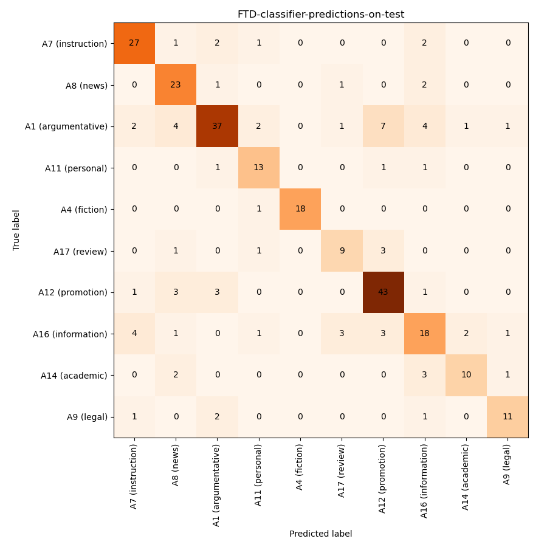

After the model was created, I applied it to the entire GINCO - to Slovene text (FTD_pred_on_SL) and to MT text (FTD_pred_on_MT) and the test split of the CORE dataset (because it would take multiple days to apply predictions on the whole dataset) and added FTD predictions to them, so that we will be able to analyze how the labels overlap. Prediction takes 20 minutes for 1,000 instances.

The datasets with FTD predictions:
- FTD dev and test split: *results/testing-FTD-model-on-dev-sheet-with-predictions.csv, **results/FTD-classifier-predictions-on-test-sheet-with-predictions.csv*; 
- the GINCO dataset with FTD predictions: *data-sheets-with-all-info/GINCO-MT-GINCO-keeptext-split-file-with-all-information.csv*;
- the CORE dataset with FTD predictions: *data-sheets-with-all-info/CORE-all-information.csv*

### GINCO-full-set classifier

I evaluated the model during training to search for the optimum epoch number. As can it be seen from the figure below, it was between 12 and 20 (the global steps needs to be divided by 72 to get the epoch number), since afterwards the eval_loss starts rising again.

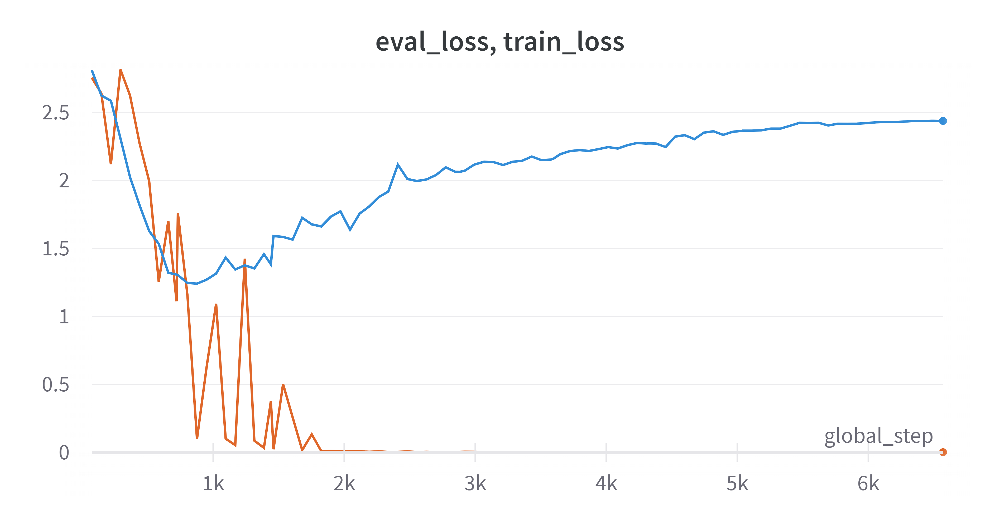

Then I trained the model for 12, 15, 20 and 25 epochs (results in *results/GINCO-Experiments-Results.json*), evaluating it on dev split and the results revealed that the optimum number of epochs is 20.

Final hyperparameters:
```
        args= {
            "overwrite_output_dir": True,
            "num_train_epochs": 20,
            "train_batch_size":8,
            "learning_rate": 1e-5,
            "labels_list": LABELS,
            "max_seq_length": 512,
            "save_steps": -1,
            # Only the trained model will be saved - to prevent filling all of the space
            "save_model_every_epoch":False,
            "wandb_project": 'GINCO-hyperparameter-search',
            "silent": True,
            }

```

To load the GINCO-full-set model from Wandb:
```
artifact = run.use_artifact('tajak/GINCO-hyperparameter-search/GINCO-full-set-classifier:v0', type='model')
artifact_dir = artifact.download()

# Loading a local save
model = ClassificationModel(
    "xlmroberta", artifact_dir)
```

The results on dev file: Macro f1: 0.539, Micro f1: 0.668

The results on test file: Macro f1: 0.466, Micro f1: 0.591

Confusion matrix on the test split:
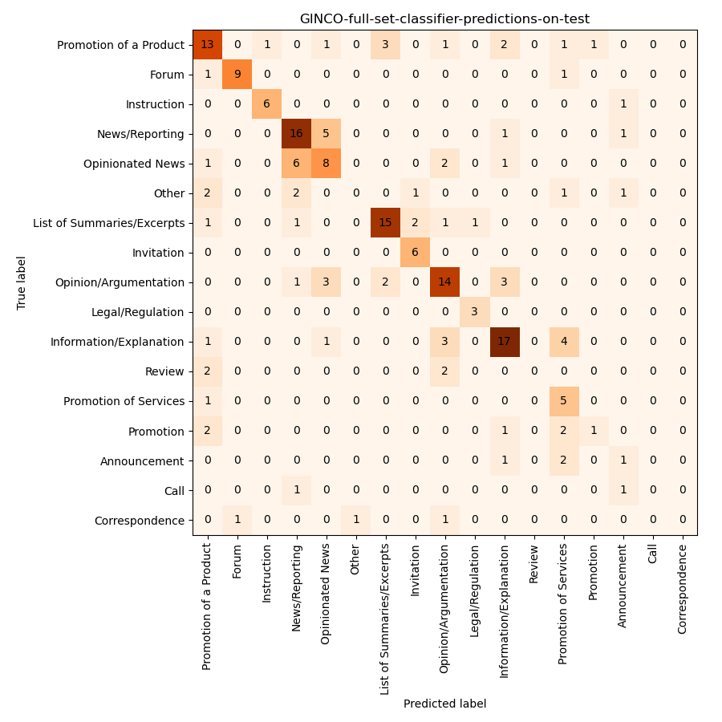

### GINCO-downcast classifier

I evaluated the model during training to search for the optimum epoch number. As can it be seen from the figure below, it was between 8 and 15 (the global steps needs to be divided by 75 to get the epoch number), since afterwards the eval_loss starts rising again.

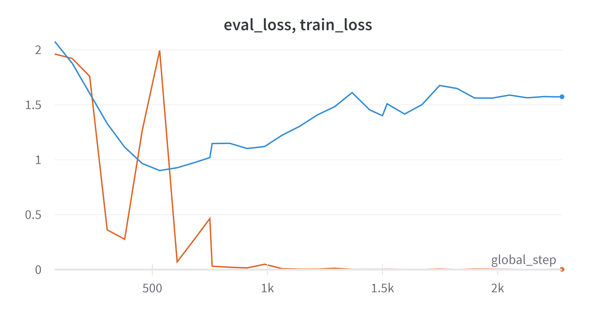

Then I trained the model for 8, 10, 15, 20, 25 and 30 epochs (results in *results/GINCO-Experiments-Results.json*), evaluating it on dev split and the results revealed that the optimum number of epochs is 15.

Final hyperparameters:
```
        args= {
            "overwrite_output_dir": True,
            "num_train_epochs": 15,
            "train_batch_size":8,
            "learning_rate": 1e-5,
            "labels_list": LABELS,
            "max_seq_length": 512,
            "save_steps": -1,
            # Only the trained model will be saved - to prevent filling all of the space
            "save_model_every_epoch":False,
            "wandb_project": 'GINCO-hyperparameter-search',
            "silent": True,
            }
```

To load the GINCO-downcast model from Wandb:
```
import wandb
run = wandb.init()
artifact = run.use_artifact('tajak/GINCO-hyperparameter-search/GINCO-downcast-classifier:v0', type='model')
artifact_dir = artifact.download()

# Loading a local save
model = ClassificationModel(
    "xlmroberta", artifact_dir)
```

The results on dev file: Macro f1: 0.741, Micro f1: 0.701

The results on test file: Macro f1: 0.73, Micro f1: 0.715

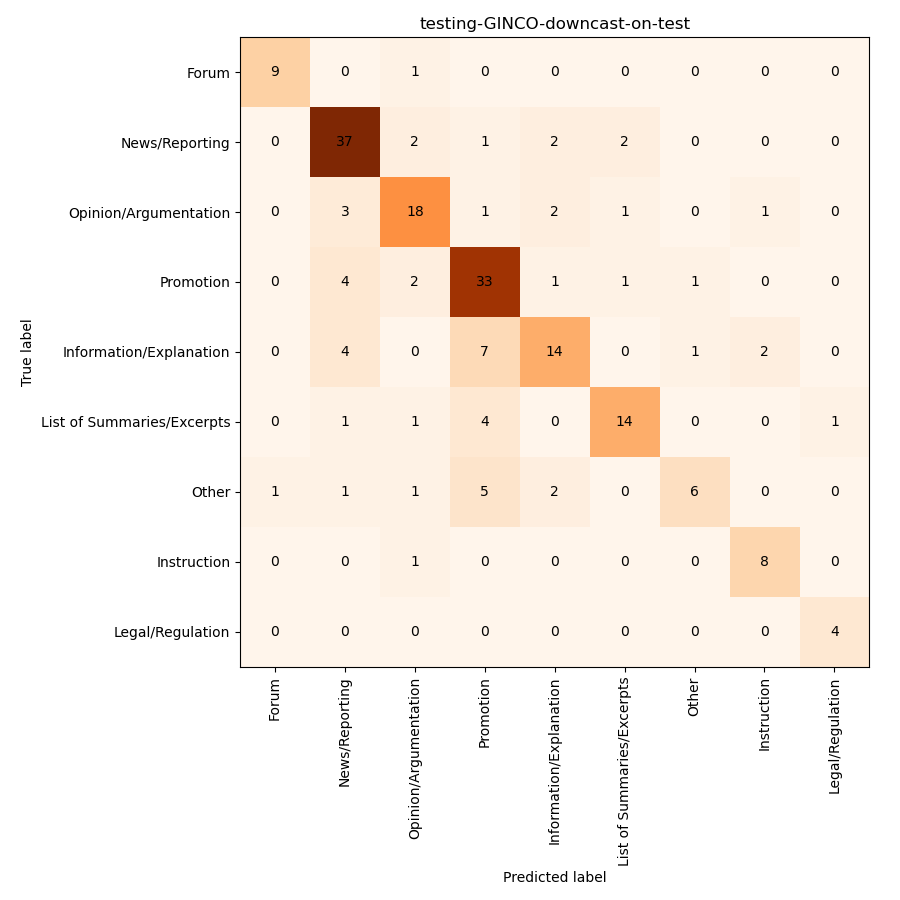

As can be seen on the confusion matrix, the model is even able to capture List of Summaries :D

### MT-GINCO-downcast classifier

As the GINCO-downcast had good results, I also trained a model on MT-GINCO with downcast labels to be able to compare their performance and see if there is any difference between the Slovene classifier and MT classifier when applied on other datasets.

I used the same hyperparameters and the instances are in the same splits as in GINCO-downcast experiments, the only difference is that the text is in English.

To load the MT-GINCO-downcast model from Wandb:
```
import wandb
run = wandb.init()
artifact = run.use_artifact('tajak/GINCO-hyperparameter-search/MT-GINCO-downcast-classifier:v0', type='model')
artifact_dir = artifact.download()

# Loading a local save
model = ClassificationModel(
    "xlmroberta", artifact_dir)
```

The results on dev file: Macro f1: 0.806, Micro f1: 0.781
The results on test file: Macro f1: 0.723, Micro f1: 0.72


### CORE-main classifier

I evaluated the model during training to search for the optimum epoch number which revealed the optimum number of epochs to be between 2 and 6 epochs. Then I trained the model for 2, 4, and 6 epochs and the optimum number of epochs revealed to be 4.

Final hyperparameters:
```
        args= {
            "overwrite_output_dir": True,
            "num_train_epochs": 4,
            "train_batch_size":8,
            "learning_rate": 1e-5,
            "labels_list": LABELS,
            "max_seq_length": 512,
            "save_steps": -1,
            # Only the trained model will be saved - to prevent filling all of the space
            "save_model_every_epoch":False,
            "wandb_project": 'CORE-hyperparameter-search',
            "silent": True,
            }
```

To load the CORE-main model from Wandb:
```
import wandb
run = wandb.init()
artifact = run.use_artifact('tajak/CORE-hyperparameter-search/CORE-main-classifier:v0', type='model')
artifact_dir = artifact.download()

# Loading a local save
model = ClassificationModel(
    "xlmroberta", artifact_dir)
```

Results on the dev file: Macro f1: 0.623, Micro f1: 0.736
Results on test file: Macro f1: 0.62, Micro f1: 0.745

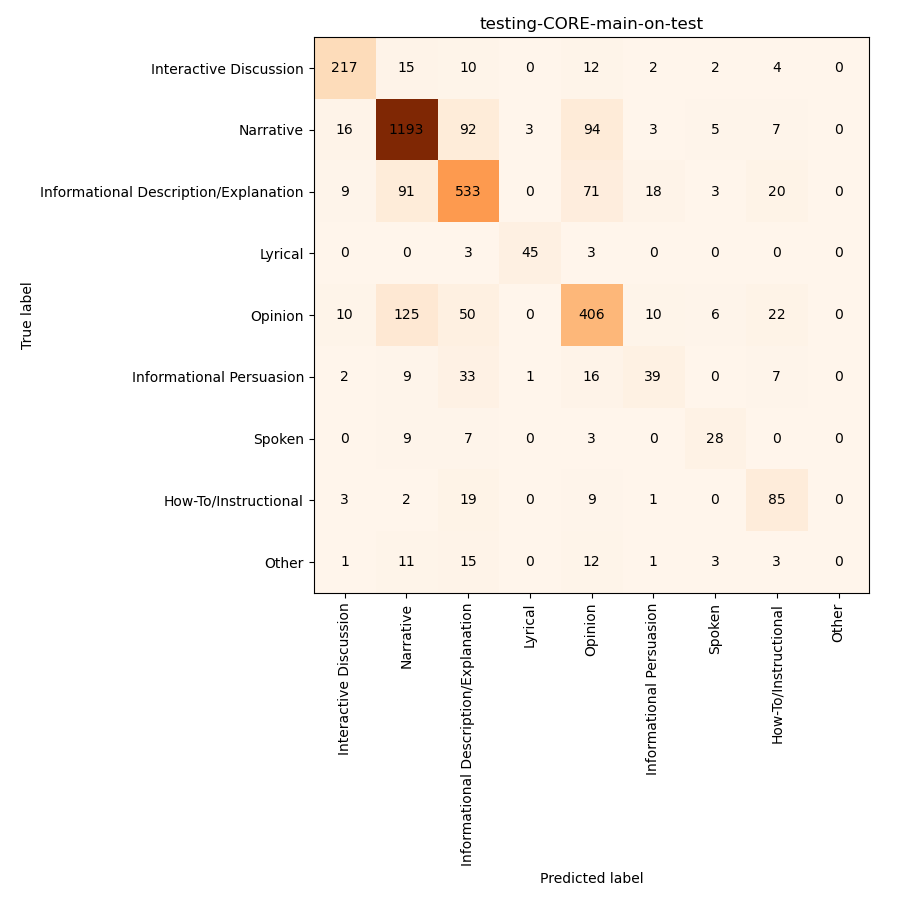

### CORE-sub classifier

I evaluated the model during training to search for the optimum epoch number which revealed the optimum number of epochs to be between 2 and 8 epochs. Then I trained the model for 2, 4, 6 and 8 epochs and the optimum number of epochs revealed to be 6.

Final hyperparameters:
```
        args= {
            "overwrite_output_dir": True,
            "num_train_epochs": 6,
            "train_batch_size":8,
            "learning_rate": 1e-5,
            "labels_list": LABELS,
            "max_seq_length": 512,
            "save_steps": -1,
            # Only the trained model will be saved - to prevent filling all of the space
            "save_model_every_epoch":False,
            "wandb_project": 'CORE-hyperparameter-search',
            "silent": True,
            }
```

To load the CORE-sub model from Wandb:
```
import wandb
run = wandb.init()
artifact = run.use_artifact('tajak/CORE-hyperparameter-search/CORE-sub-classifier:v0', type='model')
artifact_dir = artifact.download()

# Loading a local save
model = ClassificationModel(
    "xlmroberta", artifact_dir)
```

Results on the dev file: Macro f1: 0.396, Micro f1: 0.662
Results on test file: Macro f1: 0.394, Micro f1: 0.661

Very low macro score can be attributed to bad performance on some of less frequent labels: Formal Speech, Travel Blog, Persuasive Article/Essay, Transcript of Video/Audio, Poem, Course Materials, Technical Support, Magazine Article, Other Information, Reader/Viewer Responses, Editorial, FAQ about How-To, Technical Report, Letter to Editor. These categories could be discarded from the joint schema since they are very rare and were shown that they are hard to predict.


## Comparison of labels based on cross-dataset prediction

### FTD and GINCO / GINCO and FTD

#### FTD to GINCO
I applied the FTD classifier in separate prediction runs once to Slovene text and once to the text that was machine-translated to English. The code with comparison and results is here: *3.1-Compare-FTD-labels-on-GINCO.ipynb*

Main conclusions:

Comparison between the prediction on Slovene and MT text shows that mostly there is not a big difference between prediction on Slovene or English text. Only in 227 instances (out of 1002 - 23%) there is a difference between the FTD labels predicted on SL and MT text. This indicates that prediction of genre seems to be easily cross-lingual. However, it also depends on genres. On some labels, the predictions are worse on MT (Promotion labels, Prose), on some it is better (Instruction - 0.05 more correctly predicted instances, Research Article - 0.10 more predicted instances, Information/Explanation). On MT, there is a much better identification of News (0.24 more correctly predicted instances) and Opinionated News (0.10 more correctly predicted instances). In other cases, there is no difference or just a slight difference (e.g., Legal/Regulation).

Labels that were very well predicted on Slovene text: Instruction ('A7 (instruction)': 0.79 - precentage of all instruction instances), Invitation ('A12 (promotion)': 0.875), Legal/Regulation ('A9 (legal)': 1.0), Promotion of Services ('A12 (promotion)': 0.94), Promotion of a Product ('A12 (promotion)': 0.85, Promotion ('A12 (promotion)': 0.8), Prose ('A4 (fiction)': 1.0), Recipe ('A7 (instruction)': 0.83), Research Article ('A14 (academic)': 0.67), Review ('A17 (review)': 0.65), Information/Explanation ('A16 (information)': 0.6)

#### GINCO/MT-GINCO to FTD

Then I applied GINCO-downcast and MT-GINCO downcast classifiers to the FTD dataset. Also in this direction (trained on Slovene/English data, predicted on English data), it seems that there is not a big difference between cross-lingual and monolingual prediction. The GINCO and MT-GINCO predictions differ only in case of 347 instances (29%).

Most FTD and GINCO-downcast categories match very well, even when we apply the Slovene classifier to the FTD dataset. The only two FTD categories that are not matched well by the GINCO categories are 'A1 (argumentative) and A17 (review). When we apply the MT-GINCO classifier, the results are better for A12 (promotion) (9 points), A4 (fiction) (26 points), A7 (instruction) (6 points), A8 (news) (7 points), but worse for A14 (academic) (3 points), A16 (information) (9 points), A9 (legal) (13 points).

### FTD and CORE-main categories

#### FTD to CORE-main

The comparison showed that the main CORE categories are not well predicted with the FTD categories. The only main CORE category where a majority of instances are identified with a corresponding FTD label, is 'How-To/Instructional' ('A7 (instruction)': 0.713). Some CORE main categories could be described by a combination of FTD categories: 'Interactive Discussion' (forum): 'A1 (argumentative)' + 'A11 (personal)', Opinion': 'A1 (argumentative)' + 'A17 (review)' . Most CORE main labels are predicted with multiple FTD labels where no corresponding label has the majority.

As with the GINCO labels, the comparison also revealed that FTD labels do not focus on some other labels, that GINCO and CORE define as a separate genre category. For instance, while GINCO and CORE have Forum as a genre category, it is not possible to identify this category with the FTD schema. According to FTD predictions, Forum text are between argumentative and personal texts. This could be a problem if we merge the datasets, because we cannot know how many forum texts are in the FTD dataset, annotated as another category (e.g., as Opinion).

#### CORE-main to FTD

In contrast to the other direction, FTD categories are identified well with the CORE-main classifier - 7 categories match, while 3 categories are not well predicted. As in the case of the CORE-main predictions to the GINCO dataset, we can see that the category "Opinion" is not matched with the FTD category 'A1 (argumentative)' or 'A11 (personal)' which were expected to be connected. However, here, FTD's Review is better identified as CORE's "Opinion" than in the case of GINCO. As with GINCO, the CORE-main classifier is not capable of recognizing promotion.


#### FTD to CORE-sub categories

Predictions of FTD categories to the CORE instances shows that they match much more with the CORE sub categories than with the main categories. 19 CORE subcategories match very well with FTD categories. Some categories, such as  'Description with Intent to Sell' or 'News Report/Blog' match worse, but they were still predominantly predicted with appropriate FTD category. Around 20 CORE subcategories do not match with FTD categories well, which means that there was no predominantly predicted FTD category which would be appropriate.

FTD predictions on CORE sublabels possibly also revealed some issues with the categorization of instances of certain labels. For instance:
* 'Description of a Thing' which is a category that belongs under 'Informational Description/Explanation' main category, was mainly identified as 'A12 (promotion)': 0.37*
* "Historical Article" and "Magazine Article" which belong under "Narrative" main category are identified as having a lot of argumentative properties based on FTD ('A1 (argumentative)')
* "Informational Blog" and "Research Article" which belong under 'Informational Description/Explanation' were also predominantly identified as 'A1 (argumentative)' text
* "Prayer" is mostly identified as 'A16 (information)'

This shows that maybe some of the categories are not to be included in the joint schema which will be used for training a classifier on all of the datasets.

#### CORE-sub to FTD categories

Most of the FTD categories are well connected to specific CORE-sub categories.

### GINCO/MT-GINCO and CORE labels

The analysis showed that the predictions of GINCO and MT-GINCO on CORE texts are mostly the same - the GINCO and MT-GINCO predictions differ only in case of 265 instances (18% of instances).

#### GINCO/MT-GINCO to CORE-main

Suprisingly, the main CORE labels are rather well connected to the GINCO-downcast labels, even when the Slovene classifier is used. The only category that is not connected is the category "Spoken".  Some category are better predicted with MT-GINCO ('How-To/Instructional': 'Instruction' - 4 points better; 'Narrative': 'News/Reporting'- 1 point, 'Opinion': 'Opinion/Argumentation' - 8 points, 'Interactive Discussion': 'Forum' - 10 points; 'Lyrical': 'Other' - 13 points), some are worse ('Informational Persuasion': 'Promotion' - 7 points worse; 'Informational Description/Explanation': 'Information/Explanation' - 5 points worse).

#### CORE-main to GINCO/MT-GINCO

The CORE-main predictions on Slovene and MT text differ in 182 instances (18%). 12 GINCO categories are relatively well connected to the CORE main categories (with at least on of the classifiers), while the other half (12 categories) are not well connected. Using MT-GINCO improves results in some cases ('News/Reporting': 'Narrative' - 14 points better; 'Opinionated News': 'Narrative' - 13 points better; 'Prose': 'Narrative' - 17 points better), while it gives worse results with some other categories (Forum: 'Interactive Discussion' - 18 points less; Script/Drama - MT-GINCO identifies it as Informational Description/Explanation). The comparison shows that CORE categories and texts are not suited well to be able to recognize some of the genres that are included in the GINCO schema: Correspondence, Promotional categories (Invitation, Promotion, Promotion of a Product, Promotion of Services), List of Summaries/Excerpts. Interestingly, although the CORE includes a category "Opinion" it is not matched well to the GINCO category Opinion/Argumentation, and the GINCO category "Review" which is a CORE subcategory belonging under the main category "Opinion" is not recognized by this main category.

If there is no information regarding the MT-GINCO results, they are the same as the GINCO.

#### GINCO/MT-GINCO to CORE-sub

If we compare CORE subcategories and GINCO-downcast categories based on the GINCO predictions, we see that 17 CORE subcategories match very well with GINCO categories, 7 match, but less well, and 19 categories do not match well. With some categories, the prediction of MT classifier is better ('Discussion Forum': 'Forum' - 9 points better; 'How-to: 'Instruction' - 4 point better; 'Opinion Blog': 'Opinion/Argumentation' and 'Personal Blog': 'Opinion/Argumentation' - 2 points better; 'Sports Report': 'News/Reporting' - 7 points better; 'Reviews': 'Opinion/Argumentation': 15 points better; 'Song Lyrics': 'Other' - 15 points), in some worse ('Description with Intent to Sell': 'Promotion' - 6 points worse; 'Encyclopedia Article': 'Information/Explanation' - 5 points; 'Historical Article': 'Information/Explanation' - 26 points; 'Persuasive Article or Essay': 'Opinion/Argumentation' - 40 points worse; 'Recipe': 'Instruction' - 16 points worse; 'Travel Blog': 'Opinion/Argumentation' - 19 points worse; 'Legal terms': 'Legal/Regulation': 0.429 on SL, no Legal/Regulation on MT). 

#### CORE-sub to GINCO/MT-GINCO

On 249 instances (25%) are the CORE-sub labels predicted to Slovene text different than those predicted on the MT text.

Half of the 24 GINCO categories are well connected to the CORE subcategories (well predicted by the CORE-sub classifier). In most cases, prediction on MT-GINCO improves the results (FAQ - 67 points better, Instruction - 8 points better, Song Lyrics - 25 points better, News/Reporting - 6 points better, Recipe - 17 points better, Research Article - 33 points better), for some categories, the predictions were worse (Forum - 8 points worse, Legal Terms - 6 points worse, Promotion of a Product - 1 point worse, Review - 12 points worse). For some GINCO labels 100% of the instances were correctly predicted by the CORE-sub labels: 'FAQ': 'FAQ about Information'(on MT), 'Interview': 'Interview' (on both Slovene and MT), 'Recipe': 'Recipe' (on MT), 'Research Article': 'Research Article' (on MT).

Despite the fact that Description of a Thing represents 9% of the instances in CORE-sub dataset, most categories that were hard to identify were predicted this label. This suggests that the label is very fuzzy and can thus incorporate so many different genres. Very rare labels, (Course Materials, Formal Speech, Magazine Article, Travel Blog, Persuasive Article/Essay, Transcript of Video/Audio, Technical Support, Other Information, Reader/Viewer Responses, Editorial, FAQ about How-To, Technical Report, Letter to Editor), were not predicted to any instance in the GINCO dataset.

If there is no information regarding the MT-GINCO results, they are the same as the GINCO.

### Main comparison of labels

CORE main categories are not able to describe promotional texts in contrast to FTD and GINCO labels. Similarly, FTD labels are not made to identify Forums in constrast to GINCO and CORE labels. CORE main genre set has many labels that do not match well with FTD and GINCO categories - Narrative, Informational Description/Explanation, Lyrical, Informational Persuasion, Spoken. This shows issues with annotation or different criteria for these genre labels, e.g. Narrative was identified as 'news', but also a large part of instances were identified as 'argumentative'; similarly, a large part of instances with the CORE main label Informational Description/Explanation were identified as A12 (promotion). For the mapped schema, we will use CORE subcategories which have a higher granularity (to not introduce more noise with the main categories).

1. Well connected labels (similar):
    - **Instruction**:
        - Instruction predicted as 'A7 (instruction)', 'How-To/Instructional' (CORE main), 'How-to' (CORE);
        - 'A7 (instruction)': pr. as 'Instruction' (GINCO), but as 'How-To/Instructional' + 'Informational Description/Explanation' (CORE - main), 'How-to' + 'Description of a Thing' (CORE- sub --> Description of a Thing is a problematic category);
        - 'How-To/Instructional' (CORE-main): 'A7 (instruction)', 'Instruction';
        - 'How-to' (CORE) pr. as 'A7 (instruction)', 'Instruction';
        - 'Technical Support' pr. as 'A7 (instruction)', 'Instruction'
    - **Legal**:
        - Legal/Regulation pr. as 'A9 (legal)', Informational Description/Explanation (CORE main), 'Legal terms' (CORE);
        - 'A9 (legal)': pr. as Legal/Regulation', 'Informational Description/Explanation' (CORE main),  'Legal terms' (CORE sub);
        - 'Legal terms' (CORE sub) pr. as 'A9 (legal)', not identified well with GINCO: 'Instruction' + Information/Explanation' + 'Legal/Regulation
    - **Promotion**:
        - Promotion pr. as 'A12 (promotion)', 'Informational Description/Explanation' (CORE main);
        - 'A12 (promotion)': pr. as 'Promotion', 'Informational Description/Explanation' (CORE main - problem with this category),'Description of a Thing' '+ 'Description with Intent to Sell' (CORE sub - CORE categories cannot identify promotion), 'Description of a Thing' (CORE);
        - 'Advertisement' (CORE sub): pr. as 'A12 (promotion)', 'Promotion'
        - Promotion of Services (merged to Promotion): pr. as 'A12 (promotion)', 'Informational Description/Explanation' (CORE main), 'Description of a Thing' (CORE) ;
        - Promotion of a Product (merged to Promotion): pr. as 'A12 (promotion)', 'Informational Description/Explanation' + 'Informational Persuasion' (CORE main), 'Description with Intent to Sell' + 'Description of a Thing' (CORE);
        - Invitation (merged to Promotion): predicted as 'A12 (promotion)', 'Informational Description/Explanation' (CORE main), 'Description of a Thing' (CORE)
    - **Prose**:
        - Prose (merged to Other): pr. as 'A4 (fiction)', 'Narrative' (CORE main), 'Short Story' (CORE);
        - 'A4 (fiction)': pr. as 'Other', 'Narrative' (CORE main), 'Short Story' (CORE sub);
        - 'Short Story' pr. as 'A4 (fiction)', 'Other'
    - **Recipe**:
        - Recipe (merged to Instruction): pr. as 'A7 (instruction)', 'How-To/Instructional' (CORE main), 'Recipe' (CORE);
        - 'Recipe' (CORE sub): 'A7 (instruction)' + 'A11 (personal)', Instruction'
    - **Research Article**:
        - Research Article (merged to Information/Explanation): pr. as 'A14 (academic)', Informational Description/Explanation' (CORE main), 'Research Article' (CORE);
        - 'A14 (academic)': pr. as 'Information/Explanation' (GINCO), Informational Description/Explanation' (CORE main), 'Research Article' (CORE sub);
        - 'Research Article' (CORE) predicted more as 'A1 (argumentative)' than 'A14 (academic)', 'Information/Explanation'
    - **Review**:
        - Review (not identified well with GINCO-full; merged to Opinion/Argumentation): pr. as 'A17 (review), 'Informational Description/Explanation'/ 'Spoken' (CORE main - not identified well), 'Reviews' + 'Personal Blog' + 'Description of a Thing' (not identified well with CORE-sub)
        - 'A17 (review)' (predicted well with FTD classifier) was predicted with more Promotion than Opinion/Argumentation with GINCO ('Promotion': 0.32, 'Opinion/Argumentation': 0.29), 'Reviews' (CORE), 'Opinion' (CORE-main)
        - 'Reviews' (CORE): 'A17 (review)',Opinion/Argumentation
    - **Information**:
        - Information/Explanation pr. as 'A16 (information)', 'Informational Description/Explanation (CORE main), 'Description of a Thing' (CORE);
        - 'A16 (information)': pr. as 'Information/Explanation' (GINCO), 'Informational Description/Explanation' (CORE main), 'Description of a Thing' +  'Encyclopedia Article' (CORE sub);
        - 'Encyclopedia Article' (CORE) pr as. 'A16 (information)', 'Information/Explanation'
    - **News/Reporting**:
        - News/Reporting pr. as 'A8 (news)', Narrative (CORE main), News Report/Blog (CORE);
        - 'A8 (news)' pr. as 'News/Reporting' (GINCO), 'Narrative' (CORE main), 'News Report/Blog' (CORE sub);
        - Opinionated News (merged to News/Reporting): pr. as 'A8 (news), Narrative (CORE main), 'News Report/Blog' + 'Sports Report' (CORE)
        - 'Sports Report' (CORE) pr. as A8 (news)', 'News/Reporting'
        - 'News Report/Blog' (CORE) pr. as 'A8 (news)', 'News/Reporting'
    - **Opinion/Argumentation**:
        - Opinion/Argumentation pr. as 'A1 (argumentative) + 'A11 (personal)', Informational Description/Explanation' + 'Spoken' (CORE main - not identified with CORE's category Opinion), scattered across all categories with CORE-sub: 'Description of a Thing' + 'Interview' + 'Personal Blog';
        - 'A11 (personal)': pr. as 'Opinion/Argumentation', 'Narrative' (CORE main), 'Personal Blog' (CORE);
        - 'Opinion' (CORE main) pr. as 'A1 (argumentative)' + 'A17 (review)', Opinion/Argumentation (GINCO);
        - 'Opinion Blog' (CORE) pr. as 'A1 (argumentative),  'Opinion/Argumentation';
        - 'Personal Blog pr. as 'A11 (personal)', 'Opinion/Argumentation';
        - 'Persuasive Article or Essay' pr. as 'A1 (argumentative)', 'Opinion/Argumentation';
        - 'Letter to Editor' (CORE): 'A1 (argumentative)',  'Forum'/'Opinion/Argumentation'
        - 'Formal Speech' (CORE): 'A1 (argumentative)', Opinion/Argumentation
        - 'Editorial'(CORE) pr. as 'A1 (argumentative)', but 'News/Reporting' with GINCO (however, only 2 instances were predicted)

2. Labels that are not connected well:
    - **Announcement** (not identified well in GINCO-full classifier; merged to News/Reporting): the closest to 'A12 (promotion)' and 'A8 (news)', 'Informational Description/Explanation' (CORE main), Description of a Thing (CORE)
    - **Call** (not identified well in GINCO classifier; merged to Other): 'A1 (argumentative)', 'A12 (promotion)' and 'A9 (legal)' , 'Informational Description/Explanation' (CORE main), Description of a Thing (CORE)
    - **Correspondence** (not identified well in GINCO classifier; merged to Other): the closest to 'A1 (argumentative)', 'Informational Description/Explanation' + 'Interactive Discussion' (CORE main), scattered accross multiple categories in CORE sub, the most instances: 'Question/Answer Forum'
    - **FAQ**:
        - FAQ (very rare category in GINCO; merged to Other): 'A12 (promotion)' + A7 (instruction)', 'Informational Description/Explanation' (CORE main), 'FAQ about Information';
        - 'FAQ about Information' (CORE): 'A7 (instruction)' + 'A12 (promotion)', 'Information/Explanation'
        - 'FAQ about How-to' (CORE) pr. as 'A7 (instruction)', but with GINCO: 'Instruction' + 'Promotion'
    - **Forum**:
        - Forum: 'A1 (argumentative)' and 'A11 (personal)', 'Interactive Discussion' (CORE main), 'Discussion Forum';
        - 'Interactive Discussion' (CORE main): pr. as 'A1 (argumentative)'+ 'A11 (personal)', with GINCO predicted as Forum;
        - 'Discussion Forum' (CORE): 'A1 (argumentative)' + 'A11 (personal)', good identification with GINCO: 'Forum';
        - 'Question/Answer Forum' (CORE) pr. as 'A7 (instruction)' + 'A11 (personal)' + A1 (argumentative)', not identified well with GINCO: 'Forum' + 'Instruction'
        - 'Reader/Viewer Responses' (CORE) pr. as 'A17 (review)', 'A12 (promotion)', 'A7 (instruction)', 'Forum'/'Opinion/Argumentation'
        - 'Other Forum': 'Opinion/Argumentation'
    - **Interview**:
        - Interview (merged to Other): not connected to FTD labels well, 'Spoken' (CORE main), 'Interview' (CORE);
        - 'Interview' (CORE): ''A17 (review)', A1 (argumentative), 'A11 (personal)', 'News/Reporting' + 'Opinion/Argumentation';
    - **List of Summaries/Excerpts**: not connected to FTD labels well, 'Informational Description/Explanation' + 'Narrative' (CORE main), scattered across all categories in CORE-sub
    - **Lyrical**:
        - Lyrical (very rare category in GINCO, merged to Other): 'A11 (personal)' or 'A4 (fiction)', Lyrical (CORE main), 'Song Lyrics' + 'Religious Blogs/Sermons' + 'Short Story' (CORE);
        - 'Lyrical' (CORE main): 'A11 (personal)', Other (GINCO)
    - **Other**: not connected to FTD labels well, Informational Description/Explanation' (CORE main), scattered across categories in CORE-sub
    - **Script/Drama** (very rare category in GINCO; merged to Other): pr. as 'Spoken'/Informational Description/Explanation (CORE main), 'Encyclopedia Article' (CORE-sub), 'A16 (information)'
    - '**A1 (argumentative)**': not connected to GINCO labels well (pr. as various labels), not connected to CORE main well (predicted mostly as 'Informational Description/Explanation'); CORE sub: 'Description of a Thing': 0.25, scattered across all labels. Not used in the final mapping, because it is too fuzzy based on the predictions.
    - '**Narrative**' (CORE main): 'A8 (news)', 'A1 (argumentative)'; however, identified well with GINCO: News/Reporting
    - '**Informational Description/Explanation**' (CORE main): A12 (promotion)' + 'A16 (information) + 'A1 (argumentative)', 'Information/Explanation' + 'Promotion' (GINCO); FTD's 'A12 (promotion)' pr. as 'Informational Description/Explanation' (problem with this CORE main category)
    -'**Informational Persuasion**' (CORE main): 'A12 (promotion)', 'A1 (argumentative)', 'A17 (review); Other Informational Persuasion' (CORE sub) pr. as 'A1 (argumentative)'; however, identified well with GINCO: 'Promotion'
    - '**Spoken**':
        - Spoken (CORE main): 'A1 (argumentative)' + 'A11 (personal)' + 'A17 (review)', News/Reporting' + 'Opinion/Argumentation' + 'Other' (GINCO);
        - 'Other Spoken' (CORE sub) pr. as 'A11 (personal)', Opinion/Argumentation'
    - '**Advice**' pr. as 'A7 (instruction)', 'Opinion/Argumentation' + 'Instruction'
    - '**Religious Blogs/Sermons**' (CORE): 'A1 (argumentative)', 'Opinion/Argumentation'
    - '**Description with Intent to Sell**' (CORE): A12 (promotion)', 'A17 (review)', better identification with GINCO: 'Promotion'
    - '**Travel Blog**' (CORE): 'A11 (personal) + A17 (review)' + 'A12 (promotion)', Opinion/Argumentation' + 'Promotion'
    - '**Course Materials**' (CORE): 'A7 (instruction)' and 'A16 (information), better identification with GINCO: 'Information/Explanation'
    - '**Description of a Person**' (CORE):  'A16 (information)' + 'A17 (review)', 'Information/Explanation' + 'Opinion/Argumentation'
    - '**Description of a Thing**' (CORE): 'A12 (promotion)', 'Information/Explanation' + 'Promotion'
    - '**Historical Article**' (CORE): 'A16 (information)', 'A1 (argumentative)', better identification with GINCO: mostly 'Information/Explanation' (although some Opinion/Argumentation as well)
    - '**Information Blog**' (CORE): 'A1 (argumentative)' + 'A7 (instruction)', 'Information/Explanation' + 'News/Reporting'/'Opinion/Argumentation'
    - '**Magazine Article**' (CORE): 'A1 (argumentative), 'Opinion/Argumentation'
    - '**Poem**' (CORE): 'A4 (fiction)' + A11 (personal) + 'A17 (review)', 'Information/Explanation' + 'Opinion/Argumentation' + 'Other'; manual inspection of instances revealed that some reviews of poems or informational texts on poems are annotated as "Poem" as well (e.g., instances in the sheet at indices 20275, 22514, 40221, 41080)
    - '**Prayer**' (CORE): 'A16 (information)', 'Information/Explanation' (only on a few instances though), based on manual inspection of CORE instances, I will map this to Prose/Lyrical
    - '**Song Lyrics**' (CORE): 'A11 (personal), 'Other', based on manual inspection of CORE instances, I will map this to Prose/Lyrical
    - '**TV/Movie Script**' (CORE): A11 (personal)', 'Opinion/Argumentation'; based on manual inspection of CORE instances, I will map this category under Other
    - '**Technical Report**' (CORE): more 'A1 (argumentative) than 'A7 (instruction)', 'Information/Explanation'; based on manual inspection of instances, this category is not very well defined - annotators were confused
    - '**Transcript of Video/Audio**' (CORE): 'A1 (argumentative)', 'Other'
    - '**Other Information**' (CORE): more 'A7 (instruction)' than 'A16 (information)', 'Promotion'
    - '**Other Opinion**' pr. as 'A1 (argumentative)', but 'Promotion' with GINCO
    - '**Other Lyrical**' (CORE): very rare, too fuzzy. Manual inspection revealed that information about a poet was annotated under this as well (index no. 21796)
    - '**Other Narrative**' (CORE): very rare, too fuzzy (based on manual inspection)
    - '**Other How-to**' (CORE): very rare, too fuzzy (based on manual inspection)

More details on how labels were predicted across datasets and schemata here: *More-details-on-comparison-of-labels.md*

## Joint schema (X-GENRE)

### Mapping

The following mapping is used:

```
map_FTD = {'A1 (argumentative)': 'discarded', 'A17 (review)': 'discarded', 'A14 (academic)': 'Information/Explanation', 'A16 (information)': 'Information/Explanation', 'A7 (instruction)': 'Instruction', 'A9 (legal)': 'Legal', 'A8 (news)': 'News', 'A11 (personal)': 'Opinion/Argumentation', 'A12 (promotion)': 'Promotion', 'A4 (fiction)': 'Prose/Lyrical'}

map_GINCO = {'FAQ': 'discarded', 'List of Summaries/Excerpts': 'discarded', 'Forum': 'Forum', 'Information/Explanation': 'Information/Explanation', 'Research Article': 'Information/Explanation', 'Instruction': 'Instruction', 'Recipe': 'Instruction', 'Legal/Regulation': 'Legal', 'Announcement': 'News', 'News/Reporting': 'News', 'Opinionated News': 'News', 'Opinion/Argumentation': 'Opinion/Argumentation', 'Review': 'Opinion/Argumentation', 'Call': 'Other', 'Correspondence': 'Other', 'Interview': 'Other', 'Other': 'Other', 'Script/Drama': 'Other', 'Invitation': 'Promotion', 'Promotion': 'Promotion', 'Promotion of a Product': 'Promotion', 'Promotion of Services': 'Promotion', 'Lyrical': 'Prose/Lyrical', 'Prose': 'Prose/Lyrical'}


map_CORE = {'Advice': 'discarded', 'Course Materials': 'discarded', 'Description of a Person': 'discarded', 'Description of a Thing': 'discarded', 'Description with Intent to Sell': 'discarded', 'FAQ about How-to': 'discarded', 'FAQ about Information': 'discarded', 'Historical Article': 'discarded', 'Information Blog': 'discarded', 'Magazine Article': 'discarded', 'Other Forum': 'discarded', 'Other Information': 'discarded', 'Other Informational Persuasion': 'discarded', 'Other Opinion': 'discarded', 'Other Spoken': 'discarded', 'Poem': 'discarded', 'Question/Answer Forum': 'discarded', 'Reader/Viewer Responses': 'discarded', 'Religious Blogs/Sermons': 'discarded', 'Technical Report': 'discarded', 'Transcript of Video/Audio': 'discarded', 'Travel Blog': 'discarded', 'Discussion Forum': 'Forum', 'Encyclopedia Article': 'Information/Explanation', 'Research Article': 'Information/Explanation', 'How-to': 'Instruction', 'Recipe': 'Instruction', 'Technical Support': 'Instruction', 'Legal terms': 'Legal', 'News Report/Blog': 'News', 'Sports Report': 'News', 'Editorial': 'Opinion/Argumentation', 'Formal Speech': 'Opinion/Argumentation', 'Letter to Editor': 'Opinion/Argumentation', 'Opinion Blog': 'Opinion/Argumentation', 'Personal Blog': 'Opinion/Argumentation', 'Persuasive Article or Essay': 'Opinion/Argumentation', 'Reviews': 'Opinion/Argumentation', 'Interview': 'Other', 'TV/Movie Script': 'Other', 'Advertisement': 'Promotion', 'Prayer': 'Prose/Lyrical', 'Short Story': 'Prose/Lyrical', 'Song Lyrics': 'Prose/Lyrical', 'Other Narrative': 'discarded', 'Other Lyrical': 'discarded', 'Other How-to': 'discarded'}
```

### Data

Differences between the distribution of labels in the datasets (in percentages per all the texts that were used in a dataset):

|                         |   GINCO |   FTD |   CORE |
|-----------------------|--------:|------:|-------:|
| Forum                   |    5.82 |  0    |   6.81 |
| Information/Explanation |   15.57 | 23.52 |   4.69 |
| Instruction             |    4.93 | 15.71 |  5.33 |
| Legal                   |    1.9  |  6.95 |   0.65 |
| News                    |   24.75 | 12.95 |  46.49 |
| Opinion/Argumentation   |   14.67 |  7.52 |  31.33 |
| Other                   |    7.84 |  0    |   1.71 |
| Promotion               |   23.4  | 24.38 |   0.05 |
| Prose/Lyrical           |    1.12 |  8.95 |   2.94 |

As we can see, FTD dataset was not made to include "Forum" as a specific genre category. The comparison also shows that CORE has very few promotional texts, while in the other two datasets, they represent a fifth of all texts.

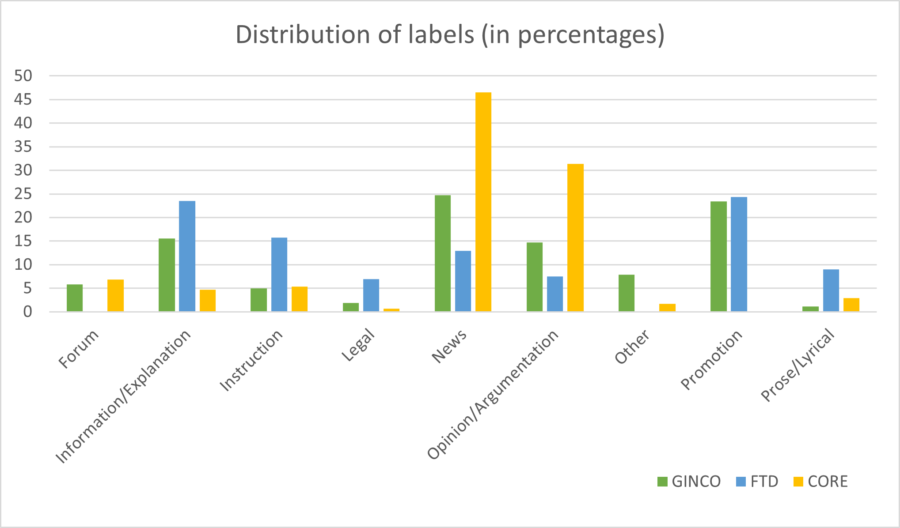

**The distribution of X-GENRE labels in the GINCO dataset**

Roughly 10% (109 texts - 11%) of the texts are discarded (labels 'FAQ' and 'List of Summaries/Excerpts'). Number of texts used: 893. Distribution of labels (without the "discarded" ones):

|                         |   Count |   Percentage |
|-----------------------|--------:|-------------:|
| News                    |     221 |        24.75 |
| Promotion               |     209 |        23.4  |
| Information/Explanation |     139 |        15.57 |
| Opinion/Argumentation   |     131 |        14.67 |
| Other                   |      70 |         7.84 |
| Forum                   |      52 |         5.82 |
| Instruction             |      44 |         4.93 |
| Legal                   |      17 |         1.9  |
| Prose/Lyrical           |      10 |         1.12 |

The dataset was split into 60:20:20 stratified train-dev-test split (535-179-179 texts). It has 9 labels: ['Information/Explanation' 'Opinion/Argumentation' 'Promotion' 'Other' 'Forum' 'News' 'Prose/Lyrical' 'Instruction' 'Legal']


**The distribution of X-GENRE labels in the FTD dataset**

364 texts (23% of all texts, including texts with multiple labels) are discarded (labels 'A1 (argumentative)', 'A17 (review)'). Texts with multiple labels (139) are discarded as well. Number of texts used: 1050. Texts were split into 60:20:20 train-dev-test split (630:210:210 texts), stratified based on the labels. There are 7 labels: ['Prose/Lyrical', 'Promotion', 'News', 'Opinion/Argumentation', 'Instruction', 'Legal', 'Information/Explanation']

|                         |   Count |   Percentage |
|-----------------------|--------:|-------------:|
| Promotion               |     256 |        24.38 |
| Information/Explanation |     247 |        23.52 |
| Instruction             |     165 |        15.71 |
| News                    |     136 |        12.95 |
| Prose/Lyrical           |      94 |         8.95 |
| Opinion/Argumentation   |      79 |         7.52 |
| Legal                   |      73 |         6.95 |

**The distribution of X-GENRE labels in the CORE dataset**

11211 texts (23% of all texts, including texts with multiple labels or no subcategory label) are discarded (labels: Advice (CORE),  Course Materials (CORE),  Description of a Person (CORE),  Description of a Thing (CORE),  Description with Intent to Sell (CORE), FAQ about How-to (CORE),  FAQ about Information (CORE),  Historical Article (CORE),  Information Blog (CORE),  Magazine Article (CORE),  Other Forum (CORE),  Other Information (CORE),  Other Informational Persuasion (CORE),  Other Opinion (CORE),  Other Spoken (CORE),  Poem (CORE),  Question/Answer Forum (CORE),  Reader/Viewer Responses (CORE),  Religious Blogs/Sermons (CORE),  Technical Report (CORE),  Transcript of Video/Audio (CORE),  Travel Blog (CORE),  Other Narrative (CORE), Other Lyrical (CORE), Other How-to (CORE)). Texts with multiple labels (3622 texts) or no subcategory label (4932 texts) are discarded as well.

Number of texts that have a mapping (other than "discarded"): 28,655.

|                         |   Count |   Percentage |
|-----------------------|--------:|-------------:|
| News                    |   13323 |        46.49 |
| Opinion/Argumentation   |    8979 |        31.33 |
| Forum                   |    1950 |         6.81 |
| Instruction             |    1528 |         5.33 |
| Information/Explanation |    1344 |         4.69 |
| Prose/Lyrical           |     842 |         2.94 |
| Other                   |     490 |         1.71 |
| Legal                   |     186 |         0.65 |
| Promotion               |      13 |         0.05 |

As we can see from the table, the distribution of the labels is severely unbalanced. As I will use much less texts in the experiments, I decided to discard 80% of News instances and 6900 instances of Opinion to make the dataset smaller and more balanced. Then I used only 1000 instances of the resulting 10,755 to have a sample of a similar size than FTD and GINCO. The sample was created as a stratified split from the 10.000 instances, stratified according to the label distribution. There are only 13 instances of "Promotion" in the entire dataset and I did not want to discard a label, so I decided to add all 13 texts to the sample.

Number of texts: 1000

|                         |   Count |   Percentage |
|-----------------------|--------:|-------------:|
| News                    |     216 |     21.3228  |
| Opinion/Argumentation   |     194 |     19.151   |
| Forum                   |     182 |     17.9664  |
| Instruction             |     142 |     14.0178  |
| Information/Explanation |     125 |     12.3396  |
| Prose/Lyrical           |      78 |      7.6999  |
| Other                   |      46 |      4.54097 |
| Legal                   |      17 |      1.67818 |
| Promotion               |      13 |      1.28332 |

The sample was split in a 60:20:20 train-dev-test split (607:203:203 texts), stratified based on the labels. There are 9 labels: ['Other', 'Information/Explanation', 'News', 'Instruction', 'Opinion/Argumentation', 'Forum', 'Prose/Lyrical', 'Legal', 'Promotion']


**The distribution of X-GENRE labels in the joined dataset (X-GENRE dataset)**

The splits of the joined dataset constitute of the splits from each dataset (e.g., the train split constitutes of the FTD, GINCO and CORE train splits as used when training classifiers on them). Total number of instances: 2956 (train-dev-test: 1772-592-592 texts).

Distribution of labels:

|                         |   Count |   Percentage |
|-----------------------|--------:|-------------:|
| News                    |     573 |    0.193843  |
| Information/Explanation |     511 |    0.172869  |
| Promotion               |     478 |    0.161705  |
| Opinion/Argumentation   |     404 |    0.136671  |
| Instruction             |     351 |    0.118742  |
| Forum                   |     234 |    0.079161  |
| Prose/Lyrical           |     182 |    0.0615697 |
| Other                   |     116 |    0.0392422 |
| Legal                   |     107 |    0.0361976 |


#### X-GENRE classifiers

In all experiments I followed the methodology from the baseline experiments - I trained the model on the train split, performed hyperparameter search (search for no. of epochs) on dev split and tested it on the test split. As a hyperparameter search, I first evaluated during training and chose an array of the most useful epochs based on the training and evaluation loss (I searched for an epoch before the evaluation loss starts rising again). Then I trained and tested (on dev split) the model on each of the chosen epochs and found the optimum one.

##### Overview of results

All results (analysed separately below):

| Trained on   | Tested on    |   Micro F1 |   Macro F1 |
|------------|------------|-----------:|-----------:|
| FTD          | FTD          |      0.843 |      0.851 |
| X-GENRE      | CORE         |      0.837 |      0.859 |
| FTD          | FTD-dev      |      0.814 |      0.828 |
| X-GENRE      | FTD          |      0.804 |      0.809 |
| X-GENRE      | X-GENRE      |      0.797 |      0.794 |
| X-GENRE      | X-GENRE-dev  |      0.784 |      0.784 |
| CORE         | CORE         |      0.778 |      0.627 |
| MT-GINCO     | MT-GINCO-dev |      0.765 |      0.759 |
| CORE         | CORE-dev     |      0.764 |      0.609 |
| SI-GINCO     | SI-GINCO     |      0.754 |      0.75  |
| X-GENRE      | SI-GINCO     |      0.749 |      0.758 |
| MT-GINCO     | MT-GINCO     |      0.743 |      0.723 |
| MT-GINCO     | FTD          |      0.736 |      0.718 |
| MT-GINCO     | SI-GINCO     |      0.732 |      0.655 |
| SI-GINCO     | FTD          |      0.726 |      0.654 |
| X-GENRE      | MT-GINCO     |      0.698 |      0.676 |
| MT-GINCO     | X-GENRE      |      0.698 |      0.667 |
| X-GENRE      | EN-GINCO     |      0.688 |      0.691 |
| SI-GINCO     | MT-GINCO     |      0.676 |      0.596 |
| SI-GINCO     | X-GENRE      |      0.672 |      0.617 |
| SI-GINCO     | SI-GINCO-dev |      0.67  |      0.582 |
| MT-GINCO     | CORE         |      0.66  |      0.553 |
| MT-GINCO     | EN-GINCO     |      0.654 |      0.538 |
| FTD          | X-GENRE      |      0.635 |      0.532 |
| SI-GINCO     | EN-GINCO     |      0.632 |      0.502 |
| SI-GINCO     | CORE         |      0.591 |      0.521 |
| FTD          | EN-GINCO     |      0.574 |      0.475 |
| FTD          | SI-GINCO     |      0.57  |      0.498 |
| FTD          | MT-GINCO     |      0.57  |      0.458 |
| CORE         | X-GENRE      |      0.551 |      0.481 |
| CORE         | FTD          |      0.495 |      0.419 |
| CORE         | EN-GINCO     |      0.485 |      0.422 |
| FTD          | CORE         |      0.478 |      0.397 |
| CORE         | MT-GINCO     |      0.385 |      0.394 |
| CORE         | SI-GINCO     |      0.374 |      0.348 |


**In-dataset experiments**

| Trained on   |   Micro F1 |   Macro F1 |
|------------|-----------:|-----------:|
| FTD          |      0.843 |      0.851 |
| X-GENRE      |      0.797 |      0.794 |
| CORE         |      0.778 |      0.627 |
| SI-GINCO     |      0.754 |      0.75  |
| MT-GINCO     |      0.743 |      0.723 |

Comparison with the baseline results (original schemata):

| Dataset | Micro F1 | Macro F1 |
|---------|----------|----------|
| FTD     | 0.739    | 0.74     |
| MT-GINCO-downcast        |   0.72       |  0.723        |
| GINCO-downcast        |  0.73        |  0.715        |
| CORE-main        |    0.745      |   0.62       |
| GINCO-full-set        |  0.591        | 0.466         |
| CORE-sub        |    0.661      |   0.394       |

In-dataset experiments with joint labels (X-GENRE labels) give better results than the experiments with the original schemata. However, this could be due to the fact that problematic categories were not used here. Like in the first experiments, FTD has the best results, but here, its results are much higher than the scores of other classifiers. We should also note that FTD has less labels than other datasets (no Forum). The X-GENRE dataset (all datasets joined) has the second best results, and its scores are better than all scores from the baseline experiments. It is followed by CORE on micro F1 and the GINCO classifiers on the macro F1. MT-GINCO performs similarly to SL-GINCO (but slightly worse).

Despite the fact that FTD reaches very high in-dataset results, it reaches much worse results in cross-dataset experiments (even on X-GENRE). This is not surprising, as all other datasets have instances of Forum, while the FTD classifier was not trained on any.

The scores for predictions of FTD classifier on the SI-GINCO and MT-GINCO are almost the same (same micro F1, difference in 5 points in macro F1  better scores on SI-GINCO). FTD is least comparable with CORE (micro F1: 0.48, macro F1 0.40).

SI-GINCO reaches higher results on FTD (0.77 micro F1, 0.65 macro F1) than on MT-GINCO or X-GENRE (0.67 micro F1, 0.62 macro F1), and the lowest scores on CORE (0.59 micro F1, 0.52 macro F1). However, it reaches much higher scores on CORE than FTD. It has issues with identifying Prose/Lyrical (rare category in GINCO). MT-GINCO achieves higher scores in cross-dataset experiments, but not significantly  the scores are up to 7 points higher in micro and macro F1.

CORE classifier has much lower results on other datasets than FTD and GINCO (highest scores in cross-lingual experiments 0.55 and 0.48 on X-GENRE. Regarding micro F1, its scores on FTD are almost 10 points better than on GINCO (MT-GINCO), while the macro F1 scores are similar. Scores for testing on MT- and SL-GINCO are similar, with MT-GINCO being better (for 2 points in micro F1, 4 points in macro F1). CORE struggles the most with predicting Promotion, Opinion/Argumentation and Legal.

X-GENRE (trained on all datasets joined) classifier achieves very good results. Surprisingly, its best results are on CORE (0.84 micro F1, 0.86 macro F1), followed by the results on FTD and the lowest results on MT-GINCO (0.70 micro F1, 0.68 macro F1) which was not in the training split (only the SI-GINCO was included). When used on MT-GINCO, it struggled the most with predicting Opinion/Argumentation and Other. If we compare the results based on the dataset on which classifiers were tested, the best results are always with the in-dataset classifier, except for CORE, where X-GENRE classifier achieves better results on the CORE test split than the CORE classifier (I assume this is because some labels, like Promotion, are much better represented in X-GENRE). Then, the second best classifier is X-GENRE which shows that merging datasets helped. Regarding the capability of the classifiers in the cross-dataset experiments, GINCO (MT-GINCO) achieves the best results when applied to other datasets (to FTD: 0.74 micro F1, 0.72 macro F1; to CORE: 0.66 micro F1, 0.55 macro F1), followed by SI-GINCO. FTD achieves lower results (applied to SL-GINCO: 0.57 micro F1, 0.50 macro F1, to CORE: 0.48 micro F1, 0.40 macro F1), while the CORE dataset is the least comparable, probably because it problems with predicting Promotion while there is many instances of this class in other datasets (applied to FTD: 0.50 micro F1, 0.42 macro F1; to SI-GINCO: 0.37 micro F1, 0.35 macro F1).


##### FTD-X-GENRE classifier

Hyperparameters:
```
        args= {
            "overwrite_output_dir": True,
            "num_train_epochs": 8,
            "train_batch_size":8,
            "learning_rate": 1e-5,
            "labels_list": LABELS,
            # The following parameters are commented out because I want to save the model
            #"no_cache": True,
            # Disable no_save: True if you want to save the model
            #"no_save": True,
            "max_seq_length": 512,
            "save_steps": -1,
            # Only the trained model will be saved - to prevent filling all of the space
            "save_model_every_epoch":False,
            "wandb_project": 'X-GENRE classifiers',
            "silent": True,
            }
```

To load the FTD-X-GENRE model from Wandb:
```
import wandb
run = wandb.init()
artifact = run.use_artifact('tajak/X-GENRE classifiers/FTD-X-GENRE-classifier:v0', type='model')
artifact_dir = artifact.download()

# Loading a local save
model = ClassificationModel(
    "xlmroberta", artifact_dir)
```

| Trained on   | Tested on   |   Micro F1 |   Macro F1 |
|------------|-----------|-----------:|-----------:|
| FTD          | FTD         |      0.843 |      0.851 |
| FTD          | FTD-dev     |      0.814 |      0.828 |
| FTD          | X-GENRE     |      0.635 |      0.532 |
| FTD          | SI-GINCO    |      0.57  |      0.498 |
| FTD          | MT-GINCO    |      0.57  |      0.458 |
| FTD          | CORE        |      0.478 |      0.397 |


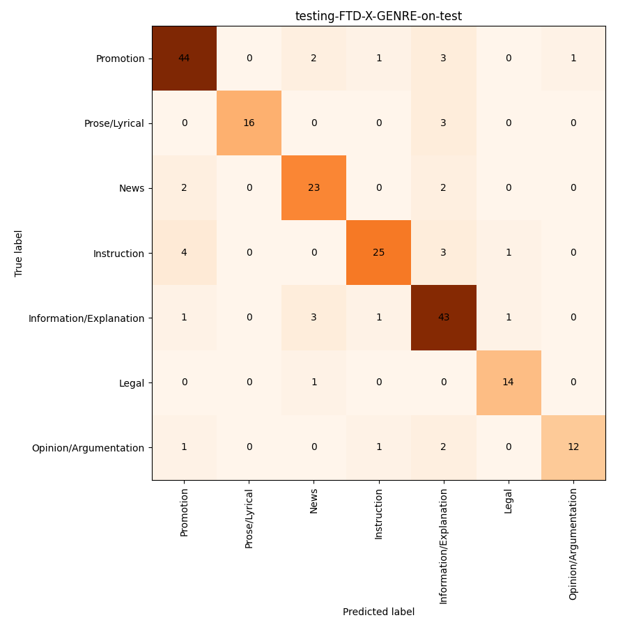

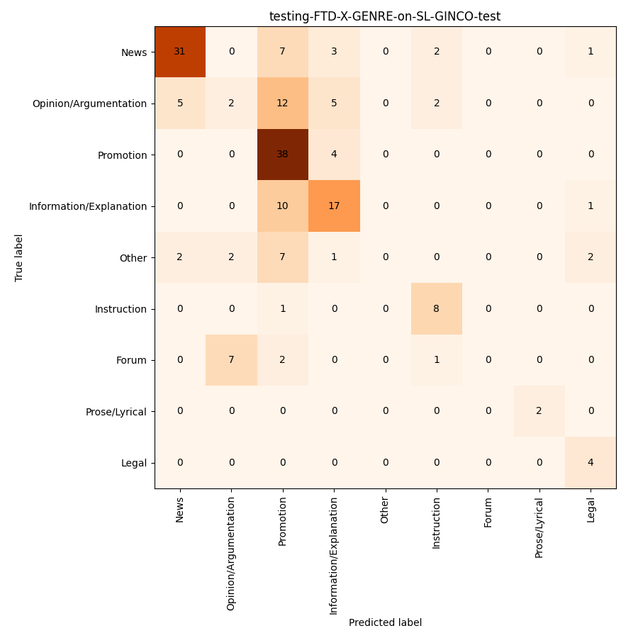

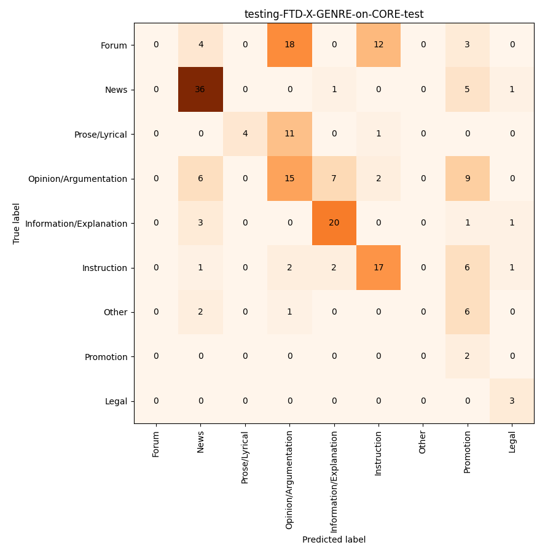

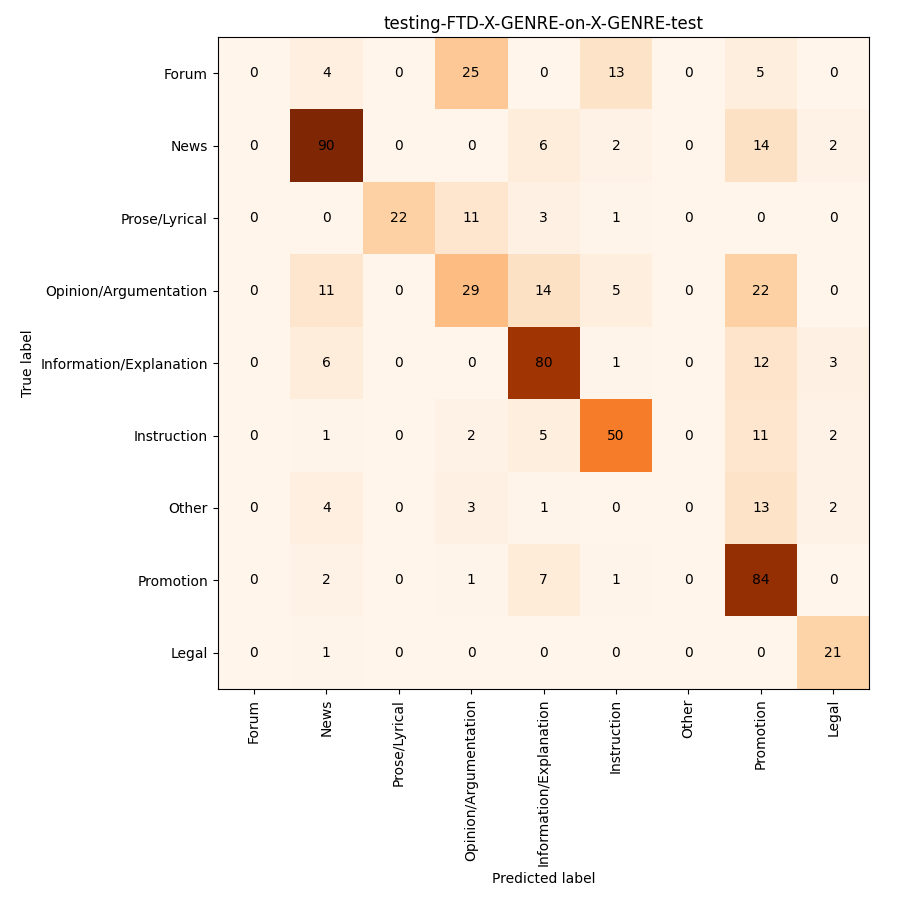

##### SI-GINCO-X-GENRE classifier & MT-GINCO-X-GENRE classifier

For training of MT-GINCO-X-GENRE, I used the same code as for the training of SI-GINCO-X-GENRE, I just changed the datasets from Slovene to MT-GINCO.

Hyperparameters (both classifiers use the same hyperparameters):
```
        args= {
            "overwrite_output_dir": True,
            "num_train_epochs": 20,
            "train_batch_size":8,
            "learning_rate": 1e-5,
            "labels_list": LABELS,
            # The following parameters are commented out because I want to save the model
            #"no_cache": True,
            # Disable no_save: True if you want to save the model
            #"no_save": True,
            "max_seq_length": 512,
            "save_steps": -1,
            # Only the trained model will be saved - to prevent filling all of the space
            "save_model_every_epoch":False,
            "wandb_project": 'X-GENRE classifiers',
            "silent": True,
            }

```

To load the SI-GINCO-X-GENRE model from Wandb:

```
import wandb
run = wandb.init()
artifact = run.use_artifact('tajak/X-GENRE classifiers/SI-GINCO-X-GENRE-classifier:v0', type='model')
artifact_dir = artifact.download()

# Loading a local save
model = ClassificationModel(
    "xlmroberta", artifact_dir)
```

**SL-GINCO results**:

| Trained on   | Tested on    |   Micro F1 |   Macro F1 |
|------------|------------|-----------:|-----------:|
| SI-GINCO     | SI-GINCO     |      0.754 |      0.75  |
| SI-GINCO     | FTD          |      0.726 |      0.654 |
| SI-GINCO     | MT-GINCO     |      0.676 |      0.596 |
| SI-GINCO     | X-GENRE      |      0.672 |      0.617 |
| SI-GINCO     | SI-GINCO-dev |      0.67  |      0.582 |
| SI-GINCO     | CORE         |      0.591 |      0.521 |

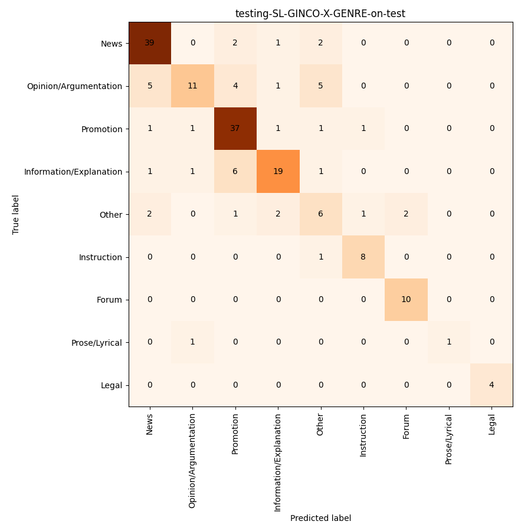

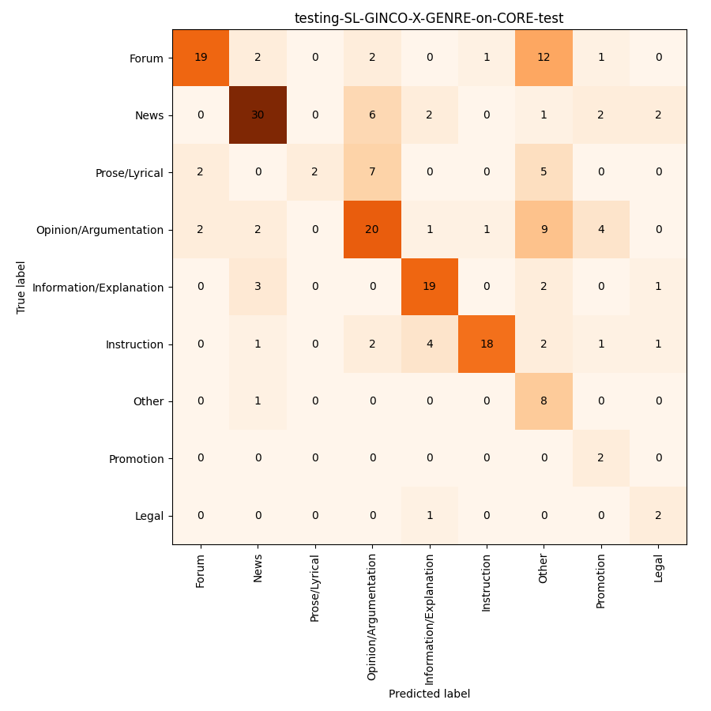


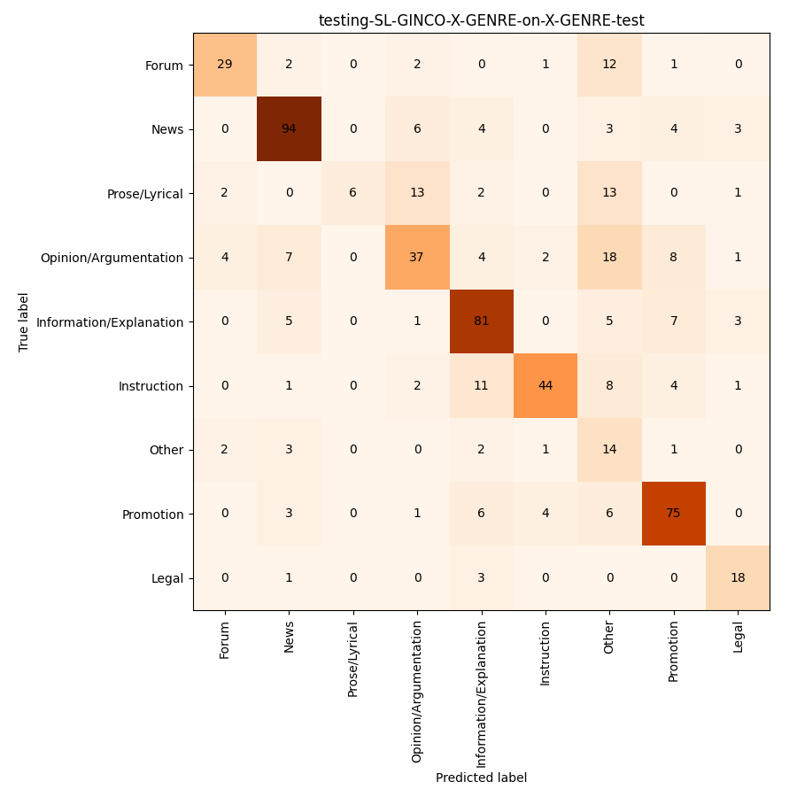

**MT-GINCO**

To load the MT-GINCO-X-GENRE model from Wandb:

```
import wandb
run = wandb.init()
artifact = run.use_artifact('tajak/X-GENRE classifiers/MT-GINCO-X-GENRE-classifier:v0', type='model')
artifact_dir = artifact.download()

# Loading a local save
model = ClassificationModel(
    "xlmroberta", artifact_dir)
```

**MT-GINCO results**

| Trained on   | Tested on    |   Micro F1 |   Macro F1 |
|------------|------------|-----------:|-----------:|
| MT-GINCO     | MT-GINCO-dev |      0.765 |      0.759 |
| MT-GINCO     | MT-GINCO     |      0.743 |      0.723 |
| MT-GINCO     | FTD          |      0.736 |      0.718 |
| MT-GINCO     | SI-GINCO     |      0.732 |      0.655 |
| MT-GINCO     | X-GENRE      |      0.698 |      0.667 |
| MT-GINCO     | CORE         |      0.66  |      0.553 |

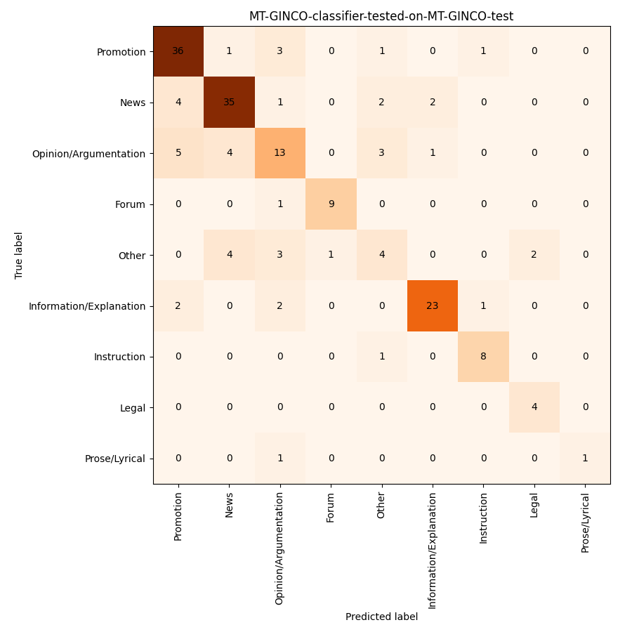

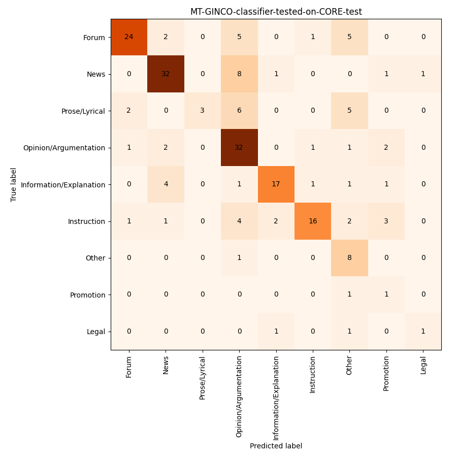

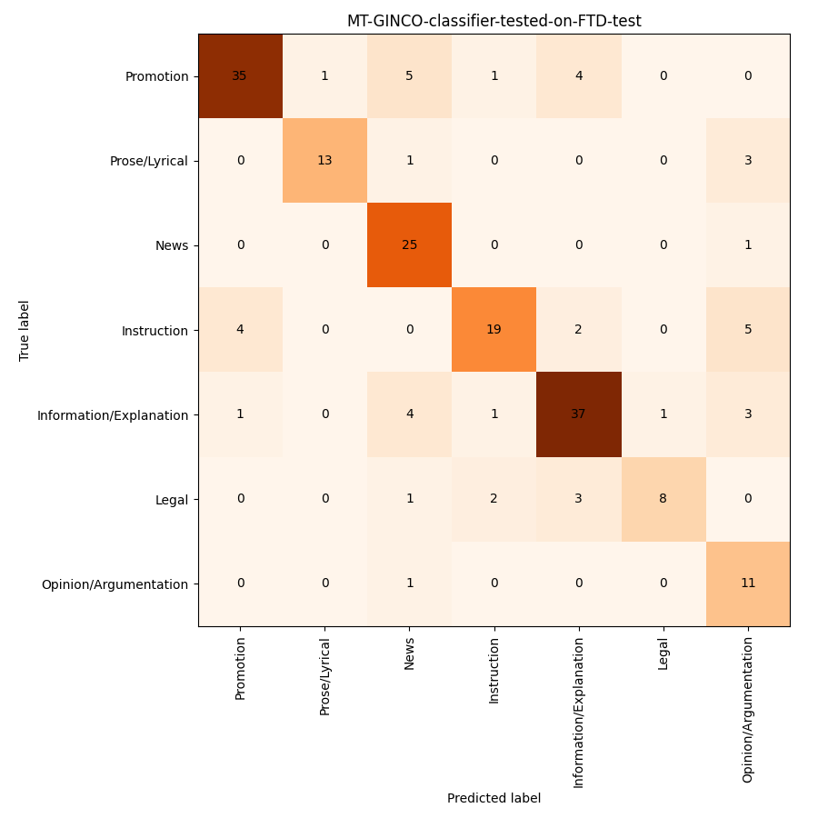

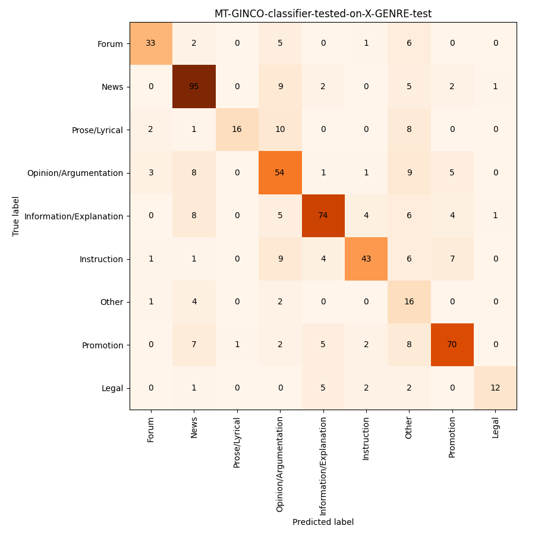


##### CORE-X-GENRE classifier

Hyperparameters used:

```
        args= {
            "overwrite_output_dir": True,
            "num_train_epochs": 10,
            "train_batch_size":8,
            "learning_rate": 1e-5,
            "labels_list": LABELS,
            # The following parameters are commented out because I want to save the model
            #"no_cache": True,
            # Disable no_save: True if you want to save the model
            #"no_save": True,
            "max_seq_length": 512,
            "save_steps": -1,
            # Only the trained model will be saved - to prevent filling all of the space
            "save_model_every_epoch":False,
            "wandb_project": 'X-GENRE classifiers',
            "silent": True,
            }
```

To access the model from the Wandb:

```
import wandb
run = wandb.init()
artifact = run.use_artifact('tajak/X-GENRE classifiers/CORE-X-GENRE-classifier:v0', type='model')
artifact_dir = artifact.download()

# Loading a local save
model = ClassificationModel(
    "xlmroberta", artifact_dir)
```

| Trained on   | Tested on   |   Micro F1 |   Macro F1 |
|------------|-----------|-----------:|-----------:|
| CORE         | CORE        |      0.778 |      0.627 |
| CORE         | CORE-dev    |      0.764 |      0.609 |
| CORE         | X-GENRE     |      0.551 |      0.481 |
| CORE         | FTD         |      0.495 |      0.419 |
| CORE         | MT-GINCO    |      0.385 |      0.394 |
| CORE         | SI-GINCO    |      0.374 |      0.348 |

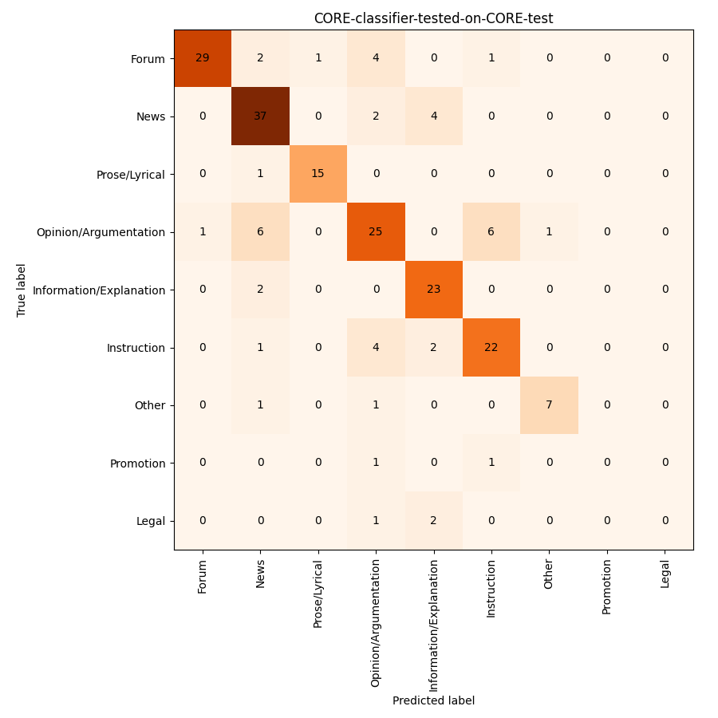

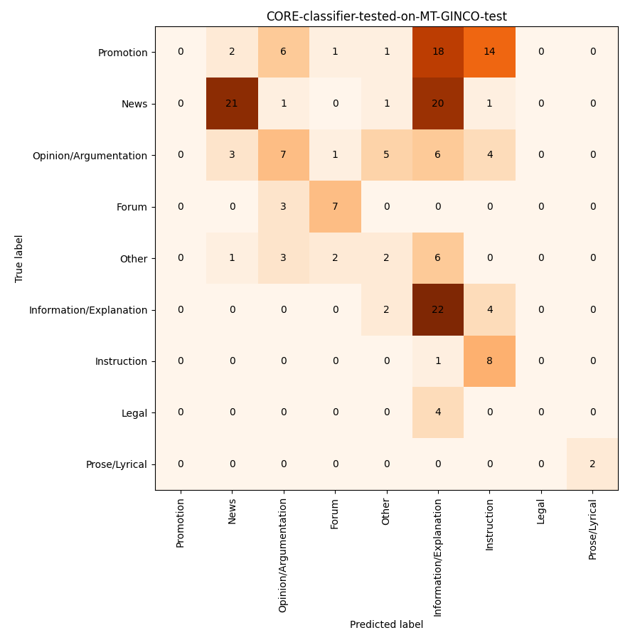

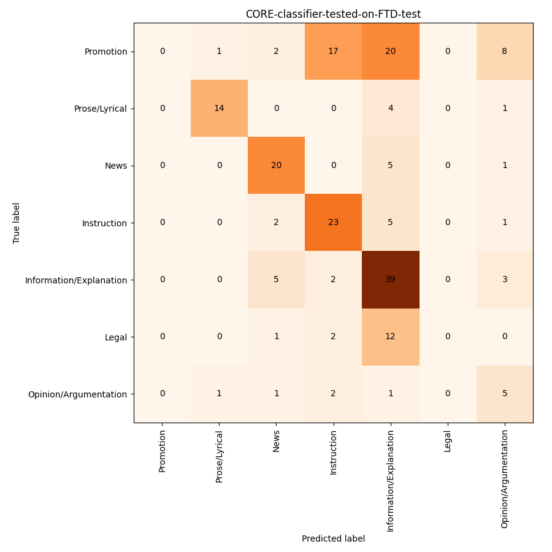

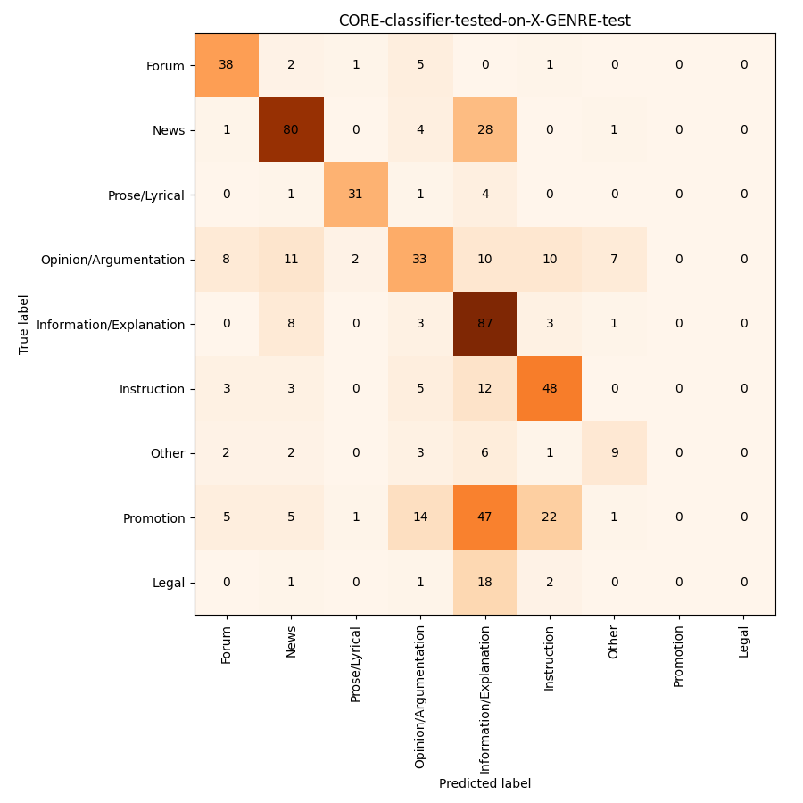

##### X-GENRE classifier

Hyperparameters:
```
args= {
            "overwrite_output_dir": True,
            "num_train_epochs": 15,
            "train_batch_size":8,
            "learning_rate": 1e-5,
            "labels_list": LABELS,
            "max_seq_length": 512,
            "save_steps": -1,
            # Only the trained model will be saved - to prevent filling all of the space
            "save_model_every_epoch":False,
            "wandb_project": 'X-GENRE classifiers',
            "silent": True,
            }
```

To access the model from the Wandb:

```
import wandb
run = wandb.init()
artifact = run.use_artifact('tajak/X-GENRE classifiers/X-GENRE-classifier:v0', type='model')
artifact_dir = artifact.download()

# Loading a local save
model = ClassificationModel(
    "xlmroberta", artifact_dir)
```


| Trained on   | Tested on   |   Micro F1 |   Macro F1 |
|------------|-----------|-----------:|-----------:|
| X-GENRE      | CORE        |      0.837 |      0.859 |
| X-GENRE      | FTD         |      0.804 |      0.809 |
| X-GENRE      | X-GENRE     |      0.797 |      0.794 |
| X-GENRE      | X-GENRE-dev |      0.784 |      0.784 |
| X-GENRE      | SI-GINCO    |      0.749 |      0.758 |
| X-GENRE      | MT-GINCO    |      0.698 |      0.676 |


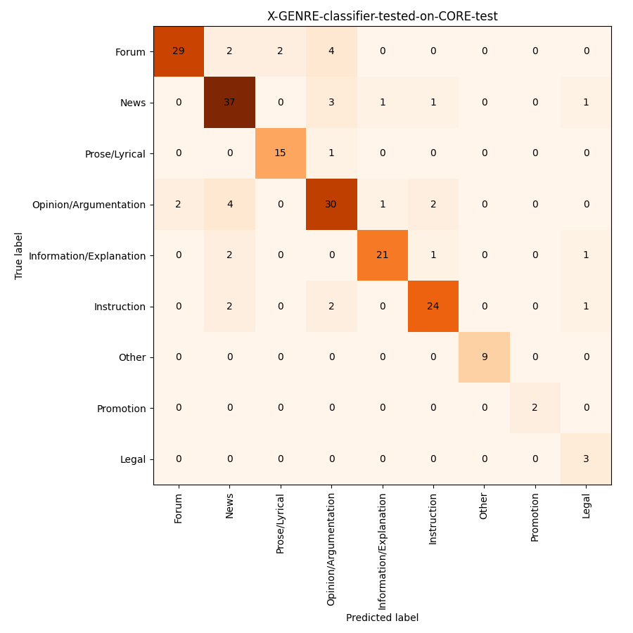

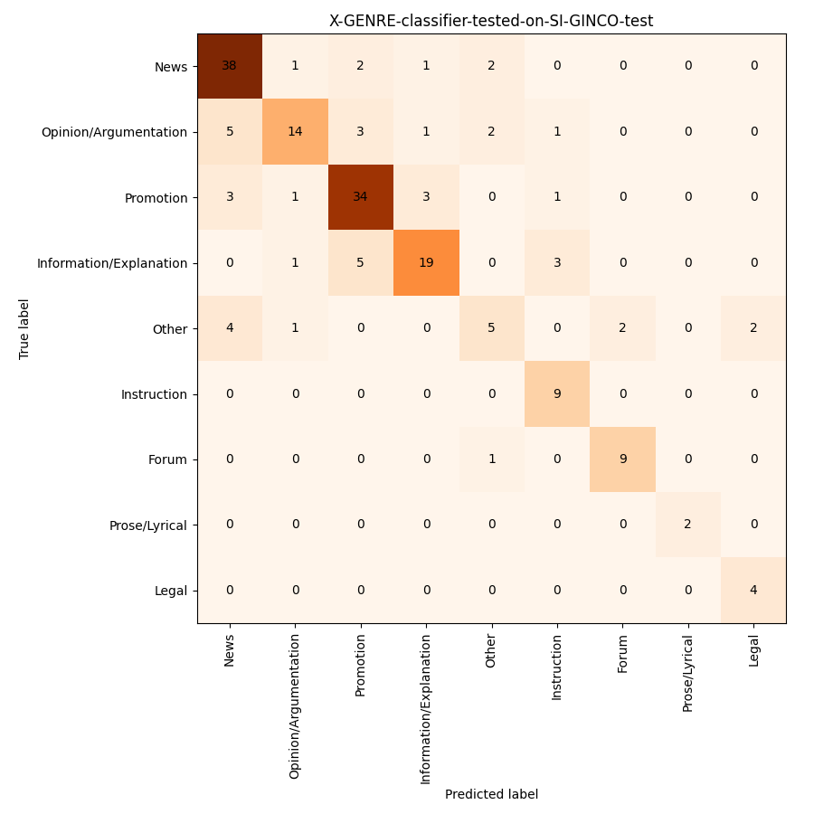

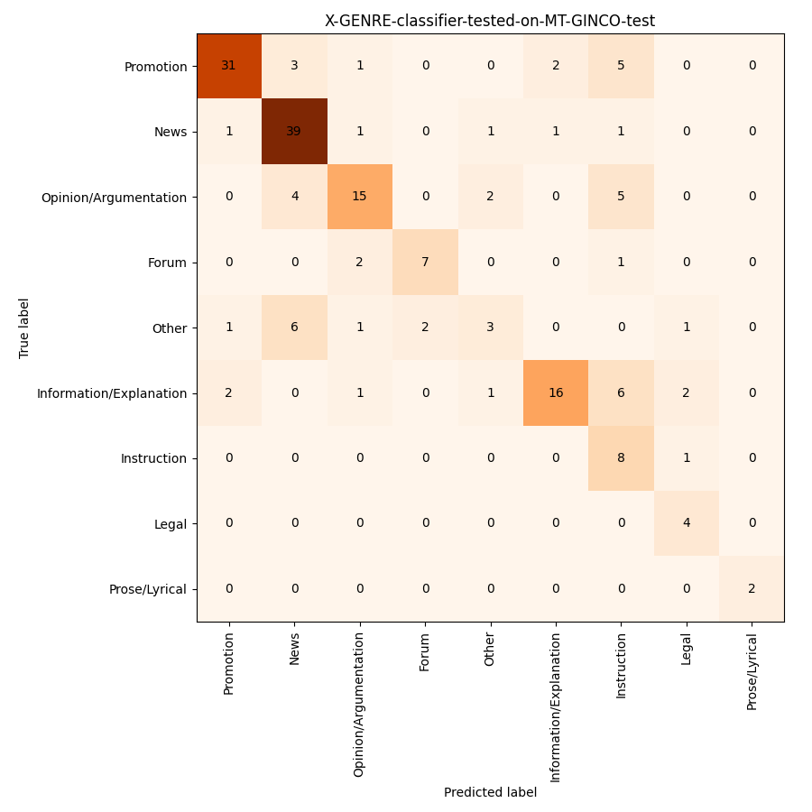


##### X-GENRE-2 classifier

Then we decided that it might be better to train the joint classifier only on on labels that are present in all of the datasets. That is why we discarded Forum and Other from the train, dev and test split for X-GENRE. This classifier is named X-GENRE-2.

The final dataset has 7 labels and 2606 instances. The sizes of splits are Train: 1562, Dev: 522, Test: 522.

Label distribution:

|                         |   labels |
|:------------------------|---------:|
| News                    |      573 |
| Information/Explanation |      511 |
| Promotion               |      478 |
| Opinion/Argumentation   |      404 |
| Instruction             |      351 |
| Prose/Lyrical           |      182 |
| Legal                   |      107 |

|                         |    labels |
|:------------------------|----------:|
| News                    | 0.219877  |
| Information/Explanation | 0.196086  |
| Promotion               | 0.183423  |
| Opinion/Argumentation   | 0.155027  |
| Instruction             | 0.134689  |
| Prose/Lyrical           | 0.0698388 |
| Legal                   | 0.0410591 |

|                                                          |   substituted_words (word in translation, corrected word) |
|:---------------------------------------------------------|--------------------:|
| [('Mir', 'Miro')]                                        |                 157 |
| [('Joseph', 'Joef')]                                    |                 112 |
| [('Goranak', 'Gorenak')]                                 |                  98 |
| [('Weber', 'Veber')]                                     |                  77 |
| [('Sarca', 'arec')]                                     |                  61 |
| [('Fisher', 'Fier')]                                    |                  57 |
| [('Matthew', 'Matej')]                                   |                  55 |
| [('Jean', 'an')]                                        |                  51 |
| [('Serva', 'Sluga')]                                     |                  42 |
| [('Shabeder', 'abeder')]                                |                  41 |
| [('Moon', 'Mesec')]                                      |                  41 |
| [('Sharec', 'arec')]                                    |                  38 |
| [('Christmas', 'Boi')]                                 |                  34 |


#### Results based on "tested on"

Results for tested on SI-GINCO:

| Trained on   | Tested on   |   Micro F1 |   Macro F1 |
|------------|-----------|-----------:|-----------:|
| SI-GINCO     | SI-GINCO    |      0.754 |      0.75  |
| X-GENRE      | SI-GINCO    |      0.749 |      0.758 |
| MT-GINCO     | SI-GINCO    |      0.732 |      0.655 |
| FTD          | SI-GINCO    |      0.57  |      0.498 |
| CORE         | SI-GINCO    |      0.374 |      0.348 |


Results for tested on MT-GINCO:

| Trained on   | Tested on   |   Micro F1 |   Macro F1 |
|------------|-----------|-----------:|-----------:|
| MT-GINCO     | MT-GINCO    |      0.743 |      0.723 |
| X-GENRE      | MT-GINCO    |      0.698 |      0.676 |
| SI-GINCO     | MT-GINCO    |      0.676 |      0.596 |
| FTD          | MT-GINCO    |      0.57  |      0.458 |
| CORE         | MT-GINCO    |      0.385 |      0.394 |


Results for tested on CORE:

| Trained on   | Tested on   |   Micro F1 |   Macro F1 |
|------------|-----------|-----------:|-----------:|
| X-GENRE      | CORE        |      0.837 |      0.859 |
| CORE         | CORE        |      0.778 |      0.627 |
| MT-GINCO     | CORE        |      0.66  |      0.553 |
| SI-GINCO     | CORE        |      0.591 |      0.521 |
| FTD          | CORE        |      0.478 |      0.397 |

Results for tested on FTD:

| Trained on   | Tested on   |   Micro F1 |   Macro F1 |
|------------|-----------|-----------:|-----------:|
| FTD          | FTD         |      0.843 |      0.851 |
| X-GENRE      | FTD         |      0.804 |      0.809 |
| MT-GINCO     | FTD         |      0.736 |      0.718 |
| SI-GINCO     | FTD         |      0.726 |      0.654 |
| CORE         | FTD         |      0.495 |      0.419 |


Results for tested on X-GENRE:

| Trained on   | Tested on   |   Micro F1 |   Macro F1 |
|------------|-----------|-----------:|-----------:|
| X-GENRE      | X-GENRE     |      0.797 |      0.794 |
| MT-GINCO     | X-GENRE     |      0.698 |      0.667 |
| SI-GINCO     | X-GENRE     |      0.672 |      0.617 |
| FTD          | X-GENRE     |      0.635 |      0.532 |
| CORE         | X-GENRE     |      0.551 |      0.481 |

#### Classifiers tested on EN-GINCO

| Trained on   | Tested on   |   Micro F1 |   Macro F1 |
|------------|-----------|-----------:|-----------:|
| X-GENRE      | EN-GINCO    |      0.688 |      0.691 |
| MT-GINCO     | EN-GINCO    |      0.654 |      0.538 |
| SI-GINCO     | EN-GINCO    |      0.632 |      0.502 |
| FTD          | EN-GINCO    |      0.574 |      0.475 |
| CORE         | EN-GINCO    |      0.485 |      0.422 |

X-GENRE performs the best.

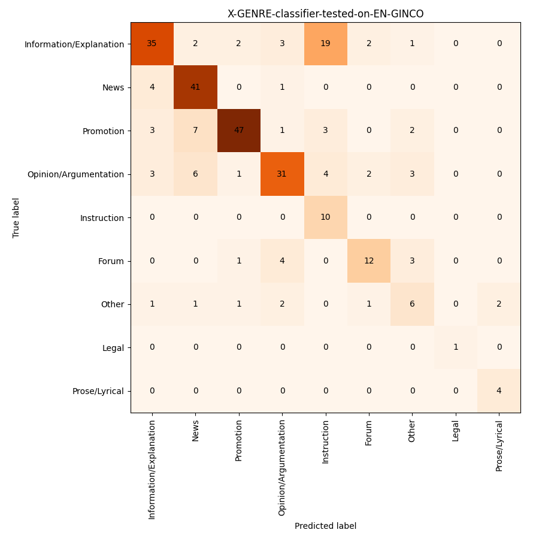

MT-GINCO performs better than SI-GINCO is able to classify Opinion while SI-GINCO has much more problems with this category. On the other hand SI-GINCO classifies Information much better.

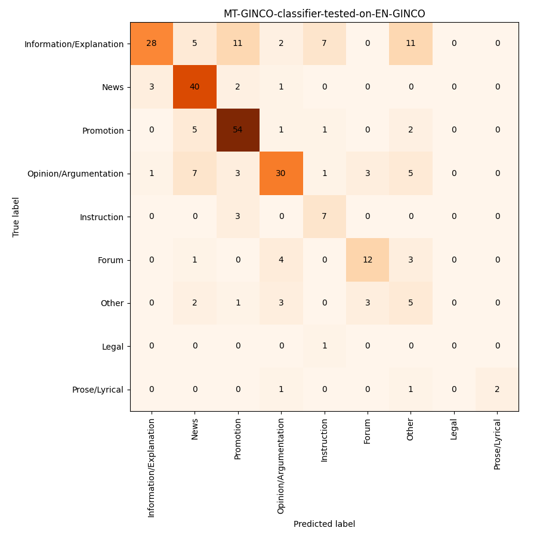

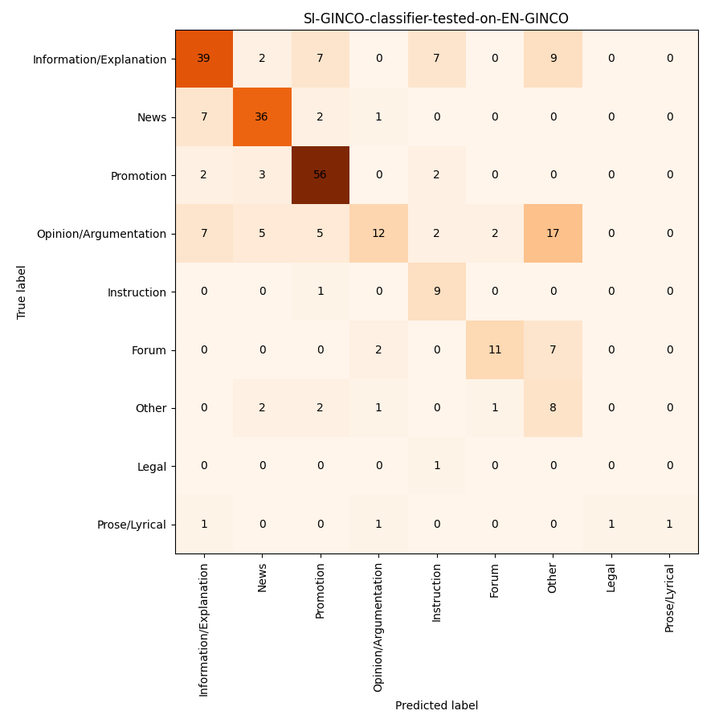

FTD performs worse than GINCO datasets, mostly on the account of Forum and Other but also because it missclassifies many instances as Promotion.

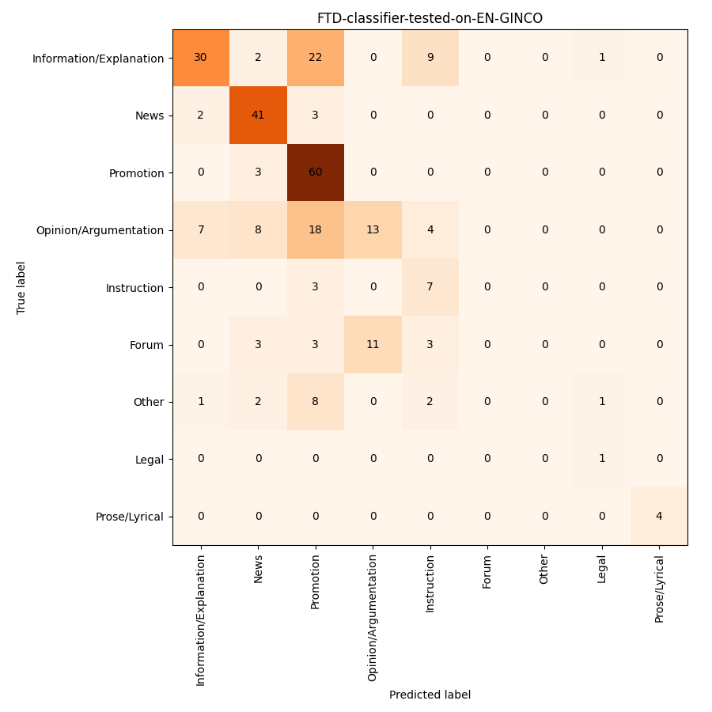

CORE performs much worse, mostly on the account of Promotion and Legal.

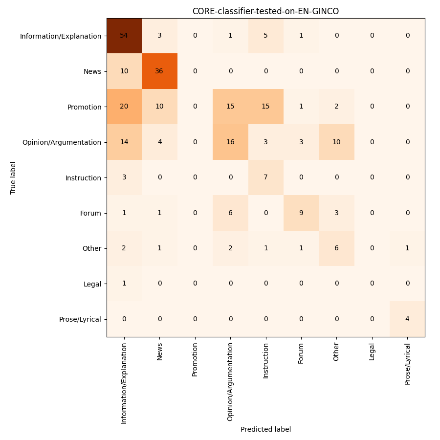


#### Classifiers tested on other X-CORE datasets

##### FinCORE

The original dataset contains 10,738 instances. I discarded duplicated texts (2 instances). Discarded all instances with multiple subcategories (2847 instances) and instances with no subcategory (895). 2447 texts were discarded because they are from the "discarded" labels. Final number of instances: 4557.

There are some new labels for which I could not find anywhere what the abbreviations mean (CB, IG etc.)

Distribution of X-CORE labels in FinCORE:

|                         |   Count |   Percentage |
|-----------------------|--------:|-------------:|
| Opinion/Argumentation   |    1765 |        38.73 |
| News                    |    1599 |        35.09 |
| Forum                   |     716 |        15.71 |
| Information/Explanation |     298 |         6.54 |
| Legal                   |     106 |         2.33 |
| Other                   |      44 |         0.97 |
| Instruction             |      29 |         0.64 |

I tested the X-GENRE classifier on a (stratified) sample of FinCORE (200 instances) and the results were amazing since the classifier did not learn on Finnish: Macro f1: 0.581, Micro f1: 0.674

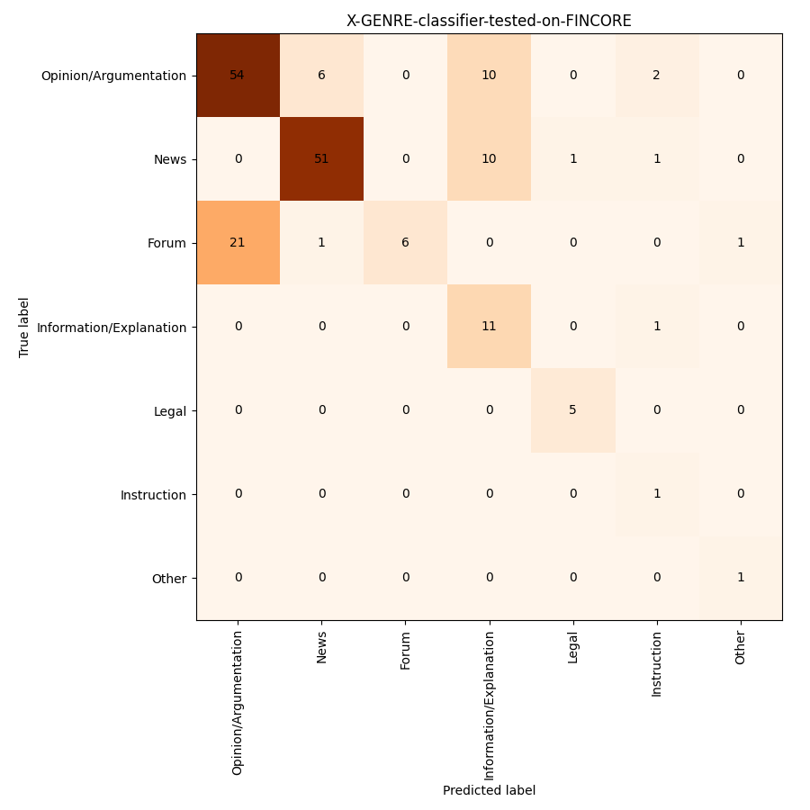

