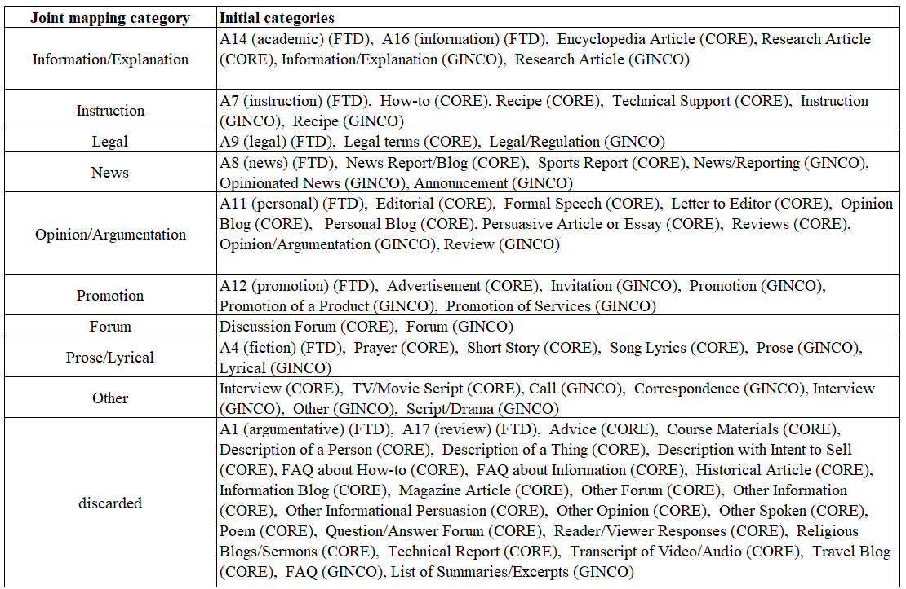
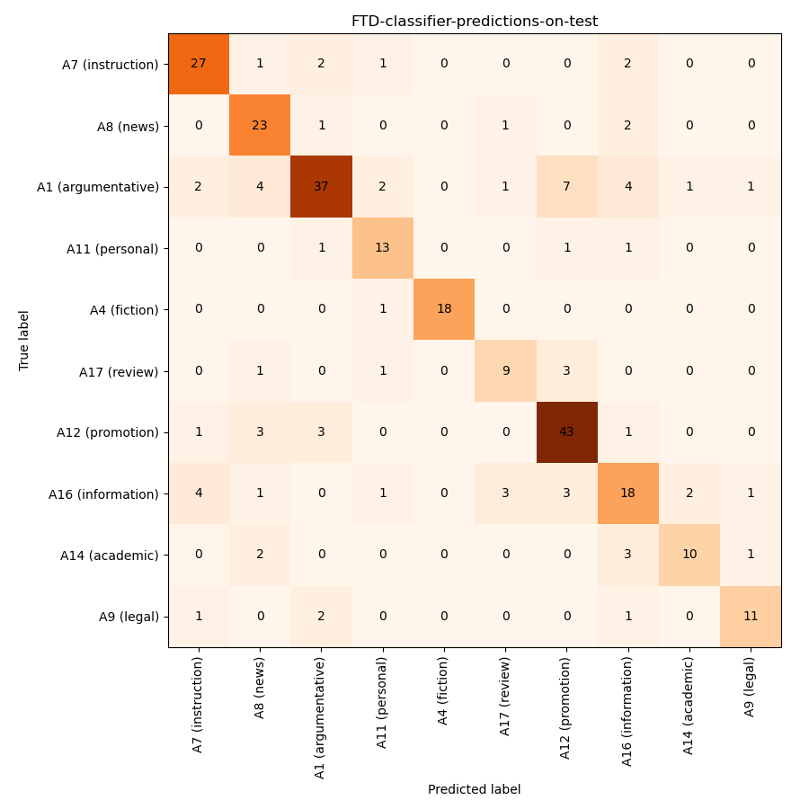
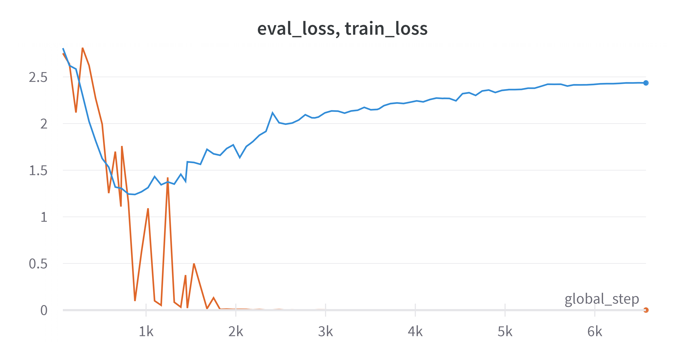

# Comparison of genre datasets: CORE, GINCO and FTD

We compare genre datasets that aim to cover all of the genre diversity found on the web: the CORE dataset, the GINCO dataset and the FTD dataset.

To this end, we perform text classification experiments:
* baseline experiments: in-dataset experiments (training and testing on the same dataset)
* cross-dataset experiments: training on one dataset, applying prediction on the other two - to analyse the comparability of labels (which labels are predicted as which)
* multi-dataset experiments: merging the labels into a joint schema, and training on a combination of all three datasets - using the joint schema, testing on each dataset (+ on a combination of the datasets)
* multi-lingual experiments: extending the multi-dataset experiments by adding the other CORE languages

To simplify experiments, we will perform single-label classification and the texts from CORE and FTD which are labelled with multiple labels will not be used.

We will use the base-sized XLM-RoBERTa model.

The joint schema (merging the FTD labels with the GINCORE labels is based on the [FTD guidelines](https://github.com/ssharoff/genre-keras)):



(FTD categories, marked with a * are not present in the FTD corpus.)

## Repository structure
* artifacts: contains saved models
* data-preparation code: code for preparation of splits for training and testing; some additional data for preparation of splits
* data-sheets-with-all-information: sheets for GINCO, MT-GINCO, CORE and FTD, enriched with all information obtained from the experiments and containing all instances (even those that were not used in the experiments)
* data-splits: datasets, split into train, dev and test splits which were used for classification
* figures: figures with information on results, joint schema etc.
* hyperparameter-search: code with hyperparameter search for FTD - sweep with Wandb (not used in the end)
* results: json and csv files with results of the model training
* root folder: "2.*" - code for training, testing the models and applying prediction to the datasets; "3.*" - code for comparison of labels (based on the prediction on other datasets)

## Table of Contents
* [Experiments overview](#experiments-overview)
* [Information on the datasets](#information-on-the-datasets)
* [Baseline experiments](#baseline-experiments)
* [Comparison of labels based on cross-dataset prediction](#comparison-of-labels-based-on-cross-dataset-prediction)
* [Training on a joint dataset](#training-on-the-joint-schema)
* [X-GENRE: adding X-CORE datasets](#x-genre-adding-x-core-datasets)

## Experiments Overview

As previous experiments have shown that there is little variance between the results, each experiment will be performed once. We will do the following experiments:

1. Baseline experiments (in-dataset experiments) - training and testing on the splits from the same dataset:
    * CORE-main: main categories as labels
    * CORE-sub: subcategories as labels

    | Dataset | Micro F1 | Macro F1 |
    |---------|----------|----------|
    | FTD     | 0.739    | 0.74     |
    | GINCO        |          |          |
    | MT-GINCO        |          |          |
    | CORE-main        |          |          |
    | CORE-sub        |          |          |

    For more details, see [Baseline experiments](#baseline-experiments).

2. Applying prediction to other datasets:
    * predict FTD on Sl-GINCO and MT_GINCO
    * predict FTD on CORE
    * predict MT-GINCO on FTD and CORE
    * predict SL-GINCO on FTD and CORE
    * predict CORE-main on SL-GINCO, MT-GINCO and FTD
    * predict CORE-sub on SL-GINCO, MT-GINCO and FTD

    Comparison between the prediction of FTDs on Slovene and MT text shows that mostly there is not a big difference between prediction on Slovene or English text. Only in 23% instances, there is a difference between the FTD labels predicted on SL and MT text. This indicates that prediction of genre seems to be easily cross-lingual. However, it also depends on genres. On some labels, the predictions are worse on MT (Promotion labels), on some it is better (News: 0.24 more correctly predicted instances of News).

    For more details, see [Comparison of labels based on cross-dataset prediction](#comparison-of-labels-based-on-cross-dataset-prediction)

3. Training on a combination of GINCO + FTD + CORE (joint schema):
    * testing on SL-GINCO and MT-GINCO (joint schema)
    * testing on CORE (joint schema)
    * testing on FTD (joint schema)
    * testing on a combination of GINCO + FTD + CORE (joint schema)
    * testing on EnTenTen (manual analysis whether predicted labels apply)

    For more details, see [Training on a joint dataset](#training-on-the-joint-schema)

6. Multilingual experiments: training on GINCO + FTD + CORE + X-CORE corpora (joint schema):
    * testing on GINCO (GINCO schema)
    * testing on CORE (CORE schema)
    * testing on FTD (FTD schema)
    * (testing on EN-GINCO (GINCO schema))
    * testing on a combination of GINCO + FTD + CORE (joint schema)
    * testing on a combination of all corpora used for training

    For more details, see [X-GENRE: adding X-CORE datasets](#x-genre-adding-x-core-datasets)

## Information on the datasets

Content:
* [Information on CORE](#information-on-core)
* [Information on FTD](#information-on-ftd)
* [Inforrmation on GINCO](#information-on-ginco)

### Information on CORE

When preparing the dataset, we:
* discarded instances with no texts (17)
* discarded duplicates (12)

The dataset has 48,420 texts with 459 different main and sub-category label combinations. Regarding main labels, it has 35 different combinations and 297 different sub-category combinations.

#### CORE-main

CORE-main is the CORE dataset, annotated with main categories only (9 categories). For these experiments, we discarded all text that are annotated with more than 1 main category (5686 texts).

| main labels                  | count | percentage |
|-----------------------------------------|-------|------------|
| Narrative                               | 17659 | 41.3231    |
| Informational Description/Explanation | 9314  | 21.7953    |
| Opinion                                 | 7862  | 18.3975    |
| Interactive Discussion                | 3272  | 7.65667    |
| How-To/Instructional                    | 1493  | 3.49371    |
| Informational Persuasion              | 1330  | 3.11228    |
| Lyrical                                 | 639   | 1.4953     |
| Spoken                                  | 583   | 1.36425    |
| Other                                   | 582   | 1.36191    |


|       |   text_length |
|:------|--------------:|
| text count |      42734    |
| mean  |       1236.27 |
| std   |       3167.36 |
| min   |         52    |
| 25%   |        333    |
| 50%   |        630.5  |
| 75%   |       1152    |
| max   |     118278    |

Total number of texts: 42734, distributed in train split (25640 texts), test and dev split (8547 each), stratified according to the label.

#### CORE-sub

CORE-sub is the CORE dataset, annotated with subcategories only. For the experiments, we:
* discarded all texts that are annotated with multiple subcategories (3622)
* discarded all texts that are not annotated with any subcategory (4932)
* discarded instances belonging to categories with less than 10 instances (17)

| subcategories                     | count | percentage |
|-----------------------------------|-------|------------|
| News Report/Blog                  | 10503 | 26.3458    |
| Opinion Blog                      | 4135  | 10.3722    |
| Description of a   Thing          | 3508  | 8.79948    |
| Sports Report                     | 2820  | 7.0737     |
| Personal Blog                     | 2769  | 6.94577    |
| Discussion Forum                  | 1950  | 4.89139    |
| Reviews                           | 1803  | 4.52265    |
| Information Blog                  | 1526  | 3.82782    |
| How-to                            | 1318  | 3.30608    |
| Description with   Intent to Sell | 1093  | 2.74168    |
| Question/Answer   Forum           | 1052  | 2.63884    |
| Advice                            | 933   | 2.34034    |
| Research Article                  | 822   | 2.06191    |
| Description of a   Person         | 764   | 1.91642    |
| Religious   Blogs/Sermons         | 697   | 1.74836    |
| Song Lyrics                       | 543   | 1.36206    |
| Encyclopedia   Article            | 522   | 1.30939    |
| Interview                         | 468   | 1.17393    |
| Historical Article                | 422   | 1.05855    |
| Travel Blog                       | 283   | 0.709878   |
| Short Story                       | 283   | 0.709878   |
| FAQ about   Information           | 252   | 0.632118   |
| Legal terms                       | 186   | 0.466563   |
| Recipe                            | 171   | 0.428937   |
| Other Information                 | 137   | 0.343651   |
| Persuasive Article   or Essay     | 120   | 0.301008   |
| Course Materials                  | 118   | 0.295992   |
| Poem                              | 73    | 0.183113   |
| Magazine Article                  | 72    | 0.180605   |
| Editorial                         | 66    | 0.165555   |
| Transcript of   Video/Audio       | 62    | 0.155521   |
| Reader/Viewer   Responses         | 50    | 0.12542    |
| FAQ about How-to                  | 47    | 0.117895   |
| Letter to Editor                  | 43    | 0.107861   |
| Formal Speech                     | 43    | 0.107861   |
| Technical Report                  | 41    | 0.102845   |
| Technical Support                 | 39    | 0.0978277  |
| TV/Movie Script                   | 22    | 0.0551849  |
| Other Opinion                     | 18    | 0.0451513  |
| Other Forum                       | 18    | 0.0451513  |
| Other Spoken                      | 17    | 0.0426429  |
| Prayer                            | 16    | 0.0401345  |
| Advertisement                     | 13    | 0.0326092  |
| Other   Informational Persuasion  | 11    | 0.0275924  |
| Other Narrative*                   | 9     | 0.0225756  |
| Other Lyrical*                     | 6     | 0.0150504  |
| Other How-to*                      | 2     | 0.00501681 |

Categories (marked with a *) with less than 10 instances were discarded.

The final dataset contains 39,849 texts, annotated with 44 labels. It was split into train (23,909), test and dev split (7970 each), stratified based on the labels.

### Information on FTD

The dataset is available here: https://github.com/ssharoff/genre-keras/blob/master/en.csv

To simplify experiments, we will perform single-label classification. The original dataset allows multiple-label annotation using a scale from 0 to 2 for each label. To simplify experiments, we will regard texts annotated with 2 at a certain category as belonging to this label.

The distribution of the labels:

| Labels         | Count | % (of single labels)|
|--------------------|-------------|--------------|
| **single labels**      | **1547**        |      |
| A1 (argumentative) | 297         | 19,20%       |
| A11 (personal)     | 79          | 5,11%        |
| A12 (promotion)    | 259         | 16,74%       |
| A14 (academic)     | 81          | 5,24%        |
| A16 (information)  | 168         | 10,86%       |
| A17 (review)       | 70          | 4,52%        |
| A22 (non-text)     | 125         | 8,08%        |
| A4 (fiction)       | 94          | 6,08%        |
| A7 (instruction)   | 165         | 10,67%       |
| A8 (news)          | 136         | 8,79%        |
| A9 (legal)         | 73          | 4,72%        |
| **multiple labels**    | **139**         |      |
| **Grand Total**        | **1686**        |              |

Although the FTD article mentions 12 principal categories and 6 optional, it seems that the final FTD dataset is annotated only with 11 categories, out of which one is an "unsuitable" category.

For the experiments, we removed:
* unsuitable texts, marked as "non-text" (125)
* texts, annotated with multiple labels (139)
* duplicated texts (7)

The final number of instances, used for the experiments: 1415.

Dataset that is used for the ML experiments is split into the train-dev-test split according to the label distribution.

|        | train              | test               | dev                |
|:-------|:-------------------|:-------------------|:-------------------|
| count (texts) | 849                | 283                | 283                |

Text length:

|       |    length |
|:------|----------:|
| mean  |   1445.29 |
| std   |   4987.81 |
| min   |     31    |
| 25%   |    224    |
| 50%   |    495    |
| 75%   |   1147    |
| max   | 146922    |

There are 215 texts that are longer than 2000 words, 71 of them are longer than 5000 words and 10 of them are longer than 20,000 words. The analysis shows that the corpus contains very big parts of literary works (e.g., __id__47-FictBalzacH_Goriot_Ia_EN.txt - 22.3k words) and very long UN documents (e.g., __id__214-un - 35.6k words).

### Information on GINCO-full-set

We will use paragraphs of texts that are marked as "keep". As labels, we used the primary_level_1 labels (the original set without downcasting).

Text length:

|       |   text_length |
|:------|--------------:|
| count |      1002     |
| mean  |       362.159 |
| std   |       483.747 |
| min   |        12     |
| 25%   |        98     |
| 50%   |       208     |
| 75%   |       418.75  |
| max   |      4364     |

Like in experiments with CORE, we discarded instances of categories with less than 10 instances (marked with a * in the table below).

|                            |   Count |   Percentage |
|:---------------------------|--------:|-------------:|
| Information/Explanation    |     130 |  0.129741    |
| News/Reporting             |     115 |  0.11477     |
| Promotion of a Product     |     115 |  0.11477     |
| Opinion/Argumentation      |     114 |  0.113772    |
| List of Summaries/Excerpts |     106 |  0.105788    |
| Opinionated News           |      89 |  0.0888224   |
| Forum                      |      52 |  0.0518962   |
| Instruction                |      38 |  0.0379242   |
| Other                      |      34 |  0.0339321   |
| Invitation                 |      32 |  0.0319361   |
| Promotion of Services      |      32 |  0.0319361   |
| Promotion                  |      30 |  0.0299401   |
| Legal/Regulation           |      17 |  0.0169661   |
| Announcement               |      17 |  0.0169661   |
| Review                     |      17 |  0.0169661   |
| Correspondence             |      16 |  0.0159681   |
| Call                       |      11 |  0.010978    |
| Research Article*           |       9 |  0.00898204  |
| Interview*                  |       8 |  0.00798403  |
| Recipe*                     |       6 |  0.00598802  |
| Prose*                      |       6 |  0.00598802  |
| Lyrical*                    |       4 |  0.00399202  |
| FAQ*                        |       3 |  0.00299401  |
| Script/Drama*               |       1 |  0.000998004 |

The final dataset has 965 texts with 17 different labels. A stratified split was performed in a 60:20:20 manner into a train (579), dev and test spli (each 193). The splits are saved as *data/GINCO-full-set-{train, test, dev}.csv*

The spreadsheet with information on the splits is saved as *final_data/GINCO-MT-GINCO-keeptext-split-file-with-all-information.csv*.

### GINCO-downcasted-set

## Baseline experiments

### FTD
I used the wandb library to evaluate the optimal number of epochs by performing evaluation during training. By analysing the training and evaluation loss, I opted for the epoch number = 10.

Code for training: *2.1-FTD-classifier-training-and-saving.ipynb*

The hyperparameters that I used:

```
            "overwrite_output_dir": True,
            "num_train_epochs": 10,
            "train_batch_size":8,
            "learning_rate": 1e-5,
            # Use these parameters if you want to evaluate during training
            #"evaluate_during_training": True,
            #"evaluate_during_training_steps": steps_per_epoch*10,
            #"evaluate_during_training_verbose": True,
            #"use_cached_eval_features": True,
            #'reprocess_input_data': True,
            "labels_list": LABELS,
            "max_seq_length": 512,
            "save_steps": -1,
            # Only the trained model will be saved - to prevent filling all of the space
            "save_model_every_epoch":False,
            "wandb_project": 'FTD-learning-manual-hyperparameter-search',
            "silent": True,
```

The trained model was saved to the Wandb repository and can be accessed for testing (see code *2.2-FTD-classifier-testing-and-applying-on-other-datasets.ipynb*).

Load the FTD model from Wandb:
```
artifact = run.use_artifact('tajak/FTD-learning-manual-hyperparameter-search/FTD-classifier:v1', type='model')
artifact_dir = artifact.download()

# Loading a local save
model = ClassificationModel(
    "xlmroberta", artifact_dir)
```

The results on dev file: Macro f1: 0.759, Micro f1: 0.749

The results on test file: Macro f1: 0.74, Micro f1: 0.739



After the model was created, I applied it to the entire GINCO - to Slovene text (FTD_pred_on_SL) and to MT text (FTD_pred_on_MT) and the test split of the CORE dataset (because it would take multiple days to apply predictions on the whole dataset) and added FTD predictions to them, so that we will be able to analyze how the labels overlap. Prediction takes 20 minutes for 1,000 instances.

The datasets with FTD predictions:
- FTD dev and test split: *results/testing-FTD-model-on-dev-sheet-with-predictions.csv, **results/FTD-classifier-predictions-on-test-sheet-with-predictions.csv*; 
- the GINCO dataset with FTD predictions: *data-sheets-with-all-info/GINCO-MT-GINCO-keeptext-split-file-with-all-information.csv*;
- the CORE dataset with FTD predictions: *data-sheets-with-all-info/CORE-all-information.csv*

### GINCO-full-set

I evaluated the model during training to search for the optimum epoch number. As can it be seen from the figure below, it was between 12 and 20 (the global steps needs to be divided by 72 to get the epoch number), since afterwards the eval_loss starts rising again.



Then I trained the model for 12, 15, 20 and 25 epochs (results in *results/GINCO-Experiments-Results.json*), evaluating it on dev split and the results revealed that the optimum number of epochs is 20.

Final hyperparameters:
```
        args= {
            "overwrite_output_dir": True,
            "num_train_epochs": 20,
            "train_batch_size":8,
            "learning_rate": 1e-5,
            "labels_list": LABELS,
            "max_seq_length": 512,
            "save_steps": -1,
            # Only the trained model will be saved - to prevent filling all of the space
            "save_model_every_epoch":False,
            "wandb_project": 'GINCO-hyperparameter-search',
            "silent": True,
            }

```

To load the GINCO-full-set model from Wandb:
```
artifact = run.use_artifact('tajak/GINCO-hyperparameter-search/GINCO-full-set-classifier:v0', type='model')
artifact_dir = artifact.download()

# Loading a local save
model = ClassificationModel(
    "xlmroberta", artifact_dir)
```


## Comparison of labels based on cross-dataset prediction

### FTD and GINCO
I applied the FTD classifier in separate prediction runs once to Slovene text and once to the text that was machine-translated to English. The code with comparison and results is here: *3.1-Compare-FTD-labels-on-GINCO.ipynb*

Main conclusions:

Comparison between the prediction on Slovene and MT text shows that mostly there is not a big difference between prediction on Slovene or English text. Only in 227 instances (out of 1002 - 23%) there is a difference between the FTD labels predicted on SL and MT text. This indicates that prediction of genre seems to be easily cross-lingual. However, it also depends on genres. On some labels, the predictions are worse on MT (Promotion labels, Prose), on some it is better (Instruction - 0.05 more correctly predicted instances, Research Article - 0.10 more predicted instances, Information/Explanation). On MT, there is a much better identification of News (0.24 more correctly predicted instances) and Opinionated News (0.10 more correctly predicted instances). In other cases, there is no difference or just a slight difference (e.g., Legal/Regulation).

Labels that were very well predicted on Slovene text: Instruction ('A7 (instruction)': 0.79 - precentage of all instruction instances), Invitation ('A12 (promotion)': 0.875), Legal/Regulation ('A9 (legal)': 1.0), Promotion of Services ('A12 (promotion)': 0.94), Promotion of a Product ('A12 (promotion)': 0.85, Promotion ('A12 (promotion)': 0.8), Prose ('A4 (fiction)': 1.0), Recipe ('A7 (instruction)': 0.83), Research Article ('A14 (academic)': 0.67), Review ('A17 (review)': 0.65), Information/Explanation ('A16 (information)': 0.6)

The comparison of labels:

1. Very well connected labels (similar):
    - Instruction: 'A7 (instruction)'
    - Invitation: 'A12 (promotion)'
    - Legal/Regulation: 'A9 (legal)'
    - Promotion of Services: 'A12 (promotion)'
    - Promotion of a Product: 'A12 (promotion)'
    - Promotion: 'A12 (promotion)'
    - Prose: 'A4 (fiction)'
    - Recipe: 'A7 (instruction)'
    - Research Article: 'A14 (academic)'
    - Review: 'A17 (review)'
    - Information/Explanation: 'A16 (information)'


2. A bit less connected labels (lower percentage of GINCO instances with the "correct" FTD label):
    - News/Reporting: 'A8 (news)' - very well connected in MT-GINCO, less connected on SL-GINCO
    - Opinion/Argumentation: 'A1 (argumentative) (0.39 - GINCO, 0.46 - MT-GINCO) + 'A11 (personal)' (0.14 - GINCO, 0.18 - MT-GINCO)
    - Opinionated News: 0.50-0.60 identified as 'A8 (news)', 20% as 'A1 (argumentative)' (on MT-GINCO)


3. Some GINCO labels were predicted by a variety of FTD labels - there is no majority FTD label:
    - Announcement: the closest to 'A12 (promotion)': 0.47 on SL text; on MT text, the main labels are 'A12 (promotion)': 0.41 and 'A8 (news)': 0.41 
    - Call: on SL mostly connected to 'A12 (promotion)': 0.73; on MT text, it is divided between 'A1 (argumentative)', 'A12 (promotion)' and 'A9 (legal)' (0.27 each)
    - Correspondence: the closest to 'A1 (argumentative)': 0.375 on SL, on MT similar, but there is also a lot of 'A7 (instruction)': 0.25
    - FAQ: 'A12 (promotion)': 0.67 in SL,  A7 (instruction)': 0.66 and 33 % as 'A12 (promotion)' on MT - to note: there are only 3 FAQ instances
    - Forum: mostly 'A1 (argumentative)' and 'A11 (personal)'; easier to identify as these two on MT than SL
    - Interview: 'A12 (promotion)': 0.375 , 'A17 (review)': 0.25 on SL;  'A1 (argumentative)': 0.25, 'A11 (personal)': 0.375, 'A12 (promotion)': 0.25, and 'A17 (review)': 0.125 on MT.
    - List of Summaries/Excerpts: most vague category - identified as all of the FTD categories.
    - Lyrical: 'A11 (personal)' or 'A4 (fiction)' (note: there are only 4 instances)
    - Other: predicted with various FTD labels, mostly 'A12 (promotion)': 0.44 (less Promotion on MT)
    - Script/Drama (1): not well predicted - as 'A16 (information)' - but there is only one instance.


## Training on the joint schema

## X-GENRE: adding X-CORE datasets