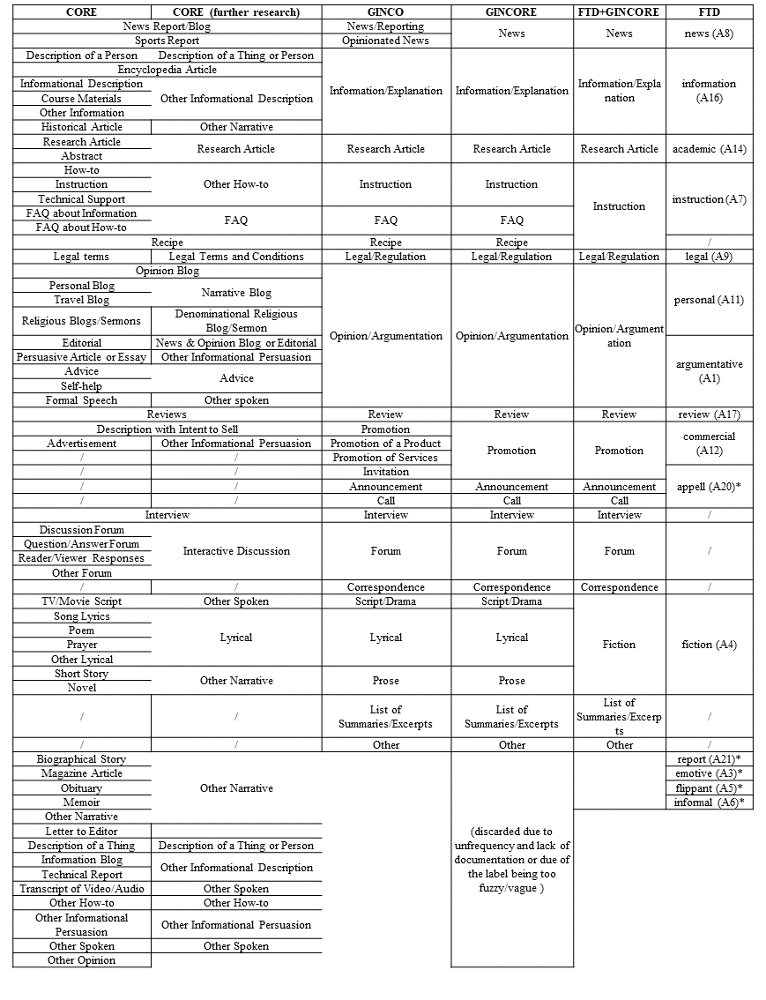
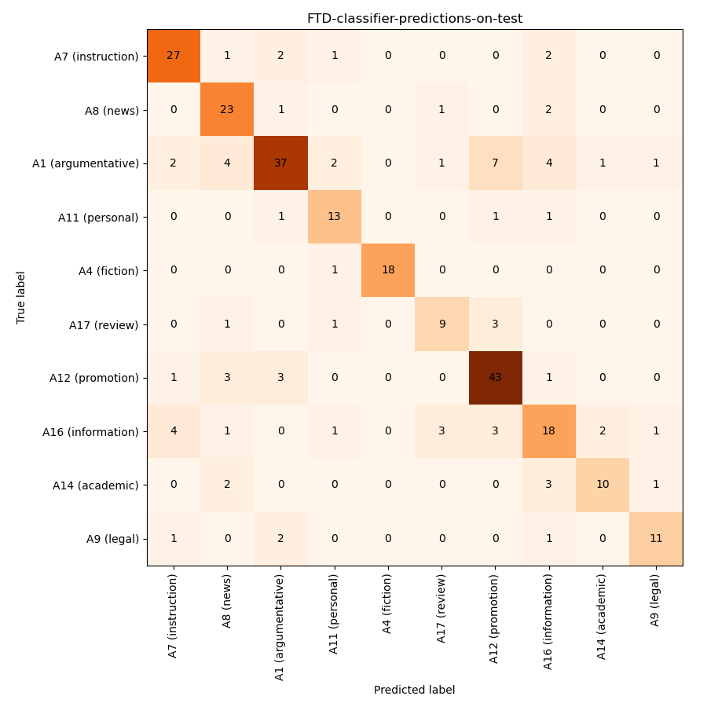

# Comparison of genre datasets: CORE, GINCO and FTD

We compare genre datasets that aim to cover all of the genre diversity found on the web: the CORE dataset, the GINCO dataset and the FTD dataset.

To this end, we perform text classification experiments:
* baseline experiments: in-dataset experiments (training and testing on the same dataset)
* cross-dataset experiments: training on one dataset, applying prediction on the other two - to analyse the comparability of labels (which labels are predicted as which)
* multi-dataset experiments: merging the labels into a joint schema, and training on a combination of all three datasets - using the joint schema, testing on each dataset (+ on a combination of the datasets)
* multi-lingual experiments: extending the multi-dataset experiments by adding the other CORE languages

To simplify experiments, we will perform single-label classification and the texts from CORE and FTD which are labelled with multiple labels will not be used.

We will use the base-sized XLM-RoBERTa model.

The joint schema (merging the FTD labels with the GINCORE labels is based on the [FTD guidelines](https://github.com/ssharoff/genre-keras)):



(FTD categories, marked with a * are not present in the FTD corpus.)

## Experiments

As previous experiments have shown that there is little variance between the results, each experiment will be performed once. We will do the following experiments:

1. Baseline experiments (in-dataset experiments):
* training and testing on FTD
* training and testing on GINCO
* training and testing on MT-GINCO
* training and testing on CORE-main (main categories as labels)
* training and testing on CORE-sub (subcategories as labels)

2. Applying prediction to other datasets:
* predict FTD on Sl-GINCO and MT_GINCO
* predict FTD on CORE
* predict MT-GINCO on FTD and CORE
* predict SL-GINCO on FTD and CORE
* predict CORE-main on SL-GINCO, MT-GINCO and FTD
* predict CORE-sub on SL-GINCO, MT-GINCO and FTD

3. Training on a combination of GINCO + FTD + CORE (joint schema):
    * testing on SL-GINCO and MT-GINCO (joint schema)
    * testing on CORE (joint schema)
    * testing on FTD (joint schema)
    * testing on a combination of GINCO + FTD + CORE (joint schema)
    * testing on EnTenTen (manual analysis whether predicted labels apply)

6. Multilingual experiments: training on GINCO + FTD + CORE + X-CORE corpora (joint schema):
    * testing on GINCO (GINCO schema)
    * testing on CORE (CORE schema)
    * testing on FTD (FTD schema)
    * (testing on EN-GINCO (GINCO schema))
    * testing on a combination of GINCO + FTD + CORE (joint schema)
    * testing on a combination of all corpora used for training

## Data Preparation

We performed a stratified split of each dataset 60:20:20 according to the label distribution.

We will use the following datasets:
* GINCO
* CORE-main: CORE, annotated with main categories
* CORE-sub: CORE, annotated with subcategories
* FTD
* FTD-GINCORE: FTD + GINCO + CORE (joint schema)
* X-GENRE: F-GINCORE + X-CORE (multilingual CORE datasets)
* (EN-GINCO: English corpus, annotated with GINCO labels)

### Experiments

#### FTD
I used the wandb library to evaluate the optimal number of epochs by performing evaluation during training. By analysing the training and evaluation loss, I opted for the epoch number = 10.
The hyperparameters that I used:

```
            "overwrite_output_dir": True,
            "num_train_epochs": 10,
            "train_batch_size":8,
            "learning_rate": 1e-5,
            # Use these parameters if you want to evaluate during training
            #"evaluate_during_training": True,
            #"evaluate_during_training_steps": steps_per_epoch*10,
            #"evaluate_during_training_verbose": True,
            #"use_cached_eval_features": True,
            #'reprocess_input_data': True,
            "labels_list": LABELS,
            "max_seq_length": 512,
            "save_steps": -1,
            # Only the trained model will be saved - to prevent filling all of the space
            "save_model_every_epoch":False,
            "wandb_project": 'FTD-learning-manual-hyperparameter-search',
            "silent": True,
```

The trained model was saved to the Wandb repository and can be accessed for testing (see code *2.2-FTD-classifier-testing.ipynb*).

The results on dev file: Macro f1: 0.759, Micro f1: 0.749

The results on test file: Macro f1: 0.74, Micro f1: 0.739



After the model was created, I applied it to the entire GINCO and CORE datasets and added FTD predictions to them, so that we will be able to analyze how the labels overlap. Prediction takes 20 minutes for 1,000 instances.

The datasets with FTD predictions:
- FTD dev and test split: *results/testing-FTD-model-on-dev-sheet-with-predictions.csv, **results/FTD-classifier-predictions-on-test-sheet-with-predictions.csv*; 
- the GINCO dataset with FTD predictions (I applied predictions to the Slovene and English (MT) text): *final_data/GINCO-MT-GINCO-keeptext-file-with-all-information.csv*
- the CORE dataset with FTD predictions: *final_data/CORE-all-information-FTD-predicted.csv*